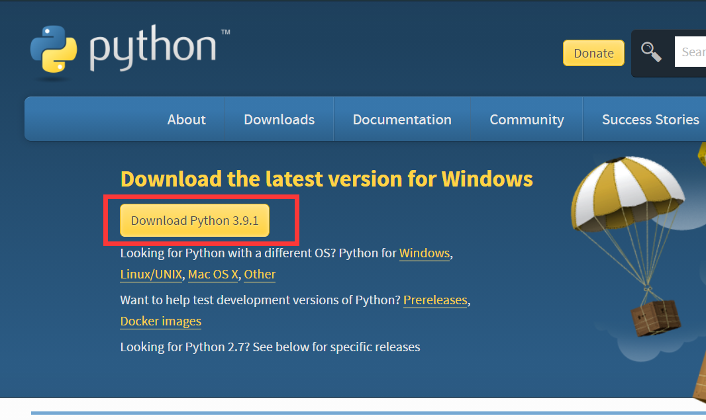
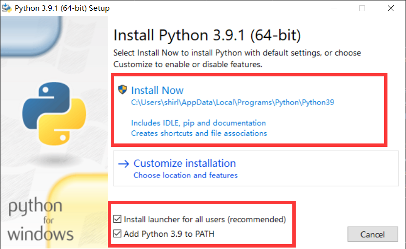
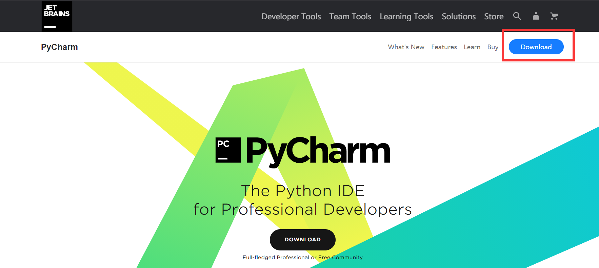
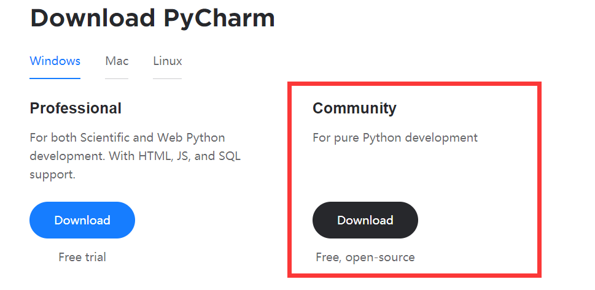
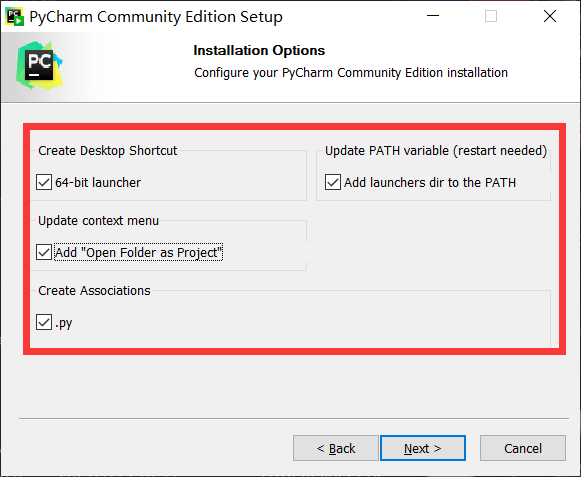
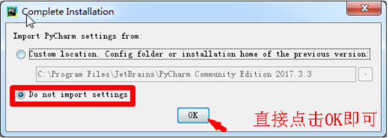
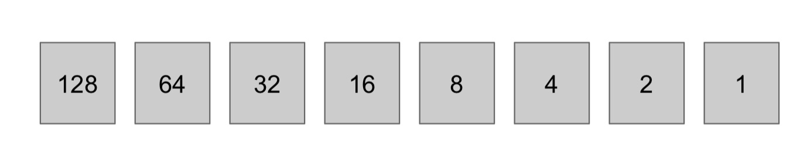
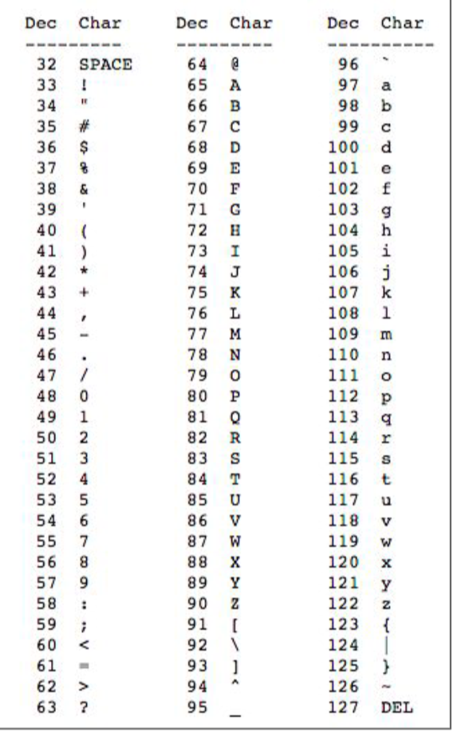

# CMPT 120

### 安装并设置Python到本地

1. Python官网：https://www.python.org/downloads/ 

   

2. 红框里都勾上，然后点击intall

   

3. 安装Pycharm

   Pycharm官网：https://www.jetbrains.com/pycharm/

4. 点击右上角 downloads

   

5. 点击 Community下的 download

   

6. 双击下载好的文件，点next，直到这一步，全部勾选之后next，install

   

7. 安装完成后，配置pycharm

   

8. Settings

   

### What is Computing Science?

###### **CS** is **problem solving**

`Algorithms` - 模板, a way of thinking, a list of steps to follow to complete a task!

`Programming / Code` - 将模板变成现实, a way of communicating

`Programming` is the process of breaking a large, complex task into smaller and smaller subtasks until the subtasks are simple enough to be performed with sequences of basic constructs, including: input, output, conditions (rules), repetition, math or logic. 

* 编程就是 大事化小小事化了。

###### Python is interpreted

`python`是一门**解释性语言**(interpreted)

`source code` -> `Interpreter` -> `output`

`C, C++, Java, ...` 都是**编译型语言**(compiled)

`source code` -> `compiler` -> `Object code` -> `Executor` -> `Output`


### Under the Hood

```python
print("""Hello
	human""")

print(type("beep"))
print(type("5"))
print(type(5))

print("Take", "5")
print("Take 5")
print(555, 555)
```


###### Bits and Bytes

**bits** - 0, 1

* digital computers are machines that convert high and low electrical signals into 0’s and 1’s.
* The lowest level of communication with a digital computer is 0’s and 1’s.

**bytes** 

* 1 byte = 8 bits




例题：

Represent Binary Number 01001010 in Decimal number.

0 * 128 + 1 * 64 + 0 * 32 + 0 * 16 + 1 * 8 + 0 * 4 + 1 * 2 + 0 * 1 = 74

What is the maximum number representable with 8 bits?


###### Ascii table



###### Binary to ASCII


###### ASCII to Binary

Hello World!


###### Hexadecimal 

0~9, A, B, C, D, E, F

十六进制，常用于表示颜色

例如：0x66ccff


###### Unicode

为了表示英文字母之外的其他字符，比如：中文汉字

每个字符占4 bytes

###### Mojibake

when characters are encoded one way, but decoded a different way.


###### Space

1 TB = 1000 GB				TB = terabyte	GB = gigabyte

1 GB = 1000 MB				MB = megabyte

1 MB = 1000 kB				kB = kilobyte

1 kB = 1000 B					B = byte

