# Solving Problems by Searching

## State-based Search 基于状态的搜索 / Heuristic search

## Introduction

**searching** is one of the most common solution-techniques in AI, and so we will spend some time discussing the basic terminology and approach

we usually imagine that our searching is done, at least conceptually, on a **search tree**

- we can also use a graph by using an "explored" list to keep track of already-visited states
- sometimes it is useful to imagine the search as being done on a 3-dimensional landscape, where the goal is to find the highest/lowest point; we'll take this approach a little later in the course

a search tree consists of **nodes**, and edges between nodes that indicate single steps (actions)

- a **node** contains the **state of the environment**, plus maybe bookkeeping information needed by the specific search algorithm

  - an environment state is a description of the world at one time, i.e. all the relevant facts at once moment in time
  - you can use logic, numbers, or pictures to represent the state of the world
  - you can choose any data structure to represent the nodes
  
- a action, such as "drop action", "pick up action", ...

  - in this course, we only deal with deterministic actions (确定的行动), no randomness.
  - edges represents actions

- in reality, we usually have infinite states and infinite actions -> infinite graphs 
  
  - we always simplify state representation to be as smaller, simple, and relevant as possible. 
  - there also can be multiple edges, indicates that there's more than one action to change state A to state B.
  - to void loops - every time checked out a state, color it, or put it on a list (the explored list)
  
- in practice, there are failed probability on each action, i.e. not get the expected result. But in our model, we assume every action will get the expected result (deterministic actions).
  - not a finite state machine - it's infinite and usually too big to put into memory. 

  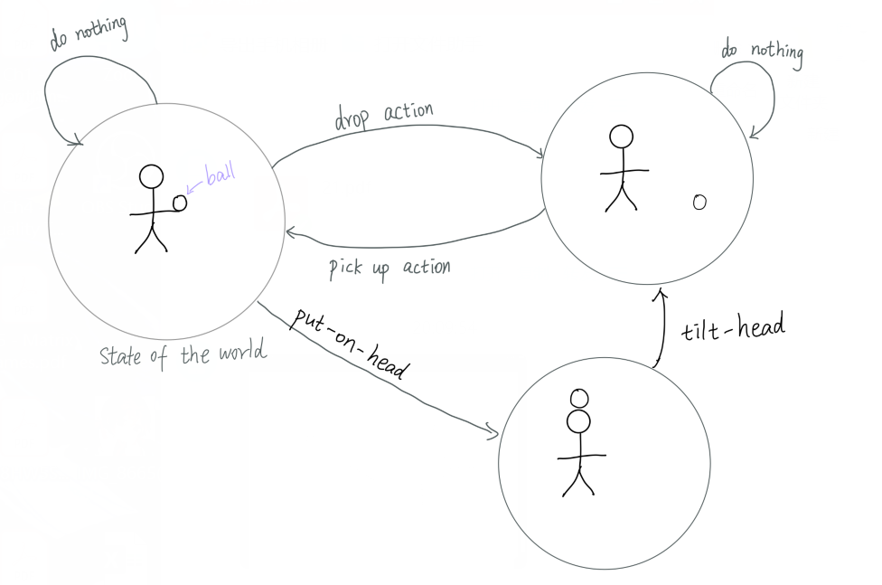

- usually, we will have a *lot* of nodes in any interesting search tree (e.g. billions and billions), and so in practice node representations should be efficient, storing only essential information

- also, huge search trees often cannot fit entirely into memory at one time; thus, we will usually assume the tree is expanded incrementally as needed

  - this is a very different assumption than for the trees you probably dealt with in CMPT 225, where it was assumed the entire tree was always in memory
  
- Typically, we should specify a **start state**, and a **goal state**.

### Tree Search

a **root**, i.e. starting state, is specified, so that we know where the search starts

also, we must have some way of recognizing **goal nodes**, i.e. the nodes that we are searching for that represent a solution to our problem.

* There may be more than one goals, generally, we want to find the goal as closest to the start

we often treat the state-based model as a tree for simplicity, as the algorithm will be simpler, there will be no loops, we never need to worry about revisiting nodes in a tree. However, you can easily end up with infinite trees.

* we can also end up running out of memory in tree search

**search space** - collection of known nodes

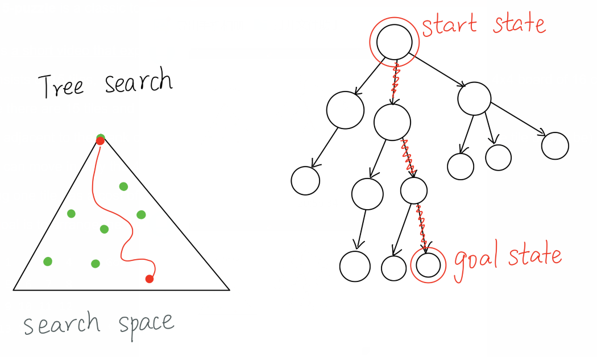

e.g. the **15-puzzle** is a classic toy puzzle

- here's [a short video that explains the puzzle and demonstrates how to solve it](https://www.youtube.com/watch?v=DgkeoRf9o-4)

- it consists of 15 tiles, numbered 1 to 15, that can slide between the grid locations on a 4x4 board of 16 cells

- since there are 15 tiles and 16 cells, there is always one **blank** cell

- a tile adjacent to the blank can slide into the blank (and afterwards the blank is where the tile use to be)

- a tile can move in only the 4 main directions: up, down, left, right

- sliding one tile has a cost of 1

- the goal is to arrange the tiles, one move at a time, until the board looks like this:

  ```
   1  2  3  4     Goal State
   5  6  7  8
   9 10 11 12
  13 14 15  *     * is the blank
  ```

  * careful scrambling(快速移动)! must scramble by legal moves.
  * edges = actions
  * we usually want the shortest path

  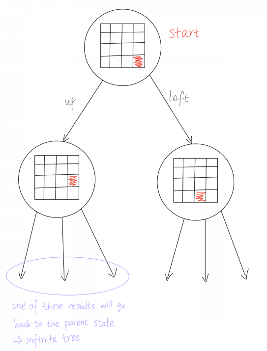

  

- usually the board starts in a random position

  - **careful**: about half of all random permutations of the tiles are states that cannot reach this goal state, i.e. in about half the states the puzzle is unsolvable

  - famously, when the 15-puzzle was first sold in the 1800s the 14 and 15 tiles were swapped like this:

    ```
     1  2  3  4     An Impossible state (14 and 15 swapped)
     5  6  7  8
     9 10 11 12
    13 15 14  *     * is the blank
    ```

    it's impossible to reach the goal state from this position making just legal tile moves!

- when humans solve the 15-puzzle, they are usually satisfied to get to the goal state without much concern for the number of tile moves

- but a much more difficult problem is, from any given solvable state, to find the **minimum number of moves to the solution state**

  - using the algorithms in this chapter, we can find guaranteed optimal solutions to the 3x3 variant using Python
  - with a more efficient implementation of the same algorithms (probably in a faster language, like C or C++), you can also find guaranteed optimal solutions to the 15-puzzle
  - it's possible, but very difficult, to find <u>optimal solutions</u> to random instances of the 5x5 variant (the 25-puzzle)
  - currently, there is no guaranteed way to find optimal solutions to random instance of the 6x6 puzzle or higher: it seems that some new ideas are needed!

* A way to solve the puzzle (may not be optimal)
  * solve the first row
  * solve the first column
  * then we never need to touch the first row and first column, it is a smaller puzzle now
  * then solve the second row
  * solve the second column
  * a even smaller problem 
  * ... 

## Problems

for this section, we define a **problem** as an object with at least these parts:

- an **initial state**, where the agent starts
- a **set of actions** that can be executed in a particular state; if `s` is a state, then `Actions(s)` is the set of all **applicable actions**, i.e. the actions that can be executed in `s` 
- a **transition model**(转换模式) that describes how exactly a state changes when an action is applied to it; the notation `Result(s,a)` is the state that results from doing action `a` in state `s`
- a **goal test** that determines if a given state is a goal state
- it's possible to have no goals
- a **path cost** that assigns a numeric cost to each path; the sum of a path will be taken to be the sum of the individual edge costs of the path; the notation `c(s,a,s′)` is the cost of going from state `s` to `s′` by doing action `a`. We always want the sum of the edges cost on the path as smallest as possible.

  - e.g. if the nodes represent locations on a map, the path costs could represent times between cities, or distances between cities
  - e.g. if the nodes represent states of a Rubik's cube puzzle, then the path cost between any two adjacent states would be 1, i.e. 1 move is needed to go between the states

this model of a problem applies just to the kinds of search problems we are describing in this chapter

- there are other problem models, e.g. in robotics you often cannot be certain what state you end up in after doing an action, i.e. `Result(s,a)` might return a *set* of states with a probability distribution on them indicating how likely each outcome is

  - e.g. a robot might try to pick up a glass; after doing that action, it might holding the glass, or it might have knocked the glass on the floor and never picked it up, or it might have crushed the glass, or the glass might have slipped out of its grasp and is still sitting on the table

## Tree Search

suppose we are searching a tree

- a tree is a graph with no loops
- each node has one parent
- each node has 0 or more children
  - this is not necessarily a binary tree — a node could have any number of children

we assume the tree consist of nodes, and has a designated root node where the search starts

here's the basic pseudocode for **tree search**:

```pseudocode
function Tree-Search(problem) returns Solution, or Failure
   frontier <-- { initial-state }
   loop forever:
                if frontier is empty, return Failure
                n <-- pop a node from frontier
                if n is a goal, then return Solution
                for each child c of n:
                         add c to frontier
```

note that when we say "pop a node", we mean that exactly *one* node is removed from `frontier`; the exact node that is removed depends upon the search algorithm being used

- different rules for removing nodes from `frontier` result in very different algorithms!
- frontier(前沿，边界)

## Graph Search

we can generalize `Tree-Search` to work with general graphs (which might have loops) by adding an "explored" list, which keeps track of nodes that have been visited:

```pseudocode
function Graph-Search(problem) returns Solution, or Failure
        frontier <-- { initial-state }
        explored <-- {}
        loop forever:
                 if frontier is empty, return Failure
                 n <-- pop a node from frontier
                 if n is a goal, then return solution
                 add n to explored
                 for each child c of n:
                          if c not in explored or frontier:
                                   add c to frontier
```

this is the basic form of many of the algorithms in this section

the algorithms differ mainly in how they remove nodes from `frontier`

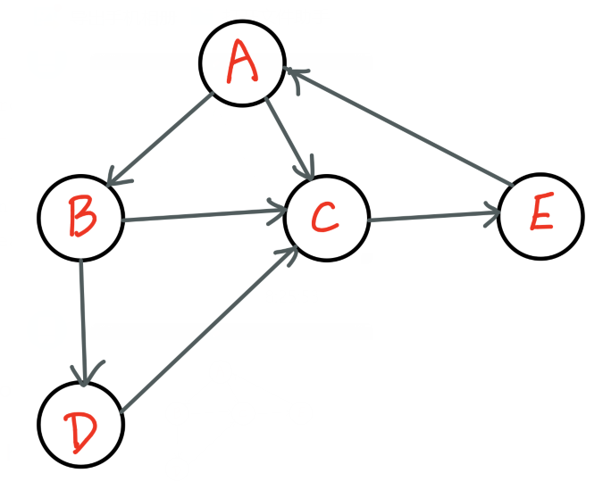

`Frontier` 中数据的变化(ex by DFS)：

```pseudocode
Frontier: A
Explored:
pop(A), check if A is a goal, yes -> return solution, no -> for all children of A, if the child of A are not in Frontier and Explore, push the child of A 

Frontier: BC
Explored: A
pop(C), check if C is a goal, yes -> return solution, no -> for all children of C, if the child of C are not in Frontier and Explore, push the child of C

Frontier: BE
Explored: AC
pop(E), check if E is a goal, yes -> return solution, no -> for all children of E, if the child of E are not in Frontier and Explore, push the child of E

Frontier: B
Explored: ACE
pop(B), check if B is a goal, yes -> return solution, no -> for all children of B, if the child of B are not in Frontier and Explore, push the child of B

Frontier: D
Explored: ACEB
pop(D), check if D is a goal, yes -> return solution, no -> for all children of D, if the child of D are not in Frontier and Explore, push the child of D

Frontier: 
Explored: ACEBD
Now Frontier is empty, return Failure
```


## Measuring Problem-solving Performance

**search algorithm performance** is typically evaluated in four ways:

- **completeness**: If there is a solution, is the algorithm guaranteed to find it?
- Search algorithms that use randomness, for example, might not be able to guarantee to always find a solution.
- **optimality**: Does it find a goal node with the lowest path cost?
- **time complexity**: How long does it take to find a solution?
- **space complexity**: How much memory is needed to do the search?

## Uninformed Search Strategy(无用的搜索策略): Breadth-first Search

if you implement `frontier` as a **queue**, and remove `n` using de-queue and add children using enqueue, then the result is an algorithm called **breadth-first search (bfs)**

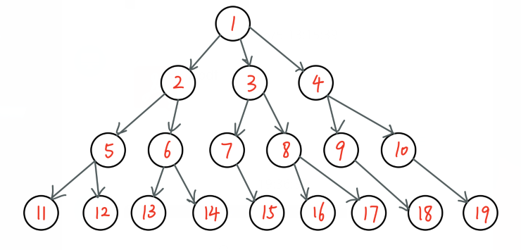

* only store frontier in memory
* frontier in BFS - nodes that are in memory, but their children have not been put into memory.

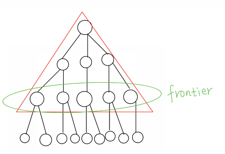

this is an important algorithm: BFS visits nodes that are closest to the root (assuming unit edge costs)

* if edge costs are all 1, breadth-first search finds the closest goal.

a nice property of BFS is that, if there is a goal, it will find the *closest* goal node to the root

unfortunately, BFS has poor space complexity

to see this, suppose that each node of the tree being searched has a branching factor of $b$ (i.e. each node has *b* children)

so the root node expands into $b$ nodes

each of those $b$ nodes expand into $b$ more nodes, for a total of $b^2$ nodes on the next level

then on the next level, each of the $b^2$ nodes expands to $b$ more nodes, for a total of $b^3$ nodes on the next level

for $d$ levels, the total number of nodes generated is $b+b^2+…+b^d=O(b^d)$

in other words, **BFS expands an exponential number of nodes** to search to level $d$

`Frontier`中数据的变化

```pseudocode
			A
		/	|	\
		B	C	D
	  / |   |   | \
	  E F	I	J  K
	 / \
	 G H

Checked: 
Frontier: A
dequeue A, check if A is a goal, yes -> return A, no -> enqueue all childern node of A

Checked: A
Frontier: BCD
dequeue B, check if B is a goal, yes -> return B, no -> enqueue all childern node of B

Checked: AB
Frontier: CDEF
dequeue C, check if C is a goal, yes -> return C, no -> enqueue all childern node of C

Checked: ABC
Frontier: DEFI
dequeue D, check if D is a goal, yes -> return D, no -> enqueue all childern node of D

Checked: ABCD
Frontier: EFIJK
dequeue E, check if E is a goal, yes -> return E, no -> enqueue all childern node of E

Checked: ABCDE
Frontier: FIJKGH
dequeue F, check if F is a goal, yes -> return F, no -> enqueue all childern node of F (no child in this case)

Checked: ABCDEF
Frontier: IJKGH
dequeue I, check if I is a goal, yes -> return I, no -> enqueue all childern node of I (no child in this case)

Checked: ABCDEFI
Frontier: JKGH
dequeue J, check if J is a goal, yes -> return J, no -> enqueue all childern node of J (no child in this case)

Checked: ABCDEFIJ
Frontier: KGH
dequeue K, check if K is a goal, yes -> return K, no -> enqueue all childern node of K (no child in this case)

Checked: ABCDEFIJ
Frontier: KGH
dequeue K, check if K is a goal, yes -> return K, no -> enqueue all childern node of K (no child in this case)

Checked: ABCDEFIK
Frontier: GH
dequeue G, check if G is a goal, yes -> return G, no -> enqueue all childern node of G (no child in this case)

Checked: ABCDEFIKG
Frontier: H
dequeue H, check if H is a goal, yes -> return H, no -> enqueue all childern node of H (no child in this case)

Checked: ABCDEFIKGH
Frontier: 
Now Frontier is empty, return Failure
```

the major practical problem with BFS is that it soon runs out memory

- Figure 3.13 in the textbook shows how bad using an exponential amount of memory is
- but even if we had enough memory, time is still a big issue: doing an exponential number of actions would take an unreasonable amount of time

BFS is like a linear search that systematical way to traverse the tree or the graph, but it takes up so much memory.

## Uninformed Search Strategy: Uniform-cost Search 统一成本搜索

**uniform-cost search** is a generalization of *breadth-first search* that allows the step cost between states be values other than 1 (the cost can be different on each edge)

it expands nodes in order of their optimal path cost, i.e. it picks the node from `frontier` that has the lowest path cost

in general, uniform-cost search does *more* work than breadth-first search

you can see this intuitively by noting that breadth-first search stops as soon as it removes a goal node from the frontier, but uniform-cost search must check all the remaining nodes in case there is a goal with a cheaper path cost

## Uninformed Search Strategy: Depth-first Search

**depth-first search**, or **dfs** for short, always expands the *deepest* node in a search tree

algorithmically, it is the same as breadth-first search but `frontier` is implemented as a **stack** instead of a queue

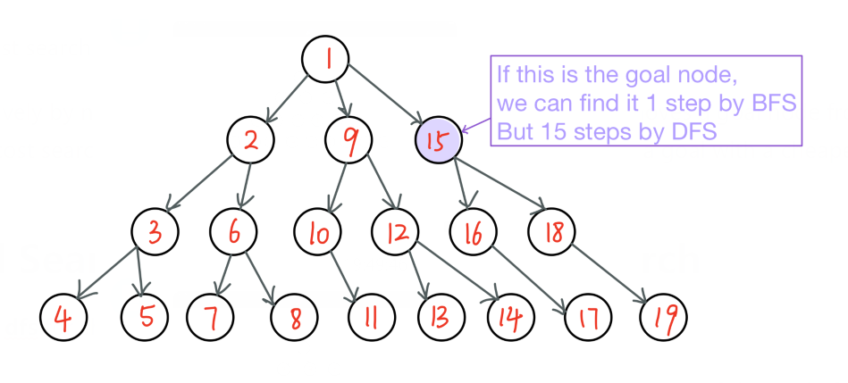

**depth-first search is not complete**, i.e. in some search problems it can fail to find a goal node that exists

- e.g. depth-first search could get stuck in an infinite sub-tree

`Frontier` 中数据的变化：

```pseudocode
			A
		/	|	\
		B	C	D
	  / |   |   | \
	  E F	I	J  K
	 / \
	 G H
	 
Checked: 
Frontier: A
pop(A), check if A is the goal, yes -> return A, no -> push all children of A

Checked: A
Frontier: BCD
pop(D), check if D is the goal, yes -> return D, no -> push all children of D

Checked: AD
Frontier: BCJK
pop(K), check if K is the goal, yes -> return K, no -> push all children of K (no child in this case)

Checked: ADK
Frontier: BCJ
pop(J), check if J is the goal, yes -> return J, no -> push all children of J (no child in this case)

Checked: ADKJ
Frontier: BC
pop(C), check if C is the goal, yes -> return C, no -> push all children of C 

Checked: ADKJC
Frontier: BI
pop(I), check if I is the goal, yes -> return I, no -> push all children of I (no child in this case)

Checked: ADKJCI
Frontier: B
pop(B), check if B is the goal, yes -> return B, no -> push all children of B

Checked: ADKJCIB
Frontier: EF
pop(F), check if F is the goal, yes -> return F, no -> push all children of F (no child in this case)

Checked: ADKJCIBF
Frontier: E
pop(E), check if E is the goal, yes -> return E, no -> push all children of E

Checked: ADKJCIBFE
Frontier: GH
pop(H), check if H is the goal, yes -> return H, no -> push all children of H (no child in this case)

Checked: ADKJCIBFEH
Frontier: G
pop(G), check if G is the goal, yes -> return G, no -> push all children of G (no child in this case)

Checked: ADKJCIBFEHG
Frontier: 
Now Frontier is empty, return Failure
```

**depth-first search is also not optimal** in the sense that it may first find goal nodes that are further from the root

despite these limitations, DFS has a major advantage over BFS: space complexity

when searching a tree, DFS need only store one **root-to-node path** (# of nodes = the height of the node), while BFS must store an entire *level* of the tree (usually an exponential number of nodes) (one level, not the entire tree)

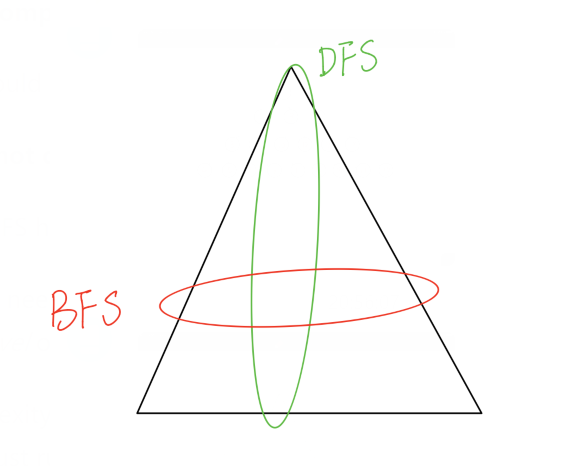

because of its space complexity, in practice, depth-first search, and variations on it, are the more commonly used algorithms — BFS usually just runs out of memory!

There's no one algorithm that's the best one, different algorithm fit in different situations.

## Uninformed Search Strategy: Depth-Limited Search

one very useful variation of depth-first search is **depth-limited search**, which is depth-first search plus a number L that indicates the maximum depth from the root to be searched

- nodes at depth L from the root are treated as if they have no children

to run depth-limited search, you must provide a value for L, e.g. `depth-limited-search(P, 5)` will do a search for problem P to depth limit 5

picking the right depth L can be tricky, but you might be able to pick a good value based on information from the problem domain

## Uninformed Search Strategy: Iterative Deepening Depth-first Search 循环加深度优先算法

a useful modification of depth-limited search is called **iterative deepening depth-first search**, and in pseudocode it looks like this:

```pseudocode
for depth = 0 to infinity:
  result = depth-limited-search(P, depth)
  if result != cutoff then return result
```

it calls **depth-limited search with increasing depths**

we assume `depth-limited-search` returns the special value `cutoff` if it searches to the given depth without finding a goal

BAD: in `depth-limited-search`, the nodes close to the root do get searched multiple times, but it is not as bad as it might seem

imagine a completed search tree drawn out; for simplicity, assume all non-leaf nodes have $b$ children

then in iterative deepening depth-first search, the nodes at level $d$ have been generated 1 time, the nodes on level $d−1$ have been generated $2$ times (once by the current call to depth-limited-search, and once by the previous call), the nodes on level $d−2$ have been generated $3$ times, and so on

in general, the number $N$ of generated nodes is

$N=(d)b+(d−1)b^2+…+(1)b^d$

this is $O(b^d)$, which is the same asymptotic(渐进的) value as for breadth-first search

Intuition: most of the nodes in a tree are deep, and ID-DFS mostly re-expands nodes near the root of the tree. (树中的大多数节点很深，而ID-DFS大多在树的根附近重新扩展节点)

GOOD: like bread-first search, iterative deepening depth-first search promises to return the goal node closest to the root, i.e. it is optimal

GOOD: but it uses much less memory than breadth-first search!

thus, in general, for a problem with a big search space and an unknown goal depth, iterative deepening depth-first search is often the best choice

## Bidirectional Search

informally, the idea of bi-directional search is to simultaneously search forwards from the start state, and backwards from a goal state

e.g. imagine trying to solve a maze with pencil and paper

- you could draw a path from the beginning that goes towards the exit
- or you could draw a path that goes from the exit towards the beginning
- you could even draw them at the same time, and once the two paths touch you've found a solution

a potential difficulty of bi-directional search is that to search backwards from the goal state to the initial state you have to be able to generate the *predecessors*(前辈) of a state, which in some cases may be difficult to do

## Informed (Heuristic) Search

**informed search strategies** use information about the problem domain to find solutions more quickly than uninformed search strategies

the basic idea is to use a **node evaluation function**, $f$, such that for any given node $n$, $f(n)$ is the value of that node

most search problems include as part of $f$ a heuristic function $h(n)$ that estimates the cost of the cheapest path from $n$ to a goal

note that $h(n)=0$ implies $n$ is a goal node

Some scientist proposed that human problem solving is a kind of heuristic search.

## Greedy Best-first Search

in **greedy best-first search**, $f(n)=h(n)$: it chooses from `frontier` the node that has the **best heuristic estimate**, i.e. the node it thinks is closest to the solution

in general, greedy best-first search is *not* optimal (the first goal it returns might not be the closest), and it is *not* complete (it may fail to find a goal node even though one exists)

the success of greedy best-first search depends very much on how good the heuristic function $f(n)=h(n)$ is

in practice, it can be *very* tricky to find good heuristic functions, and for many useful/important problems no good heuristics are known

## A* Search: Minimizing the Total Estimated Solution Cost

if $n$ is a node, then let $g(n)$ be the **path cost** from the root to reach node $n$

- i.e. $g(n)$ is the sum of the edge costs from the root to $n$ (we always know this)
- note that we know the exact value of $g(n)$

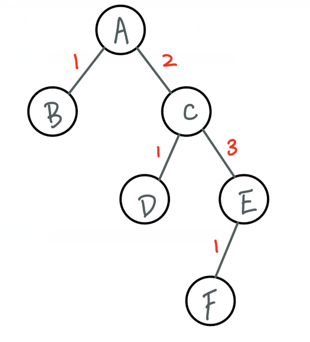

```pseudocode
g(A) = 0
g(B) = 1
g(C) = 2
g(D) = 2+1 = 3
g(E) = 2+3 = 5
g(f) = 2+3+1 = 6
```

now define the evaluation function $f$ like this:

$f(n)=g(n)+h(n)$

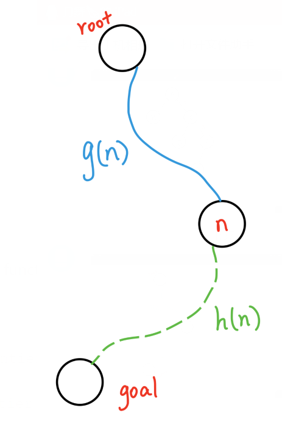

ordering the nodes in `frontier` by this `f`-value gives us an important algorithm known as **A\*-search**

* In tree-search, let `frontier` be a priority queue ordered by f-values, smallest removed first.

intuitively, we can think of this $f(n)$as the estimated cost of the cheapest solution path that goes through node $n$

A*-search is important because, if the right conditions for the heuristic function $h$ hold, then A*-search is both complete (it will find a solution if there is one) and optimal (there is no cheaper path to a goal)

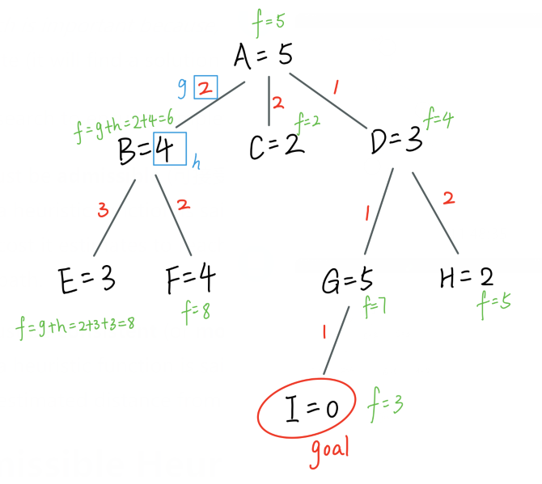

`Frontier` 中数据的变化：

```pseudocode
Frontier: A,f=5
find the smallest value in Frontier, dequeue it(A), enqueue all children of it into Frontier

Frontier: B,f=6; C,f=4; D,f=4
find the smallest value in Frontier, dequeue it(C), enqueue all children of it into Frontier

Frontier: B,f=6; D,f=4
find the smallest value in Frontier, dequeue it(D), enqueue all children of it into Frontier

Frontier: B,f=6; G,f=7; H,f=5
find the smallest value in Frontier, dequeue it(H), enqueue all children of it into Frontier

Frontier: B,f=6; G,f=7
find the smallest value in Frontier, dequeue it(B), enqueue all children of it into Frontier

Frontier: G,f=7; E,f=8; F,f=8
find the smallest value in Frontier, dequeue it(G), enqueue all children of it into Frontier

Frontier: E,f=8; F,f=8; I,f=3
find the smallest value in Frontier, dequeue it(I), we find the goal node
```

for A*-search to ensure completeness and optimality, $h$ must satisfy these two conditions:

- $h$ must be **admissible** (可接受的)
  - a heuristic function is said to be **admissible** if it never overestimates the cost of reaching the goal, i.e. the cost it estimates to reach the goal is not higher than the lowest possible cost from the current point in the path.
- $h$ must be **consistent** (or **monotonic**)
  - a heuristic function is said to be **consistent**, or **monotone**, if its estimate is always less than or equal to the estimated distance from any neighbouring vertex to the goal, plus the cost of reaching that neighbour.

Dijkstra's algorithm is a A* algorithm with $h=0$ 

With problems like the 8-puzzle, 15-puzzle, ..., Rubik's cube, ..., A*-search with an admissible/consistent heuristic will, for any scrambled state, find the goal state in the fewest possible moves.

Other algorithms might find a goal faster, but they usually can't guarantee the goal is optimal

## Admissible Heuristics

a heuristic function is **admissible** if it **never over-estimates the true cost to reach the goal**

- admissible heuristic functions are *optimistic*(乐观的): they report that the cost of achieving a solution is never more than what it actually is
- If there's two heuristic functions for one problem, the better one is the the one closest to the real cost
- an example of an admissible heuristic function is the straight-line distance between two points on a map
  - to get from point A to B, the best path is to follow the straight line that connects them
  - but in reality, you often can't go straight, e.g. if you are driving then you must follow roads
- another example of an admissible heuristic is in the 8-puzzle: the number of tiles not already in their home position is always less than (or equal to) the number of moves that must be made to reach the home position
- for **<u>tree-search problems</u>**, admissibility is all we need to ensure A*-search is complete and optimal

The graph below, $h$ is admissible since all h-values are ≤ true distance to the goal.

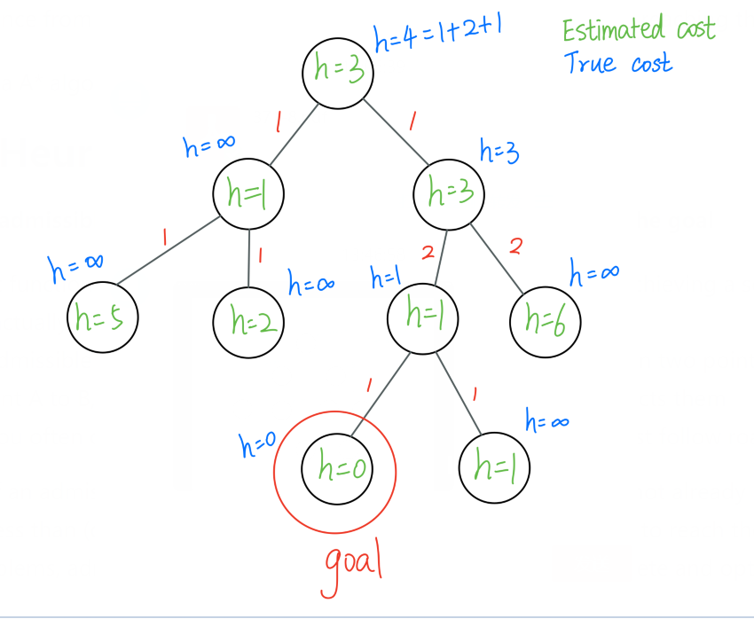

## Consistent Heuristics

a heuristic function $h$ is **consistent** if for every node $n$ and for every successor node $n′$ generated by an action $a$, this inequality holds:

$h(n)≤c(n,a,n′)+h(n′)$

$c(n,a,n′)$ is the cost of going from node $n$ to node $n′$ by action $a$

it is possible to find heuristic functions that admissible but not consistent, however those are relatively uncommon, and usually an admissible heuristic is also consistent

For **<u>graph search</u>**, $h$ must also be consistent (monotonic) to guarantee optimality.

## A*-Search with a Consistent Heuristic is Optimal

an important property of A*-search is that it guarantees to find the cheapest path from the initial node to the goal, as long as a consistent heuristic is used

this result follows from two basic facts:

- values of $f(n)$ along any path are non-decreasing
- if A* search selects a node $n$ from `frontier`, the optimal path to $n$ has been found

thus, A*-search can be useful if you want to find the cheapest solution to a problem, e.g. the minimal number of moves to solve the 8-puzzle

- other algorithms might be faster at finding a solution, but they generally cannot guarantee they've found the *optimal* solution

from a high-level view, the frontier of A*-search looks like a *contour*(等高线), and A*-search expands nodes on this contour in way that is biased(偏向) towards the goal

- the more accurate the heuristic, the bigger the bias toward the goal, and the more likely it is to quickly find the goal

unfortunately, the number of nodes in these contours is typically exponential

- A* is a variation of breadth-first search

so in practice, the problem with A* search is that for many problems it soon exhausts available memory

so in practice, memory-efficient variants of A* search, such as **IDA\* (iterative-deepening A\* search)**, **RBFS (recursive breadth-first search)** or **SMA\* (simplified memory-bounded A\* search)** must be used for most problems

IDA* - this is like iterative-deepening depth-first search, but using f-values instead of depth-levels, a good practical choice: pretty fast, and not too hard to implement

SMA* - unbelievably complicated, too hard to implement efficiently

RBFS - the problem is using the recursion, it's easy to get stuck with the stack

- or, as is often the case in practice with hard problems, the requirement for optimality is dropped

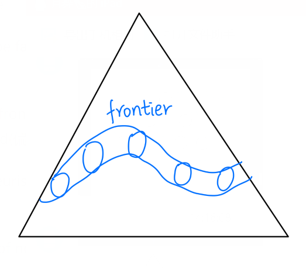 Frontier is a contour instead of straight across as with BFS.

## Heuristic Functions

the better your heuristic, the quicker A*-search can find a solution

generally, we want heuristics that estimate the true cost of a path to a goal without going over that true cost (i.e. admissibility)

so, suppose you happened to have two admissible heuristics, $h1$ and $h2$

you can define a new admissible heuristic $h3$ as follows:

$h3(n)=max(h1(n),h2(n))$

in general, if you have $n$ admissible heuristics, then taking the max of them is another admissible heuristic

- however, it can be difficult to say in general if the algorithm will run faster — it's possible that the time spent calculating the max of $n$ heuristic values outweighs the benefit of the improved heuristic accuracy!

another sometimes useful trick(窍门) for developing admissible heuristics is to considered a **relaxed** version of the problem being solved, i.e. a version of the problem with fewer constraints on actions

for example, in the 8-puzzle, suppose you could simply place each tile in its home position in a single step; this is a relaxed version of the 8-puzzle that corresponds to the **misplaced tile heuristic**

a different relaxation of the 8-puzzle is this: suppose a tile could slide unimpeded(畅通无阻的) from its current position to its home position, one cell at a time (up, down, left, or right as usual), this corresponds to the **Manhattan** metric

relaxation is an interesting idea in part because it is a fairly general-purpose rule for helping to find admissible heuristics

- it can even be automated, to help discover heuristics automatically

## Pattern Databases for Heuristics

at least for problems similar to the 8-puzzle (which includes things like Rubik's cube), the most successful heuristics have been created using so-called **pattern databases** (模式数据库)

the basic idea is to compute a very accurate heuristic function $h$ by pre-solving simplified versions of the problem in a way that never over-estimates the true cost

to understand this, lets re-create the Manhattan metric 8-puzzle heuristic as a small pattern database

recall that in the 8-puzzle, the Manhattan distance between a tile and its home location is the number of moves the tile must make to get to its home position if it were the only tile on the board

the Manhattan heuristic is then the sum of all these costs for each tile

this never over-estimates the true number of moves because you usually have to move other tiles out of the way in the full 8-puzzle

now consider just tile 1, the tile that will be in the upper-left corner of the board in the solved puzzle:

```
1 2 3    Solution State for 8-puzzle
4 5 6
7 8 *
```

for each of the 9 positions on the board, we can pre-compute the Manhattan distance of that that position with the home position of tile 1:

```
0 1 2   Pre-computed Manhattan distances to
1 2 3   home position of tile 1 (upper left corner)
2 3 4
```

so, on a board containing only the tile 1, if tile 1 is in its home position, 0 moves are required to move it home

if, instead, tile 1 was in the upper-right corner of the board, 2 moves would be needed to move tile 1 home (assuming its the only tile on the board)

to get the complete Manhattan heuristic estimate for a state of the 8-puzzle, we will need to create 9 of these tables, one for each possible home position:

```
0  1  2  # 1
1  2  3
2  3  4

1  0  1  # 2
2  1  2
3  2  3

2  1  0  # 3
3  2  1
4  3  2

1  2  3  # 4
0  1  2
1  2  3

2  1  2  # 5
1  0  1
2  1  2

3  2  1  # 6
2  1  0
3  2  1

2  3  4  # 7
1  2  3
0  1  2

3  2  3  # 8
2  1  2
1  0  1

4  3  2  # 9
3  2  1
2  1  0
```

these tables can be used to implement a very efficient version of the Manhattan heuristic (a good thing to do in heuristic search!)

- this is essentially a table of 9*9=81 values, indexed by (tile name, location)
- for example, if tile 5 is at location 3 (the first position of the second row), then the board above for tile 5 says that 1 move is needed for 5 to get to its home location from position 3

but this approach also suggests what turns out to be a useful generalization

what if instead of having one tile on the board, what if we have two tiles on the board?

for example, consider just tile 1 and tile 2

there are 9*8=72 different placements of tile 1 and 2 on the 8-puzzle

here's one of them:

```
. . 1
2 . .
. . .
```

4 moves are needed to get both tile 1 and tile 2 home (assuming no other tiles on the board)

here’s another example:

```
2 1 .
. . .
. . .
```

this needs 4 moves to get both tiles to their home position

- note that the Manhattan heuristic estimates only 2 moves are needed
- but more are needed because one of the tiles has to “move around” the other

for each of these 72 placements of tiles 1 and 2, we could find an optimal solution and record the number of moves the two tiles made into a table (i.e. a database)

- the table would be indexed by tile positions so that whatever the positions of 1 and 2 are, we could quickly retrieve the number of moves needed to get them home
- we could use A*-search to solve these simpler problems

now we could do the same trick for the other pairs of tiles: 3/4, 5/6, and 7/8

for each pair of tiles, we optimally solve the 72 possible tile positions, and store the results in a table index by position

overall, this gives us a table with 4*72=288 entries index by all possible positions of 2 tiles

we can now use this table to get a good heuristic estimate for the 8-puzzle: look up the positions of tiles 1/2, 3/4, 5/6, and 7/8, and add their corresponding values together

this is an admissible heuristic that is a little better than the Manhattan heuristic, because in some cases it is a greater value (but still never over-estimates the true distance to the goal)

and that's the basic idea for creating heuristics using disjoint pattern databases

essentially, we pre-compute solutions for simplified versions of the problem, and then use those as estimates for our heuristic in an informed search (such as A*-search, or one of its memory-efficient variations)

for more complex puzzles, such as the 4x4 15-puzzle or the 5x5 25-puzzle, pattern databases with more tiles are pre-computed, and they result in much effective heuristics that can be used to solve random instance of those puzzles in a reasonable amount of time when used with a memory-friendly A*-search variant (such as IDA*-search)

- however, for the 6x6 36-puzzle and beyond, this technique doesn't seem to help since the pattern databases get too big and the heuristics don't reduce the search enough
- it seems like a new idea is needed to find optimal solutions to the 36-puzzle and beyond
  - maybe some variation on pattern database no one has thought of yet
  - or maybe some completely different idea!

## Aside: Solving the 15-puzzle by Hand

here is a simple way to solve the 4x4 15-puzzle (and ones like it) without a computer …

start by solving the first row and the first column

- the tricky part is getting the last two tiles of the row/column in place, but with a bit of experimentation you should be able to figure out the trick

now the first row and first column are done, and they won't be touched again

the remaining tiles form a 3x3 8-puzzle

solve this by solving the first row (get tiles 6, 7, 8 in the first row) and the first column (6, 10, 14)

then solve the remaining 2x2 puzzle — its trivial!

and that's it!

the resulting solutions are not necessarily optimal, but it is easy to remember and fairly easy for humans to do

which leads one to wonder: could you write a computer program that would come up with a general strategy like this for solving such puzzles, as opposed to just solving particular instances of it the way A*-search does?