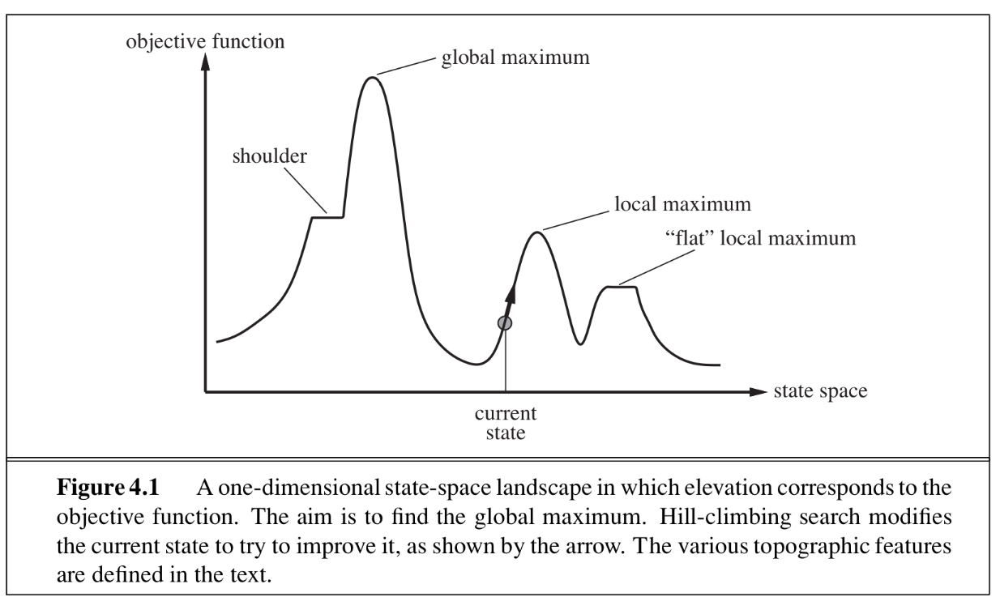
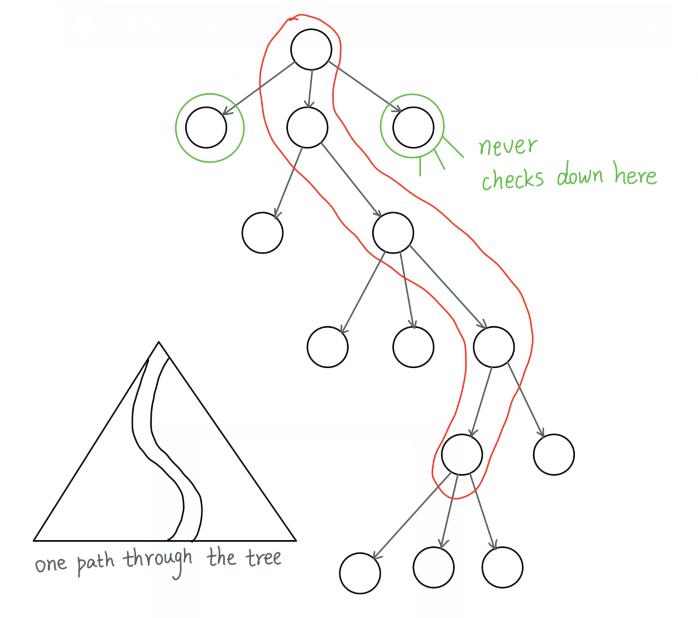
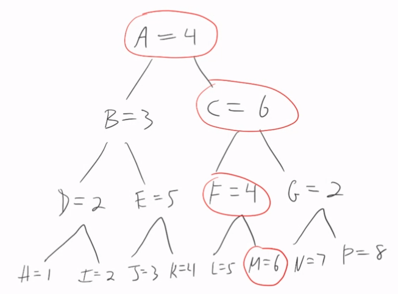
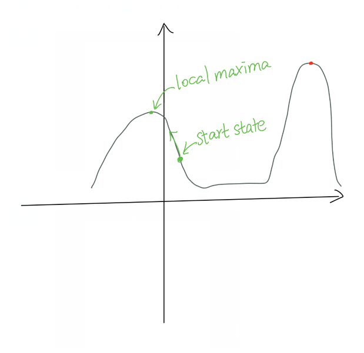
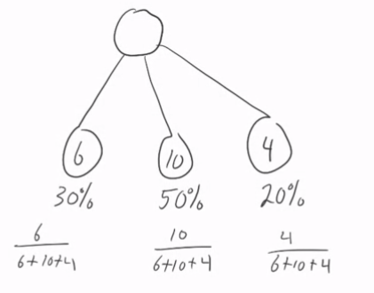

# Notes on Chapter 4: Beyond Classical Search

In A* search, what we can improve is only the $h$ function, even `frontier` can be changed, it doesn't make big difference. The heuristic function $h$ is the only place where extra knowledge can be added.

* A good heuristic $h$ can result in extremely high performance

Two big problems:

* Stuffing all knowledge about a problem into a cost-based heuristic function is easier said than done, and for most interesting problems, it's very hard to find good such heuristics
* the frontier can get exponentially big, quickly exhausting computer memory. e.g. many problems have lots of possible actions

What could we do to make tree-search more practical?

* Idea: limit the size of frontier. e.g., say frontier can only store at most 3 nodes.

  ```
  			A
  		/	|	\
  		B	C	D
  	  / |   |   | \
  	  E F	I	J  K
  	   / \		   / \
  	  G   H       L   M        (L is the goal)
  	  
  Frontier: A
  Frontier: BCD
  Frontier: CDEF 
  (more than 3, hard to choose to drop which one, if we drop the goal brach, then it's incomplete and non-optimal)
  ```

This is known as **beam search**(定向搜索), and can work for some problems

* completeness and optimality not guaranteed 
* need some heuristic rule for deciding which 3 nodes to keep in frontier

## Local Search 局部搜索

in many problems, the path that was taken to get to a goal doesn't matter

e.g. in the n-queens problems, you are asked to place $n$ chess queens on a square $n * n$ board so that no two queens are in the same row, column, or diagonal (i.e. no two queens attack each other)

the order in which the queens are placed doesn't matter; all we care about is the final configuration

this suggests another approach to searching: keep track of just the current node, generate its successors, and then choose one of those successors to be the next current node

this is the basic idea of **local search**

local search typically uses **much** less memory than classical search algorithms like A*-search, and in practice has been used to find good solutions to large and difficult problems

Figure 4.1 of the textbook shows the **state-space landscape** of a search problem, which can be a useful way of thinking about local search



essentially, we want to find the highest point in the landscape, and local search says to do this by taking one step at a time in a close-by direction

as Figure 4.1 shows, local search can get stuck in local maxima, or stuck on plateaus, and so some strategy is needed to deal with such problems

- note that we now talk about *maximizing* the score of a node, i.e. the higher the better; this is the opposite of what we did with A*-search, where in A*-search the lower the f-value the better

e.g. Find the smallest integers $x$ and $y$ that satisfy $x^2 - 61y^2 = 1$ (Pell's equation)

​	We just want $x$ and $y$: intermediate values we try for $x$ and $y$ don't matter

​	Answer: $x = 1766319049$, $y=226153980$ 

Such problems are often solved using a general approach to search called local search.

The idea is:

* start in some given state $S$
* generate the successors of $S$
* pick the one best successor
* repeat using the chosen successor

In general, no guarantee of completeness or optimality



## Hill Climbing

**hill-climbing** is a simple local search algorithm that can find local maximas

- a local maxima is a point near (i.e. local) to the start point that is a maximum value

  

the idea is you have a current state, and then you always move to the successor state that has the highest value (for some function of interest); if no successor state has a higher value, then current state is a local maxima

```
function Hill-Climbing(problem) returns a state that is a local maxima
  current <-- initial-state
  loop:
     neighbor <-- highest-valued successor of current
     if neighbor.value <= current.value then return current
     current <-- neighbor
```

GOOD: the code is simple, fast, and memory-efficient, and so can be implemented in many situations

BAD: 

* can easily miss goals and be lead astray(误入歧途地)
* doesn't help when many children have the same f-value
  * A plateau is a part of a search space where many nodes have the same value. (no hills to climb in a plateau)



hill-climbing is a kind of **greedy search**: it always chooses the next current node to be the one that increases its objective function the most

if more than one successor is tied for the highest-valued successor, then most hill-climbing implementations choose the next current state at random

- if many successors tie for the highest-value, then the agent may be on a plateau, which mean it will wander around randomly until it hits an edge

there are many variations on basic hill-climbing, e.g.:

- **stochastic hill-climbing**(随机爬山) chooses at random from among the uphill moves, possible giving a greater chance to moves that are steeper; we note that most deep-learning neural nets uses a version of stochastic hill-climbing to do their learning

  - choose choose successor nodes with probability proportional to their f-value
  - 30% chance to choose $f=6$, 50% chance to choose $f=10$, 20% chance to choose $f=4$

  

- **first-choice hill-climbing** generates successors at random, and stopping as soon as it finds one that has a higher value than the current node

  - consider successors in random order, stopping when you find one whose f-value is bigger than the parent node's f-value.

- **random-restart hill-climbing** (tabu search) does a series of hill-climbing searches starting from randomly chosen initial states; when the agent gets to a local maxima, it re-starts at a randomly chosen start point

  - this has can be a very effective strategy for some problems, e.g. the n-queens problem for n=3 million can be solved in under a minute by a random-start search
- If Hill-Climbing doesn't find a goal <u>soon enough</u>(choosing when to do a re-start can be tricky棘手的), re-start the hill climbing from a new randomly chosen start node.
  
- **enforced hill-climbing** - if it's on a plateau,  it will do a BFS, until they get out of the plateau, i.e. find a value higher or lower

- These can be combined together.

in practice, it can be hard to find the best variation of hill-climbing to use for a particular problem, and so often a lot of experimentation is needed

## Simulate Annealing 模拟退火

basic hill-climbing never makes downward moves, i.e. it will never choose a successor node with a value lower than the parent node if it can avoid it

- that's why it stops when it reaches a local maxima

in metallurgy(冶金学), **annealing**(退火) is the process of slowly cooling down metal to harden(变坚固) it; quickly cooling metal can result in brittleness(脆性) that makes it weaker and easy to shatter(粉碎)

**simulated annealing** is a search algorithm inspired by this process

simulated annealing works by choosing a successor at random; if that successor has a lower value, then it is accepted; but if the successor has a higher value, then there is some probability, based on a changing temperature T, that the higher value will be accepted

A variation of hill-climbing that uses a temperature value T to control the amount of randomness in the search.

* Intuition
  * when temperature T is high, more randomness
  * when T is low, less randomness
* e.g. put ice cube back to ice cube tray. More shaking(randomness) first, less shaking(randomness) over the time.

the temperature T starts out high (hot), and decreases as the algorithm continues

the higher T is, the more likely simulated annealing will choose a downward step

here's pseudocode for simulated annealing; note that `schedule` is a function that maps the time `t` into a temperature `T`

```
function Simulated_Annealing(problem, schedule) returns solution state
  current <-- initial-state
  for t = 1 to infinity do:
    T <-- schedule(t)
    if T == 0, then return current
    next <-- randomly selected successor of current
    dE <-- next.Value - current.Value
    if dE > 0 then
      current <-- next
    else
      current <-- next with probability e^{dE/T} 
```

* dE is the differences in f-value of the parent and the child
* if no successor is chosen, then a new random successor is picked and it ties again
* If it's on early time, T is big, dE<0, $e^{dE/T}$ is high, there's more chance that it choose downwards steps

In general, no one search algorithm appears to be best for all problems - "no free lunch" theorem.

## Local Beam Search 局部光束搜索

basic local search stores only *one* state, and chooses among the successors of that one state

**local beam search** keeps track of $k$ states

first it generates $k$ random states

then it generates the successors of those $k$ states; if any of the successors is a goal, then the algorithms stops

otherwise, it picks the $k$ best successors for the next step

**stochastic local beam search** is a variation of local beam search that chooses the $k$ successors at random, with the probability of choosing a particular successor proportional to the value of the successor

- i.e. the higher the value of a node, the more likely it will be chosen

## Genetic Algorithms 遗传算法

a **genetic algorithm** is a variant of local beam search where the next state is generated by *combining* two parent states instead of modifying a single state

it tries to mimic the process of evolution and genetics in an algorithmic way

like local beam search, genetic algorithms use a collection of $k$ states

to generate the next collection of states, pairs of states are chosen in a randomly weighted way (i.e. the better states have a proportionally higher chance of being chosen), and then pairs are somehow combined to create a new state

- the process of combining is like breeding, and the resulting state contains information from both its parent states

for example, suppose we represent states of a search problem as bit strings of size 20

then given two 20-bit strings representing states, one way to combine them is to use **cross-over**, e.g. create a new 20-bit child state that consists of the first 10 bits of its first parent, and the last 10 bits of its second parent

another common operation is genetic algorithms is **mutation**(突变), e.g. randomly modifying a part of the state with the hope that some mutations will result in useful new states

* random mutation
  * choose a state at random
  * flip a bit at random
* Strongest get a "free ride"
  * top ~10% copied to next generation (~10%是老师自己随便定的，具体情况具体分析)
* Cross-over ... breeding(繁殖)
* 

genetic algorithms are popular in some communities, but a *lot* of work is typically required to find a good set of parameters for a genetic algorithm to work well

- what size of $k$?
- how should states be combined?
  - many, many different ways have been proposed!
- how frequently should mutations occur?

if these parameters are not chosen well, then genetic algorithms can perform quite poorly, e.g. as little more than expensive versions of hill-climbing

no doubt part of the appeal of genetic algorithms is that they have a pleasing connection to evolution and genetics, something that many people think must surely be a good thing since we know that those processes have produced people!

plus, tinkering with all the different aspects of genetic algorithm can be fun

but in general, it's hard to recommend them over other, simpler, variations of hill-climbing

## Rest of the Chapter

in this course we won't cover any of the topics after genetic algorithms

we encourage you to browse through them if you are curious — there are many interesting and useful topics in the remainder of this chapter!