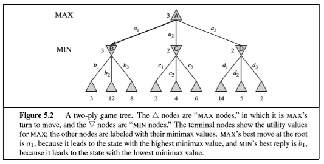
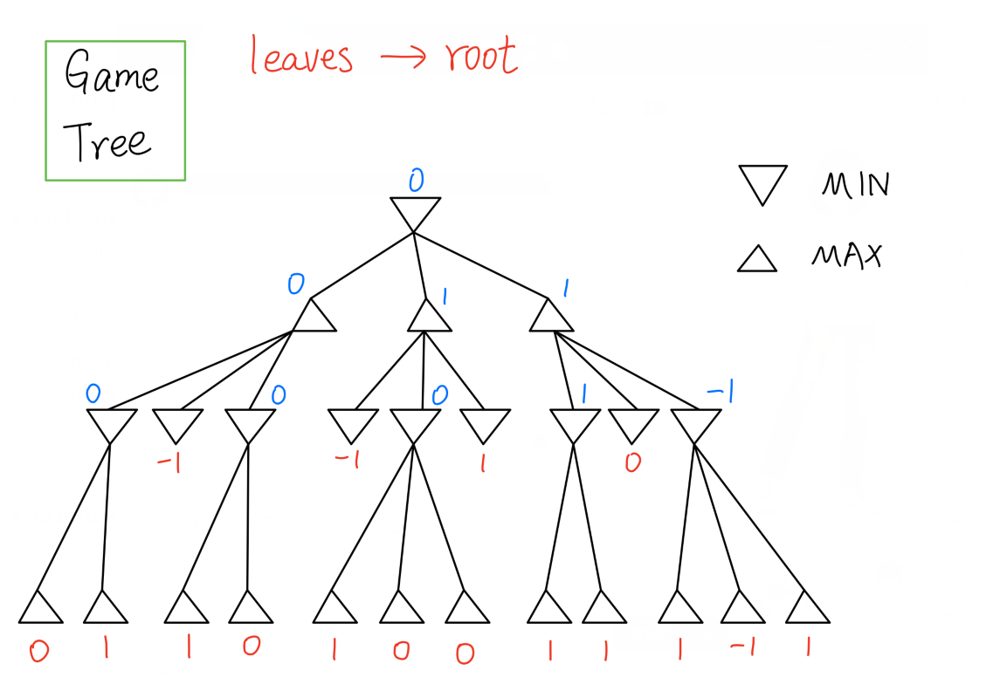
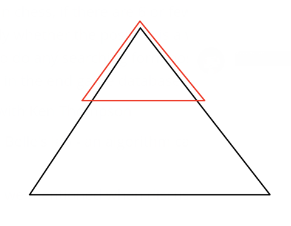
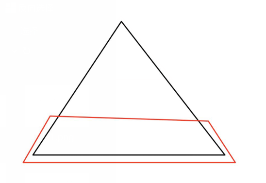
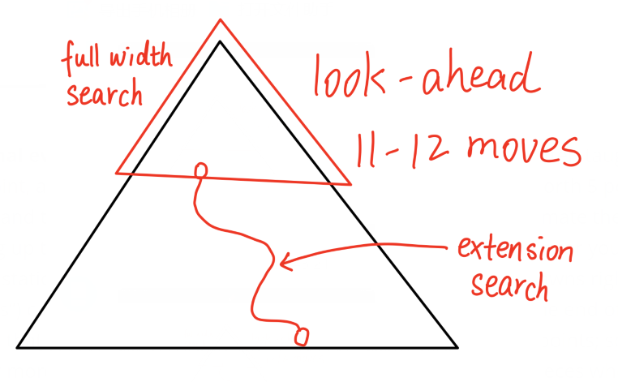
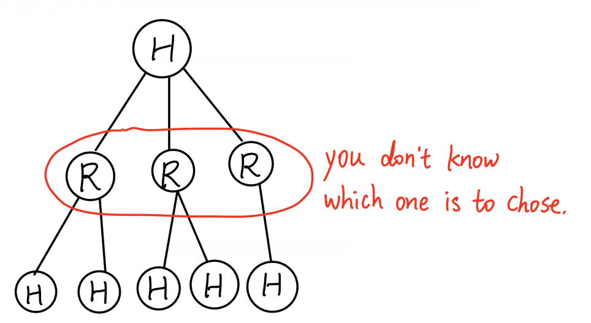

# Adversarial Search

对抗搜索

### Introduction

* By some accounts, chess is nowadays more popular than ever
* Thanks in large part to the web, computers, and charismatic players like Carlsen
  * Magnus Carlsen (1990 - ), current world chess champion, top rated human chess player of all time (2882)
* Yet ... the best humans are no match for even average computer chess programs
* In Western culture, chess has been played for 100s of years
* to be good at chess is to be an intelligent and sophisticated genius
* so, surely, if a "machine" could play chess well, then it too would have to be intelligent ...

##### The Turk (1770 - 1854)

* From about 1770 to 1854 (when it was destroyed in a fire), you could play chess against The Turk.
* It appeared to be an automaton, i.e. a machine that played chess on its own (它似乎是自动机，即一台自己下棋的机器)
* and it could play pretty well
* but it was a hoax (恶作剧)!
* a small human chess player hid inside the compartment on the right and made all the moves. 

##### Alan Turing: Turochamp (1948) 

* Alan Turing is best known for the creation of **Turing machines** (to help prove that some problems cannot be solved by any computer)
* He was also greatly interested in AI, and created the **Turing Test**
* Turochamp (1948) was a complete chess-playing program written by Turing and David Champernowne. 
* They didn't actually get it running on a computer!
* But it could be run by tracing it by hand, and it could play chess (although not very well) 

##### Claude Shannon (1949 / 50)

* Best known as "the father of information theory"
* Wrote a famous paper called "Programming a Computer for playing Chess" in 1949
* Proposed the basic idea of "position evaluation" and **min max search** for looking ahead to find the best moves
  * Later this was refined to **alpha-beta search**, which does essentially the same thing but more efficiently
  * position evaluation - it is like the f function in heuristic search
* In 1950 he published another paper where he estimated that **total number of different possible chess positions $10^{120}$** 
  * There are "only" about $10^{80}$ atoms in the universe
  * Such a huge number means that pure "brute force"(蛮力) can't be used to play chess well

##### The Kotok-McCarthy Chess Program (1962)

* John McCarthy is famous for creating the LISP programming language, and many other contributions to AI
  * He coined the term "Artificial Intelligence" 
* Alan Kotok was an undergrad student who worked with McCarthy in the 1960s to create a chess playing programming
* Generally considered to be the strongest chess playing program of the time
* Took 5 to 25 minutes to make one move
* Played full chess, but not great
  * Estimated to play about as well as an amateur who had played 100 games.

##### Chess as the Drosophila of AI

* McCarthy famously argued that research in computer chess is analogous to research in fruit flies (Drosophila) (计算机象棋的研究类似于果蝇的研究（果蝇）)
* Researchers who study fruit flies are not interested in making better fruit flies
  * fruit flies are cheap and easy to breed
* Similarly, good chess-playing programs are not the end goal of AI research most research into chess
* Chess is a relatively simple and well-defined sandbox for comparing some AI ideas

##### MacHack (1967)

* Developed by famed(著名的) "hacker" Richard Greenblatt
* An influential program with a number of new ideas
* First program to defeat a human in a tournament
* Greenblatt himself was a pretty good amateur player, and hand-coded many chess heuristics into his program
* MacHack played a famous game of chess against philosopher Hubert Dreyfuss in 
  * Drefuss argued that the claims of AI where vastly overblown(夸大) 
  * The poor quality of chess programs was something he often pointed out
  * So he played a game against MacHack - and Dreyfus lost!

##### Hubert Dreyfus: What Computers Can't do (1972)

* Hubert Dreyfus (1929 - 2017)
* Dreyfus was a respected philosopher who was getting fed up (感到厌倦) with all the grand claims of AI in the 1960s/70s
* Quite rightly, he pointed out the lack of impressive results 
  * "Current claims and hopes for progress in models for making computers intelligent are like the belief that someone **climbing a tree is making progress toward reaching the moon.**"
* He believed that human intelligence depended upon unconscious processes
* And so the conscious symbol-processing approach of AI in the 1960s - 70s was on the wrong track
* The now current popularity of "sub-symbolic" approaches like deep neural nets suggest he may have been right!

Computer Chess Grows

* By the 1970s, there were enough computer chess programs that tournaments started to be held
* **1970**: the first **North American Computer Chess Tournament** was held
  * 6 participants
  * Won by a program called **Chess 3.0**
  * Successors of Chess 3.0 dominated this tournament in its first decade (only lost the championship twice in the 1970s!)
* **1974**: the first world computer chess championships
  * Won by the Russian program **Kaisa**
* **1977**: first consumer chess programs that ordinary people could buy

##### The Levy-McCarthy Bet (1969)

* In 1969, chess master David Levy made a bet of $1000 with John McCarthy that Levy could defeat any chess playing program in the next 10 years
* Levy won the bet - in 1979 he defeated the best chess programs of the day
* Levy extended his bet and offered $1000 to the first chess program that could beat him
* He finally lost that bet to ... Deep Thought

##### Deep Thought (1989)

* Feng-hsiung Hsu developed a special purpose **chess chip** that was used to create the chess machine Deep Thought
* First computer to beat chess master David Levy
* First computer to beat a grandmaster in a tournament (Bent Larsen, 1988)
* Lost a 2-game match to then chess world champion Garry Kasparov
* Deep Thought could search about **500 million positions per second** 
  * Enough to look ahead 10 - 11 moves completely
  * Although it also used so-called "extension searches"(扩展搜索) where it could sometimes look ahead many more moves: once found checkmate in 35 moves

##### Deep Blue

* The Deep Thought team moved to IBM, and renamed their project Deep Blue
  * IBM's nickname is Big Blue
* 1996: world chess champion Garry Kasparov played a 6-game match against Deep Blue
  * **Deep Blue won the 2nd game - the first time a reigning human chess champion has ever lost a game to a computer in a match**
  * Kasparov won the match overall, 4-2
* 1997: Kasparov and Deep Blue played a 6-game rematch 
  * **This time Deep Blue won the match 3.5-2.5**
  * This was a major media event, and generally seen as marking the turning point when computers became better at chess than the best humans
  * Nowadays, a chess program running on your cell phone could easily defeat Deep Blue (or the human world champion)

##### AlphaZero (2017)

* AlphaZero is generally considered to be the next major breakthrough in computer chess
* Previous elite-class programs (精英级程序) used highly tuned (高度调整) and carefully crafted (精心制作) versions of **alpha-beta search** 
  * With lots of hand-crafted chess knowledge
* But AlphaZero is different
  * It used **reinforcement learning** to play chess games **against itself**
    * reinforcement learning - trying to do sth and get feed feedback, "yes, you're right" or "no, you're wrong"
  * It was given just the rules of chess, and no other knowledge
  * In **a few hours** (8 hours) of self-play (on high-performance hardware!), AlphaZero learned to paly chess about as well as the best programs of the day
  * In 2019, a 1000-game match against the world champion calibre chess program StockFish, AlphaZero
    * AlphaZero won 155 games
    * AlphaZero lost 6 games
    * Drew 839 games

##### AlphaZero (~3500)

(3500是象棋水平评分)

* Radically different approach to chess than previous best programs (与先前的最佳计划截然不同的下棋方式)
  * Learned all its chess knowledge through self play, and stored it as a **neural network**
* Uses **Monte-Carlo Tree search** (MCTS) 蒙特卡洛树搜索
  * the basic idea of MCTS is to pick random successor states, and keep playing until the game is "played out"  (MCTS的基本思想是选择随机的后继状态，并继续玩直到游戏“结束”为止)
  * this is repeated thousands of times
  * the move that most often leads to a win is selected
  * AlphaZero uses a modified version of this: it uses its learned knowledge to decide what move to make when simulating the games

| Program      | Positions Searched per second |
| ------------ | ----------------------------- |
| Deep Thought | 500 million                   |
| StockFish    | 60 million                    |
| AlphaZero    | 60 thousand                   |

* StockFish does not do any learning, "learning" in this algorithm is done manually by human, type things in (不确定老师说的是不是这个意思) 
* Deep Thought use special purpose hardware
* StockFish run on regular PCs, it totally dominate Deep Thought because it has better knowledges, smarter
* AlphaZero - it has so much knowledge that it doesn't need to search a lot

##### AlphaZero

* Another remarkable fact about AlphaZero is that it is **not** specific to chess!
  * The AlphaZero algorithm was also used to create (probably) the best **Go** and **Shogi** programs
  * Alpha-beta search programs don't play Go well because the branching factor of Go is so much bigger than chess
* This dramatic success of AlphaZero has sparked the imagination of many people: **if a computer can learn more about chess in ten hours than humans have learned in centuries, how long before computers start to similarly out-perform humans in other disciplines?**

## Note

we’re not going to cover the algorithms in this chapter in significant detail

they are mostly specific to turn-taking games like *chess* and *Go*

recent developments in reinforcement learning (强化学习) have dramatically altered the state of the start of game playing algorithms

while min/max alpha-beta search is still a good algorithm that powers many strong game-playing programs, other techniques have eclipsed(使...黯然失色) it in games like chess and Go

## Min/max Search

in games like chess, Go, poker, Connect-4, etc., **adversarial** search techniques have traditionally been used to create intelligent computer players for these games

assuming a 2-player game like chess, the basic idea is to represent the game as a **game tree**, where nodes in the tree alternate between one players move and the others

the players are often generically named MIN and MAX, corresponding to how they want to influence the objective function

- MIN wants to minimize the objective function, while MAX wants to maximize it
- MIN - choose the minimum child
- MAX - choose the maximum child
- solving a game - Assume perfect players, what result going to be? (win / lost / draw)

the MINIMAX algorithm is the basic search techniques that computers use for making moves

the basic idea is to evaluate the leaves of the **game tree**, and then to work upwards from those using the minimax rule to assign values to the nodes for each player

in practice, MINIMAX search is usually implement with **alpha-beta pruning** (修剪), an effective technique for efficiently discarding certain parts of the game tree

* 实际中，一般用alpha-beta pruning，只有toy programs才只用MINMAX search
* Deep Thought put alpha-beta pruning into hardware

dozens of other tricks, techniques, and ideas have been tried and tested over the decades of research into these algorithms, so that today the best adversarial search algorithms are highly optimized and efficient

here are some other tricks used in games like chess: 

- **opening books**: a database of thousands (or tens of thousands) of standard opening moves that experts agree are a good way to start a game 

  - 一个专家认可的完美开局的database

    

- **end game databases**: in chess, if there are 6 or fewer pieces left on the board, there are databases that will tell you instantly whether the position is a win, loss, or draw; in practice, this means a chess program doesn’t need to do any searching form positions with 6, or fewer, pieces on the board: it can just look-up the answer in the end game database

  - this idea is started with Ken Thompson
  - Ken Thompson and Belle's lab - an algorithm called Belle, first chess algorithm get to the master level player

  the **pattern databases** we mentioned when discussing the 15-puzzle are similar in spirit to end game databases

  - the key idea seems to be to pre-compute *lots* of simpler/smaller versions of a problem so as to help solve large problems
  - chess always start with the same initial condition, but 15-puzzle does not, so there is no opening book for 15-puzzle

  

- **extension searching**: traditional chess programs only have enough time and memory to look ahead a fixed number of moves; but in some situations, the computer might look ahead *dozens of more moves* because of things like forced moves (e.g. you must always move your king out of check), or because there are very promising moves (e.g. capturing a piece, or putting the kind in check); using extension searches, modern chess programs can occasionally look dozens of moves ahead to find guaranteed checkmates(把...将死) beyond the ability of humans

  - top red triangle - full width search

  

- **dynamic positional evaluation** (动态位置评估): beginning chess players are often taught that pawns(兵卒) are worth 1 point, a bishops(象)/knights are worth 3 points, rooks(车) are worth 5 points, the queen is worth 9 points (and the king is worth infinitely many points); so you can estimate the strength of your position by adding up the points of all your pieces and comparing to the points for your opponents pieces; but, these static point values for pieces are not always correct, e.g. 2 pawns right beside each (“connected pawns”) can be worth much more than 2 points, especially near the end of the game; similarly, a bishop that is blocked from moving anywhere is worth less than 3 points; so good chess programs look for more sophisticated(富有经验的) patterns and positions of pieces when evaluating a board, so that the point score of individual pieces might change throughout the game

  - passed pawn (同路兵) - 任何敌兵都无法影响其前进的兵，因此是有严重的升变威胁的兵
  - pawn structure - two pawns together are much stronger than two pawns separate

## Games with Randomness

importantly, chess is a game with *no randomness* or *hidden information*

games that use dice(骰子) or cards, however, have randomness that is not present in chess

one way to think about randomness in a 2-player game is to imagine that randomness is another player named RAND; RAND gets to make a move at various points in the game, and neither of the other two actual players know exactly what that move will be

* Monte Carlo Tree Search treat randomness like a player
  * H - human
  * R - random (nature)

this makes a big difference to the kind of algorithms that work well for playing such games!

the addition of randomness no longer makes alpha-beta search the necessarily best algorithm

one generally successful approach to some random games is **monte carlo simulation**(蒙特卡洛模拟), which has been used to create world-class backgammon(西洋双陆棋) and Scrabble programs (拼字游戏程序)

a standard twist related to randomness is **partial observability** (与随机性相关的标准扭曲是**部分可观察性**)

consider the game 7-card stud Poker, where 2 (or more players) have there own hand of 7 cards (taken at random from a deck of 52) that they keep secret from the other players (考虑游戏7张牌梭哈扑克，其中2位（或更多位玩家）手中有7张牌（从52张牌组中随机抽取），他们对其他玩家保密)

making probabilistic predictions about what cards your opponent might have is an important poker skill, as the tactic(战术) of purposefully(有目的地) trying to confuse(迷惑) your opponent about what cards you have

- e.g. a poker player with a strong hand might act as if they have a weak hand, or vice-versa

## Chess, Go, and AlphaZero

until about 2017, variations of alpha-beta search were the best chess-playing agents

they essentially combine a lot of human-added chess knowledge with an extremely efficient alpha-beta search

but AlphaZero surprised the chess world by showing that **reinforcement learning** could be used to *learn* to play chess at a level comparable to the best alpha-beta style chess agents

furthermore, AlphaZero did its learning in less than 10 hours of *self-play* (i.e. playing thousands and thousands of games against itself)

- although, to be fair, it did use a huge amount of computational power in those few hours, and did its training in parallel, so much that only a big company like Google could realistically do it

also, AlphaZero does use some searching, but it does **not** use alpha-beta search

instead, it uses a different technique called **Monte-Carlo Tree search** (**MCTS**)

- the basic idea of MCTS is to pick random successor states, and keep going until the game is played out
- this is repeated thousands (or more) times
- then the move that is actually selected is the one that leads to the most wins
- AlphaZero uses a modified version of this: it uses its learned knowledge (in the form of a neural network) to decide what move to make when simulating the games

consider the following [news report from April 2019](https://www.chess.com/news/view/updated-alphazero-crushes-stockfish-in-new-1-000-game-match):

- AlphaZero played 1000 chess games against StockFish, generally considered to be the strongest (or among the strong) traditional alpha-beta style chess agents

  - the games gave each player 3 hours to play their moves, plus 15 seconds extra for each move

- AlphaZero won 155 of the games, lost 6, and drew the remaining 839

- this is generally taken as good evidence that AlphaZero is probably the strongest chess-playing agent that has ever existed, human or otherwise

- using MCTS, AlphaZero searched about 60,000 positions per second

- using alpha-beta search, StockFish searched about *60 million* positions per second, i.e. 1000 more positions per second than AlphaZero

- even though StockFish was greatly out-searching AlphaZero, it appears that AlphaZero’s knowledge of chess is superior

- Stockfish has an

   

  ELO rating

   

  around 3378, and based on this performance AlphaZero has an

   

  ELO rating

   

  around 3430

  - the higest ever [ELO rating](https://en.wikipedia.org/wiki/Elo_rating_system) rating of a human chess player was for Magnus Carlsen, who had a rating of 2882 in 2014

as impressive as this is, another remarkable fact about AlphaZero is that it is **not specific to chess**: it has also been used to create the best Go and [Shogi](https://en.wikipedia.org/wiki/Shogi) agents

- famously, Go is a game that the alpha-beta game tree search approach doesn’t work well with because the branching factor of the game tree is so big

the dramatic success of AlphaZero has sparked the imagination of many people: if a computer can learn more about chess in ten hours than humans have learned in centuries, how long before computers start to similarly out-perform humans in other disciplines?

- but there is still a lot of tough problems to solve — reinforcement learning doesn’t work so well with all games or problems!