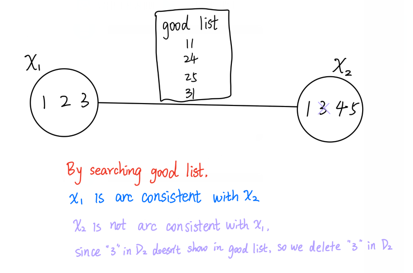
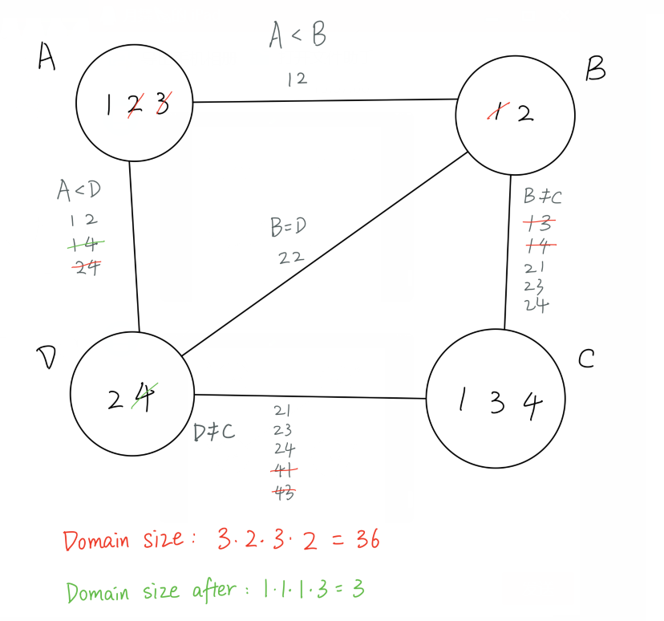
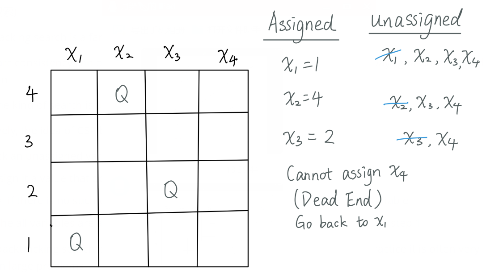
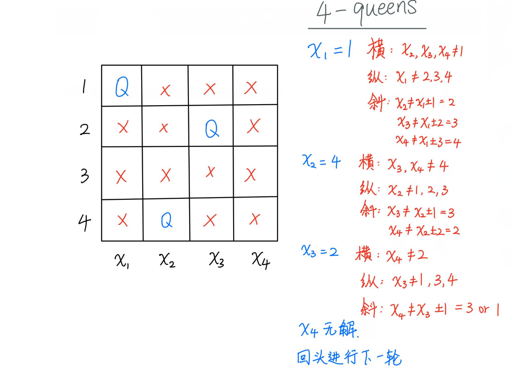
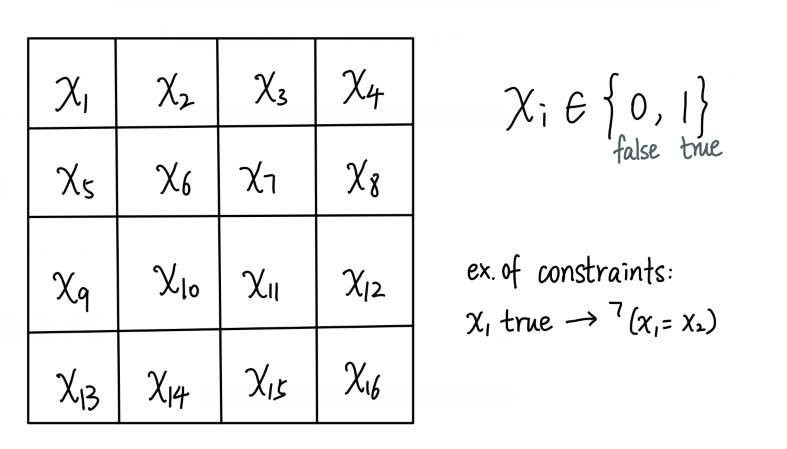
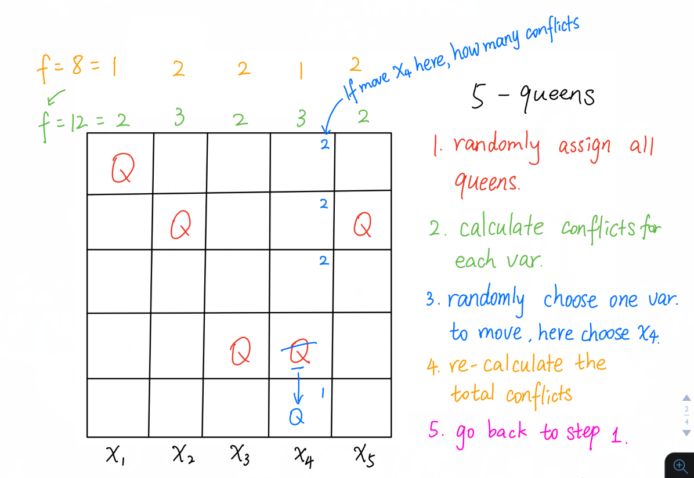

# Chapter 6: Constraint Satisfaction Problems 

约束满足问题

**Constraint satisfaction problems**, or **CSPs** for short, are a flexible approach to searching that have proven useful in many AI-style problems

CSPs can be used to solve problems such as

- **graph-coloring**: coloring a graph means assigning each of its vertices a color such that no pair of vertices connected by an edge have the same color

  - in general, this is a hard problem, e.g. determining if a graph can be colored with 3 colors is NP-hard (no polynomial time to solvable this problem)
  - many practical problems in topics such as *scheduling* or *logistics*(物流) boil down to graph coloring, or related problems
  - graph coloring is a combinatorial optimization problem

- **job shop scheduling**: e.g. suppose you need to complete a set of tasks, each of which have a duration, and constraints upon when they start and stop (e.g. task c can’t start until both task a and task b are finished)

  - CSPs are a natural way to express such problems
  - min-conflict algorithm doesn't guarantee a perfect solution but it always perfect enough

- **cryptarithmetic puzzles**(算术难题): e.g. suppose you are told that TWO + TWO = FOUR, and each letter corresponds to a *different* digit from 0 to 9, and that a number can’t start with 0 (so T and F are not 0); what, if any, are the possible values for the letters that make the equation true?

  ```
  	TWO			734
  +	TWO		   +734
  ________	  _______
     FOUR		   1468
  ```

  

  - one solution: 734 + 734 = 1468
  - while these are not directly useful problems, they are a simple test case for CSP solvers

- **Sudoku puzzles** can also be modelled as CSPs.

a CSP consists of three main components:

- **$X$**: a set of **variables** ${X_1,…,X_n}$; a variable can be assigned at most one value, and it is possible for a variable to be *unassigned*
- **$D$** : a set of **domains** ${D_1,…,D_n}$, one domain per variable
  - i.e. the domain of $X_i$ is $D_i$, which means that $X_i$ can only be assigned values from $D_i$ 
  - you can certainly have CSPs with infinite domains (e.g. real numbers), but we’re only going to consider **finite domains**
- $C$ is a set of **constraints** that specify allowable assignments of values to variables; since our domains are all finite, constraints can be thought of as mathematical relations
  - for example, a **binary constraint** consists of a pair of different variables, $(X_i,X_j)$, and a set of pairs of values that $X_i$ and $X_j$ can take on at the same time
  - we will usually only deal with binary constraints; constraints between three or more variables are possible (e.g. $X_i,X_j,X_k$ are all different), but they don’t occur too frequently, and can be decomposed into binary constraints
  - **good list** - a good list is a list of pairs of values two variable can have at the same time

**example 1**: suppose we have a CSP as follows:

- three variables $X_1$, $X_2$, and $X_3$ 
- domains: $D_1=\{1,2,3,4\}$, $D_2=\{2,3,4\}$, $D_3=\{3,7\}$
  - so $X_1$ can only be assigned one of the values $1$, $2$, $3$, or $4$ 
- constraints: no pair of variables have the same value, i.e. $X_1≠X_2$, $X_1≠X_3$, and $X_2≠X_3$; we can explicitly describe each of these constraints as a relation between the two variables where the pairs show the allowed values that the variables can be simultaneously assigned, i.e.
  - $X_1≠X_2=\{(1,2),(1,3),(1,4),(2,3),(2,4),(3,2),(3,4),(4,2),(4,3)\}$  
  - $X_1≠X_3=\{(1,3),(1,7),(2,3),(2,7),(3,7),(4,3),(4,7)\}$
  - $X_2≠X_3=\{(2,3),(2,7),(3,7),(4,3),(4,7)\}$
  - 3 list above are good lists

* How to find a good list?

  ```
  D2 x D3 = {2, 3, 4} x {3, 7}
  		= {(2,3), (2,7), (3,7), (4,3), (4,7)}
  ```

  

these three constraints are each binary constraints because they each constrain 2 variables

**example 2**: suppose we have the same variables and domains as in the previous example, but now the constraints are $X_1<X_2$ and $X_2+X_3≤5$

- domains: $D_1=\{1,2,3,4\}$, $D_2=\{2,3,4\}$, $D3=\{3,7\}$
- both of the constraints are binary constraints, because they each involve two variables
- $X_1<X_2=\{(1,2),(1,3),(1,4),(2,3),(2,4),(3,4)\}$
- $X_2+X_3≤5={(2,3)}$

by looking at the constraints for this problem, we note the following:

- the only possible value for $X_3$ is 3, because 3 is the only value for $X_3$ in the constraint $X_2+X_3≤9$
- we can also see the constraint $X_2+X_3≤9$ that $X_2$ *cannot* be 4; so in the constraint $X_1<X_2$ we can discard all pairs whose second value is 4, giving: $X_1<X_2=\{(1,2),(1,3),(2,3)\}$ 
- so the final solutions to this problem are: $(X_1=1,X_2=1,X_3=3)$, $(X_1=1,X_2=3,X_3=3)$, $(X_1=2,X_2=3,X_3=3)$ 

**example 3**: suppose we have the same variables and domains as in the previous example, but now with the two constraints $X_1+X_2=X_3$, and $X_1$ is even

- domains: $D_1=\{1,2,3,4\}$, $D_2=\{2,3,4\}$, $D_3=\{3,7\}$ 
- $X_1+X_2=X_3$ is a **ternary constraint**(三元约束), because it involves 3 variables
- $X_1+X_2=X_3$ = $\{(1,2,3),(3,4,7),(4,3,7)\}$ 
- $X_1$ is even is a **unary** constraint, because it involves one variable
  - **unary constraint** - the constraint only contains one variable
  - **binary constraint** - the constraint contains two variables
  - **ternary constraint** - the constraint contains 3 variables
  - **k-ary constraints** - all different constraints
    - `all_diff(x2,x3,x7,x8,x10)` , and $x_2 \in \{a\}$, that means `x2 = a`, so we cross $a$ in the domain of x3, x4, x7, x8, x10
    - If there's another domain that only remain one value after the crossing process, then that value is the solution of that variable.
    - If all variables are solved by this method, then we are using arc consistency to solve the problem
- $X_1$ is even $=\{2,4\}$ 
- looking at the triples in $X_1+X_2=X_3$, the only one where $X_1$ is even is $(4,3,7)$, and so the only solution to his problem is $(X1=4,X2=3,X3=7)$ 

**example 4**: 4-queens problems

Place 4 queens on a 4x4 board so no two are in the same row, column, or diagonal.

$x_1 \in \{1,2,3,4\}$

$x_2 \in \{1,2,3,4\}$

$x_3 \in \{1,2,3,4\}$

$x_4 \in \{1,2,3,4\}$

row constraints: `all_different(x1,x2,x3,x4)`

diagonal constrains: $|x_i - x_j| \ne |i - j|$ 

# Some Terminology and Basic Facts

- variables can be *assigned*, or *unassigned*
- if a CSP has some assigned variables, and those assignments don’t violate any constraints, we say the CSP is **consistent**, or that it is **satisfied**
  - that *partial* sets of CSP variables can be satisfied is an important part of many CSP algorithms that work by satisfying one variable at a time
- if all the variables of a CSP are assigned a value, we call that a **complete assignment** (may be inconsistent/unsatisfied)
- a **solution** to a CSP is a complete assignment that is consistent, i.e. a complete assignment that does not violate any constraints
- depending on the constraints, a CSP may have 0, 1, or many solutions
  - a CSP with no solutions is **over-constrained**
  - a CSP with many solutions is **under-constrained**
- depending upon the problem being solved and its application, we may want just 1 solution, or we might want multiple solutions
  - for over-constrained CSPs, we may even be satisfied with a solution that violates the fewest constraints
- if a domain is empty, then the CSP is **no solution**
- if a domain has only one value, then that is the only possible value for the corresponding variable
- the size of the **search space** for a CSP is $|D1|⋅|D2|⋅…⋅|Dn|$ (i.e. product of the sizes of all domains)
  - this is the number of n-tuples(元组) that the CSP is searching through
  - this is often a quick and easy way to estimate the potential difficulty of a CSP: *the bigger the search space, the harder the problem might be*
    - this is just a rule of thumb: it’s quite possible that a problem with a large search space is easier than a problem with a small search space, perhaps because there are many more solutions to be found in the large search space

# Constraint Propagation: Arc Consistency

(约束传播：弧一致性)

as mentioned above, we are only considering CSPs with finite domains, and binary constraints between variables

it turns out that many such CSPs can be efficiently translated into a simpler CSP that is guaranteed to have the same solutions

the idea we will consider here is called **arc consistency**

the CSP variable $X_i$ is said to be **arc consistent** with respect to variable $X_j$ if for every value in $D_i$ there is at least one corresponding value in $D_j$ that satisfies the binary constraint on $X_i$ and $X_j$ 

an entire CSP is said to be **arc consistent** if every variable is arc consistent with every other variable

if a CSP is not arc consistent, then it turns out that there are relatively efficient algorithms that will make it arc consistent

- and the resulting arc consistent CSP will have the same solutions as the original CSP, but often a smaller search space
- in some cases, making a CSP arc consistent may be all that is necessary to solve it

Arc consistency is a pre-processing algorithm

the most popular arc consistency algorithm as AC-3

- on a CSP with $c$ constraints a maximum domain size of $d$, AC-3 runs in $O(cd^3)$ time
  - it returns a modified CSP `CSP'`
  - CSP' might be the same as CSP
  - CSP‘ all domains might be size 1 (solved)
  - some domain might be size 0 (unsolvable)
  - CSP and CSP' are guaranteed to have same solutions
  - CSP' search space size ≤ CSP search space size

```pseudocode
function AC-3(csp)
  returns: false is an inconsistency is found
           true otherwise
           csp is modified to be arc-consistent
  input: CSP with components (X, D, C)
  local variables: queue of arcs (edges) in
                   the CSP graph

  queue <-- all arcs in csp
  while queue is not empty do
    (X_i, X_j) <-- queue.pop_first()
    if Revise(csp, X_i, X_j) then
      if size(D_i) == 0 then return false
      for each X_k in neighbors(X_i) - {X_j} do
        add (X_k, X_i) to queue
      end for
    end if
  end while
  return true


function Revise(csp, X_i, X_j)
  returns true iff domain D_i has been changed

  revised <-- false
  for each x in D_i do
    if no value y in D_j allows (x,y) to satisfy
         the constraint between X_i and X_j then
      delete x from D_i
      revised <-- true
  end for
  return revised
```

**example**



**example**. Consider the following CSP with variables A, B, C, and D, and:

* circles are domains
* edges are constrains on the domains
* the graph is constraint graph



```
D_A = {1, 2, 3}
D_B = {2, 4}
D_C = {1, 3, 4}
D_D = {1, 2}

A < B
A < D
B = D
B != C
C != D
```

it’s useful to draw the corresponding constraint graph, and then to apply AC-3 to that by hand to see how the domains change

in this particular problem, AC-3 reduces 3 of the 3 domains down to a single value

here’s an implementation using the `csp.py` program from the textbook:

```python
import csp

vbls  = ['A', 'B', 'C', 'D']
doms  = {'A':[1,2,3], 'B':[2,4], 'C':[1,3,4], 'D':[1,2]}
neigh = {'A':['B','D'], 'B':['A','C','D'],
         'C':['B','D'], 'D':['A','B','C']}
cnstr = {
  ('A','B'): lambda x,y: x < y,
  ('B','A'): lambda x,y: x > y,

  ('A','D'): lambda x,y: x < y,
  ('D','A'): lambda x,y: x > y,

  ('B','D'): lambda x,y: x == y,
  ('D','B'): lambda x,y: x == y,

  ('B','C'): lambda x,y: x != y,
  ('C','B'): lambda x,y: x != y,

  ('C','D'): lambda x,y: x != y,
  ('D','C'): lambda x,y: x != y,
}

# If X=a and Y=b satisfies the constraints on X and Y, then True is returned.
# Otherwise,. False is returned.
def constraints(X, a, Y, b):
  try:
    return cnstr[(X,Y)](a,b)
  except KeyError:  # if a pair is not in the table, then there are no constraints
    return True     # on X an Y, and so X=a and Y=b is acceptable


prob = csp.CSP(vbls, doms, neigh, constraints)

if __name__ == '__main__':
  print('Problem domains before AC3 ...')
  print(prob.domains)

  csp.AC3(prob)

  print()
  print('Problem domains after AC3 ...')
  print(prob.curr_domains)
```

But, arc consistency might not be always work. The Backtracking Search will always work.

# Backtracking Search

(回溯搜索)

Backtracking search is a family of algorithms

while arc consistency can often reduce the size of the domains of a CSP, it can’t always guarantee to find a solution

so some kind of search is usually needed

intuitively, the idea of CSP **backtracking search** is to repeat the following steps

1. pick an unassigned variable
   * how to pick the unassigned variable? Depends on your problem. often using heuristic values.
2. assign it a value that doesn’t violate any constraints with already assigned variables
   - if there is no such value, then backtrack to step 1 and choose a different variable
   - How to choose a value 
3. if the all variables are assigned, then a solution has been found; otherwise, go to step 1

**example**: 4-Queens




basic backtracking search is *complete*, i.e. it will find solutions if they exist, but in practice it is often very slow on large problems

- keep in mind that, in general, solving CSPs is NP-hard, and so the best known general-purpose solving algorithms run in worst-case exponential time

so various improvements can be made to basic backtracking, such as:

- one general rule for choosing the next variable to assign is to always choose the one with the **minimum remaining values (MRV)** in its domain

  - the intuition is that small domains have fewer choices and so will hopefully lead to failure more quickly than big domains
- in practice, usually performs better than random or static variable choice, but it depends on the problem
  
- one general for choosing what value to assign to the current variable is to choose the **least-constraining value** from the domain of the variable being assigned, i.e. the value that rules out the fewest choices for neighbor variables

  - in practice, can perform well, but, again, depends on the problem

- interleaving searching and inference: **forward checking**(向前检查)

  - after a variable is assigned in backtracking search, we can rule out all domain values for associated variables that are inconsistent with the assignment

  - also called **constraint propagation**(约束传播)

  - also using heuristic

  - Steps:

    1. pick a variable
       * depends on the problem, if the problem heuristic give you the hint on picking the next variable, then use it; otherwise, choose *minimum remaining value* (MRV) - pick the variable with the smallest domain.
    2. choose a value for the variable
       * heuristic: assign the least-constraining value - the value that removes the fewest number of choices from neighboring variables

    
- forward-checking combined with the MRV variable selection heuristic is often a good combination
  
- **backtracking heuristics** - rules for choosing what variable to backtrack to

  - basic backtracking is sometimes called **chronological backtracking** (按时间顺序回溯) because it always backtracks to the most recently assigned variable
  - but it’s possible to do better, e.g. **conflict-directed backtracking** (冲突导向的回溯) (see textbook if you are interested)

an interesting fact about these improvements on backtracking search is that they are domain-independent — they can be applied to any CSP

- you can, of course, still use domain-specific heuristics if you have any

it’s also worth pointing out that fast and memory-efficient implementations are a non-trivial programming challenge

- plus, experiments with different combinations of heuristic rules are often needed to find the most efficient variation

### SAT Solving

* every variable only has two values

  

# Local Search: Min-conflicts

backtracking search solves a CSP by assigning one variable at a time

another approach to solving a CSP is to assign *all* the variables, and then modify this assignment to make it better - min-conflicts algorithm

sometimes called *repair algorithm*

It's not a backtracking search algorithm, but a local hill-climbing algorithm, i.e. always find the local `max` or `min` value, here we are finding the `min` value

* steps
  1. Assign *random* values to all variables
     * random - does not necessary to be random, if there's some better initialization than random, use it.
  2. Loop forever until the solution is good enough
     * re-assign the variable that results in the greatest decrease in constraint conflicts
     * anything about hill-climbing algorithm can be used here

This algorithm's goal is to return the fewest conflicts, it may not always return solutions that have no conflicts.

N queens, N ~ 3 million in < 6.0 s

this is a kind of local search on CSPs, and for some problems it can be extremely effective

example: 4-queens problem

- place 4 queens randomly on a 4-by-4 board, one queen per column
- pick a queen, and re-position it in its column so that it is attacking the fewest number of other queens; this is know as the **min-conflicts** heuristic
- repeat the previous step until there are no possible moves that reduce conflicts; if the puzzle is solved, then you’re done; if it’s not solved, then re-start the entire process with a new initial random placement of queens

local search using min-conflicts can be applied to any CSP as follows:

```pseudocode
function Min-Conflicts(csp, max_steps)
    returns: solution, or failure 
    (failure here doesn't mean there's no solution, but not able to find one. Notice that hill-climbing algorithm is incomplete)
    Inputs: csp, a constraint satisfaction problem
            max_steps, number of steps allowed before giving up

current <-- an initial complete assignment for CSP
for i = 1 to max_steps do
  if current is a solution, then return current
  var <-- randomly chosen conflicted variable from csp.VARIABLES
  value <-- the value v for var that minimizes CONFLICTS(var, v, current, csp)
  set var = value in current
end
```

the CONFLICTS functions returns the count of the number of variables in the rest of the assignment that violate a constraint when var=v



* It is possible to pick $x_4$ again, which increase $f$, so we should specify that don't pick the last variable you pick.
* you may find a solution or get stuck in a dead end (no moves can result in a smaller $f$), then you need to start this algorithm again.
* if it takes too long to find a solution, it doesn't mean no solution, but the solution is hard to find ot there are very few solutions.

a tailored version of Min-Conflicts can solve the n-queens problem for n=3 million in less than a minute (on 1990s computers!)

- this is was a surprise — it’s not obvious that min-conflicts will work so well on this problem

There are variations of min conflicts where is sometimes increases the number of conflicts.


### Variations on CSPs

##### Infinite domains

e.g. $\R$ real numbers

$x^2 - x -5 = 0$ 

e.g. $n$ variables, $x_1, x_2, x_3, ..., x_n$ all in $\R$, only linear constraints

$5x_1 - 3x_4 \le x_2 + 5x_3$

##### put weights on constraints

higher weight -> worse to violate

COP = constraint optimization problem 约束优化问题

##### Languages for CSPs

constraint libraries, e.g. python

CLP = constraint logic programming

e.g. Prolog (a programming language people think it's just a toy but not useful)