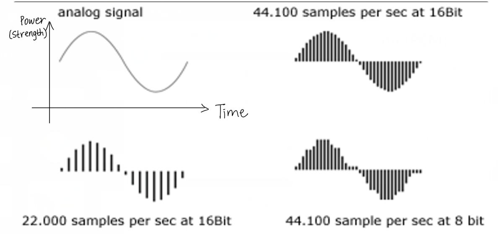

# Introduction

### Why multimedia?

* Multimedia is cool
  * Media -> Multimedia
    * Media: any thing can convey information is a media. 
    * e.g. text, pictures, audio, video, AR, VR. 
    * Combine these together -> multimedia. 
    * Single one is just media, not multimedia, but boundary is not that clear. 
  * Everywhere
    * Everything captured in real world will transferred to signals.
  * Requires broad knowledge in mathematics, signal processing, communications, networking, software, hardware, ...
  * You are paid to watch movies at your office!
    * What kind of resolution in this movie? 
    * What kinds of coding in this movie?
    * What kind of camera using in this movie?
    * How many tracks of this sound?
* Job opportunities
  * Multimedia is a booming industry
  * Tons of opportunities created by next-generation standards and emerging applications:
    * image compression standard: JPEG / JPEG 2000 
      * PNG using the same underlying technique
    * video/audio compression standard: MPEG-1/2/4    H.264/265/HEVC    4K/8K UHD    3D/freeview
      * UHD = Ultra High Definition
    * Communication: 3G/4G/5G mobile communications
    * Multimedia-enabled smartphone, tablets
    * Social media, Cloud media, Crowd media
    * Cloud media - store things in cloud, interactive with cloud, like Zoom meeting. 
    * Crowd media - everyone can generate their own content, like Youtube, you can record a video by OBS and upload it.
    * Online gaming
      * much higher demand - computation, communication
      * sensitive to the quality, sensitive to delay

### Multimedia Example

* 1G / 2G around 2000
* audio is good enough in 2G
* Old: NTT DoCoMo 3G Mobile Phone:
  * launch in 2001
  * 99% coverage in Japan as of March 2004
  * Up to 384 kbps video downloading
  * 40 times faster than 2G network (comparable to ADSL)
  * Telus using ADSL
* New: 4G LTE Mobile Phone:
  * 100 Mbps stationary
  * allow 3D virtual reality and interactive video / hologram images 
  * Commercial service since in 2010
  * 97% of the population in Canada now
* Even newer: 5G
  * speed: 1 Gbps/s
  * less than 10~50 milliseconds delay
  * VR/AR/Car …
    * Augmented Reality 增强现实技术
* Web2.0/Media streaming (Internet TV)
  * difference with Web1.0: interaction (交互), user can generate their own content on Internet. 
  * YouTube, Netflix, Twitch, TikTok
  * 4K/8K/16K HD/UHD video? 
  * 3D/360 degree video ?
* E-commerce
  * Ebay, Amazon, Craigslist, Groupon
* Online game
  * PS, XBOX, Switch
* …
* Social networking (2004-)
  * Facebook, Twitter …
  * Instagram, TikTok …
  * WhatsApp, Wechat …
* AR/VR
* AI

### Multimedia Companies

* Microsoft
* Intel
* AMD
* Adobe
* Apple
* Amazon
* Google
* Facebook
* Twitter
* Zoom
* Sony
* NVidia
* Philips
* Twitch
* YouTube
* Netflix
* Huawei
* Qualcomm
* …


### What are the objectives of this course?

* Understand what behind the interface
  * Behind BluRay, HD TV, mp3, mp4, flac, raw, jpeg? ...
  * 3D, 4K/8K UHD TV?
  
* Process multimedia data by yourself (programming projects)

* Have fun!
  
  * What a life without multimedia?
  
    * A PC with black-white monitor only ...
  
    
  
* To understand the methods for multimedia **representation** and **compression**

  * *Representation* (audio/video)
    * Digitization - input signal is analog, eg, audio from microphone, video from CCD, quantities them, make them discrete numbers, this process is called digitization, also involve sampling. (the data captured by this method is quite big., eg. raw image).
    * Quantization 量子化 - make the analog discrete numbers. The process is also called sampling. The data captured by this method can be quite big, eg, raw image - it contains all the information. 
  * *Compression* (audio/video)
    * Transform - initial sample of each pixel of an image or video, if manipulate directly on these pixels, it would be difficult. So you need to transform them into frequency domain (频率范围，频域). For sound, you have time domain samples, so that the sound contains different frequencies, and these frequencies are easier to manipulate, and later compress.
    * Entropy Coding (平均信息量代码) - The representative of information in term of bits. Based on this, we know that how much information is redundant in original data representation, and how much information is necessary to be captured. (e.g. arithmetic coding)
    * Coding Standards - mp3, JEPG, mp4

* To study the issues in multimedia **communications**

  * QoS Requirements
    *  QoS (Quality of Service) is measure by delay, by bandwidth, by loss rate, etc.
  * Network Protocols
    * TCP
    * UDP
    * IP - lower layer
    * RTP - high layer 
    * ...
  * Streaming Media
    * downloading & playing at the same time

* Multimedia database

  * Organization
  * Retrieval - multimedia retrieval
    * based on tag. eg, Google search
    * Machine Learning, e.g. search pictures

* To help you survive a job interview in multimedia

  * Programming assignments
  * C, C++, Java, Matlab could be involved

## What is "media"?

* Information represented in different formats/media (以不同格式/媒体表示的信息)
  * **Discrete** media: time independent - this time you look at it, and next time you look at it, it's same.
    * text
    * graphics
    * images
  * **Continuous** media: time dependent 
    * animation
    * audio
    * video
* Analog vs. Digital
  * **analog format**: the time-varying feature (variable) of the signal (信号的时变特征) is a continuous representation of the input, i.e., analogous to the input audio, image(continuous over the space), or video(continuous over time and space) signal.
  * **digital format** - everything will be discrete
    * don't confuse with with discrete and continuous media (this is the types of the media)
    * analog / digital is the format
    * 一个是种类，一个是格式，不要混淆
  * **Physical world is analog**!

### Hyper Text, Hypermedia

* A **hypertext** system: meant to be read *<u>nonlinearly</u>*, by following links that point to other parts of the document, or to other documents. 

   

* HTML / XML

```html
<HTML>
    <HEAD>
        <TITLE>A sample web page.</TITLE>
        <META NAME="Author" CONTENT="Professor" />
    </HEAD>
    <BODY>
        <P>
            We can put any text we like here, since this is a paragraph element.
        </P>
    </BODY>
</HTML>
```

* **HyperMedia**

  * not constrained to be text-based, can include other media, e.g., graphics, images, and especially the continuous media: sound and video. 
  * World Wide Web (WWW) --- the best example 

  
  
  * **超媒体**是一种采用<u>非线性</u>网状结构对块状多媒体信息（包括文本、图像、视频等）进行组织和管理的技术。 超媒体在本质上和超文本是一样的，只不过超文本技术在诞生的初期管理的对象是纯文本，所以叫做超文本。 随着多媒体技术的兴起和发展，超文本技术的管理对象从纯文本扩展到多媒体，为强调管理对象的变化，就产生了超媒体这个词。

### Multimedia System

* Multimedia
  * information represented through a combination of different media (audio, graphics, images, video, and animation) in an integrated and interactive manner (as contrast to traditional single-modality media, i.e., text and graphics drawing).

* Multimedia system
  * the generation, manipulation, storage, presentation, and communication of multimedia information. (多媒体信息的生成，处理，存储，表示和通信)

### Digital Media

* Multimedia digitized
  * Captured, stored, transmitted, processing in digital (discrete) domain
    * represented by binary numbers
  * By general purpose computers or dedicated embedded computers (专用嵌入式计算机)
    * Today's digital cameras' have a number of CPUs inside, many of which are more powerful than a PC of 1990's or even 2000's.

* What do you mean by **digitized**?
  * The real world is analog, all our feelings are analog. But computers can only represent integers, a series of binary numbers. So there is a gap between real world and computers, so we have to make those continuous signal to discontinuous signal so that they can be stored and processed in computers, this means digitization.
* Why **digitized**?
  * computers can only represent integers, a series of binary numbers.
  * Old analog devices are extremely expensive and extremely difficult to use, only professionals can use them.

### (Digital/Computer) Multimedia Systems

* Using computers to present and process multimedia information, in an integrated and interactive manner. 
* Examples of Multimedia Systems: 
  * Digital camera / camcord
  * World Wide Web
  * Video conferencing 视频会议
  * Video-on-demand 视频点播
  * Interactive TV 互动电视
  * Online games
  * Virtual reality
  * Digital video editing and production systems
  * Multimedia Database systems
  * Social media

### Different Views

* (Multimedia) Different views from different people
  * <u>A PC vendor</u>: a PC that has sound capability, a DVD/BluRay drive, and perhaps the superiority(优势) of multimedia-enabled CPU/GPU (Graphical Processing Unit) that understand additional multimedia instructions. (Now, all PCs, even cell phones are multimedia-enabled, but back to 15~20 years ago, these are not necessary, no video card, some no sound card)
  * <u>A consumer entertainment vendor</u>: interactive cable TV(互动有线电视) with hundreds of digital channels available, or a cable TV-like service delivered over a high-speed Internet/wireless connection. 
  * <u>A computer Science (CS) student</u>: applications that use multiple modalities (使用多种模式的应用程序), including text, images, drawings (graphics), animation, video, sound including speech; **integration** and **interactivity**. 
* Multimedia and Computer Science: 
  * **Data representation compression** - focus of this course, this is the foundation of graphics, visualization, computer vision
  * Graphics, visualization, computer vision
  * Networking, database systems

### Multimedia Research Topics and Projects

To the computer science researcher, multimedia consists of a wide variety of topics: 

1. **Multimedia processing and coding**
   * multimedia content analysis
   * content-based multimedia retrieval
   * multimedia security
   * audio/image/video processing 
   * compression
2. **Multimedia system support and networking**
   * network protocols 
   * Internet
   * operating systems
   * servers and clients
   * quality of service (QoS)
   * databases
3. **Multimedia tools, end-systems and applications**
   * hypermedia systems
   * user interfaces
   * authoring systems
4. **Multi-modal interaction and integration**
   * web-everywhere devices
   * multimedia education including Computer Supported Collaborative Learning
   * design and applications of virtual environments

### History of Multimedia

1. **Newspaper**
   * perhaps the first mass communication medium, uses text, graphics, and images.
2. **Motion pictures**
   * conceived(构思) of in the 1830's in order to observe motion too rapid for perception by the human eye. 
3. **Wireless radio transmission**
   * Gugliemo Marconi (古格里莫·马可尼), at Pontecchio, Italy, in 1895.
4. **Television**
   * the new medium for the 20th century, established video as a commonly available medium and has since changed the world of mass communications.
5. **Computers**
   * the *connection* between *computers* and ideas about *multimedia* covers what is actually only a short period: 1945 -- Vannevar Bush wrote a landmark article describing what amounts to a hypermedia system called **Memex**. 

| Year | 事件                                                         |
| ---- | ------------------------------------------------------------ |
| 1960 | Ted Nelson coined the term **hypertext**.                    |
| 1967 | Nicholas Negroponte formed the **Architecture Machine Group**. |
| 1968 | Douglas Engelbart demonstrated the **On-Line System (NLS)** (此处可能是Non-Linear System 非线性系统). |
| 1969 | Nelson and van Dam at Brown University created an early hypertext editor called **FRESS**. |
| 1976 | The MIT Architecture Machine Group proposed a project entitled **Multiple Media**: resulted in the *Aspen Movie Map* (白杨树镇电影地图), the first hypermedia videodisk, in 1978. |
| 1985 | Negroponte and Wiesner co-founded the **MIT Media Lab**.     |
| 1989 | Tim Berners-Lee proposed the **World Wide Web**              |
| 1990 | Kristina Hooper Woolsey headed the **Apple Multimedia Lab**. |
| 1991 | **MPEG-1** was approved as an international standard for digital  video - led to the newer standards, **MPEG-2**, **MPEG-4**, and further **MPEGs** in the 1990s. |
| 1991 | The introduction of **PDAs** in 1991 began a new period in the use  of computers in multimedia. |
| 1992 | **JPEG** was accepted as the international standard for digital  image compression - led to the new JPEG2000 standard. (JPEG still used in modern cameras, but JPEG2000 never really widely used) |
| 1992 | The first **MBone** audio multicast(多路广播) on the Net was made. |
| 1993 | The University of Illinois National Center for  Supercomputing Applications produced **NCSA Mosaic  -**the first full fledged browser. (NCSA Mosaic is the early version of FireFox) |
| 1994 | Jim Clark and Marc Andreessen created the **Netscape**       |
| 1995 | The **JAVA** language was created for platform-  independent application development. |
| 1996 | **DVD video** was introduced; high quality full-length  movies were distributed on a single disk. |
| 1998 | **XML** 1.0 was announced as a W3C Recommendation.           |
| 1998 | **Hand-held MP3 devices** first made inroads(涉足) into  consumerist(消费者的) tastes in the fall of 1998, with the  introduction of devices holding 32MB of flash memory. |
| 2000 | WWW size was estimated at over **1 billion pages**.          |
| 2001 | The first peer-to-peer file sharing system, Napster, was shut down by court order. |
| 2001 | First commercial 3G wireless network. (first one that can really support some multimedia data transmission and processing and play back) (2G is not enough to support the functionality and the speed) |
| 2003 | Skype: free peer-to-peer voice over the Internet.            |
| 2004 | Web 2.0 promotes user collaboration and interaction. Examples include social networking, blogs, wikis. |
| 2004 | Facebook founded                                             |
| 2004 | Flickr founded                                               |
| 2005 | YouTube created                                              |
| 2005 | Google launched online maps (online map is the foundation of location based computing, with online map, you can do a lot of location based services and social networking, self-driving system) |
| 2006 | Twitter created: 500 million users in 2012, 340 million tweets/day. |
| 2006 | Amazon launched its cloud computing platform.                |
| 2006 | Nintendo introduced the Wii home video game console -- can detect movement in three dimensions. |
| 2007 | Apple launched iPhone, running the iOS mobile operating system. . |
| 2007 | Google launched Android mobile operating system.             |
| 2009 | The first LTE (Long Term Evolution长期演变) network was set, an important step toward 4G wireless networking. (3G is experimental, 4G = 4th generation, even numbers are stable generation) |
| 2009 | James Cameron's film, Avatar, a surge on the interest in 3D video. |
| 2010 | Netflix migrated its infrastructure to the Amazon's cloud computing platform. |
| 2010 | Microsoft introduced Kinect, a horizontal bar with full-body(全身) 3D motion capture, facial recognition and voice recognition capabilities, for its game console Xbox 360. |
| 2012 | HTML5 subsumes the previous version, HTML4. Able to run on low powered devices such as smartphones and tablets. (HTML 4 early versions are designed for desktop PCs, you need dedicated or more general HTML language that independent platforms) |
| 2013 | Twitter offered Vine, a mobile app that enables its users to create and post (ultra) short video clips (less than 6s). |
| 2013 | Sony released its PlayStation 4, a video game console, which is to be integrated with Gaikai, a cloud-based gaming service. (You don't have to buy games as DVD roams and you can play everything over the cloud. You don't have to invents to infrastructure(the game console), you pay when you use it. The problem here is delay, since it's on cloud) |
| 2013 | 4K resolution TV started to be available in the consumer market. (Before 4K, we have High Definition TV, which is 1080p = horizontal pixels is 1080 pixels.) (4K means the pixels are near 4000, 4 times bigger on both horizontal and vertical) |
| 2015 | YouTube launched support for publishing and viewing 360-degree videos. |
| 2015 | AlphaGo, a computer program that plays the board game Go, became the first program to beat a human professional player. The event attracted significant attention from the general public, particular on its core technology, *deep learning*, which, in the coming years, has seen success in multimedia content understanding and generation. (facial recognition, voice recognition) |
| 2016 | HoloLens, a pair of mixed reality smartglasses developed and manufactured by Microsoft, started to be available in the market. |
| 2016 | Pokémon Go, an augmented reality (AR 增强现实, better or more than reality, is a location based service) mobile game, was released and credited with popularizing location-based and AR technologies. |
| 2016 | Netflix completely migrated to the Amazon AWS cloud platform, so for Skype to move to the Microsoft Azure platform. (Skype used p2p before) |
| 2017 | TikTok, a video-sharing social networking service for creating and sharing short lip-sync(嘴唇同步), comedy, and talent videos, was launched for the global market (it's Chinese version, Douyin, was launched in 2016). |
| 2018 | World's first 16K Ultra High Definition (UHD) short video film, Prairie Wind, was created. |
| 2019 | 5G cellular(蜂窝网络) systems started deployment(部署，展开), providing enhanced mobile broadband(宽带) and ultra low latency access. (5G is for wide area coverage, cellular technology, base stations, city wide, even country, or international wide) |
| 2019 | WiFi 6 (802.11ax) standard was released, offering theoretical maximum throughput of 1 Gbps. (WiFi is local network, using your own access point in your home or office building, within 100m) |
| 2020 | Due to the outbreak of coronavirus (COVID-19) around the world, work/study from home became a norm in early 2020. Multimedia-empowered online meeting and teaching tools, e.g., Zoom, Google Class, and Microsoft Teams, have seen booming use during this period. |

* Year 2000 - your time ...
* Image/Audio
  * Huge/cheap HDD/SSD
  * High bandwidth/unlimited data plan
    * 3G/4G/5G
    * ADSL. Fiber
  * Cloud/data center
  * No worry anymore?
    * 4K-8K UHD (ultra-high definition) - 48-200 Gbps uncompressed
      * The size is too big, finding a way to efficiently compress it and transmit it is what we study.
    * VR/AR
      * 16K video
      * Near zero delay

### Past Decade

* Skype/YouTube/Netflix
  * Replacing phone, movie theatre, TV!
* AR/VR immersive media
  * Pokémon Go!
  * MS HoloLens
* Cloud gaming
  * OnLive
  * Gaikai
  * Sony
* Livecast
  * Twitch.tv
  * eSports broadcast
* Drone/self-driving car
* Deep learning

      

### Digital Media Timeline

* Before 1985, there's not many activities because the tech of computer at that time is not powerful, especially PC
* after 1985, there are two streams to deliver multimedia
  * upper: network and computing
    * RTSP still using
  * lower: coding, process & compress & decode
    * MPEG-1: VCD
    * MPEG-2: DVD, HDTV


## Multimedia Representation

* Representation depends on who is the processor
  * human being - analog 
  * computers - digitization

### Audio Digitization (PCM)



* Computer is discrete
  * The time and power axis are both discrete
  * For time digitization, sample the strength of the power at each time
    * the short the time interval, the more sample you will take
* 图上 8 bit / 16 bit 说的是： sample精度，用多少bits去表示这个sample

### Digital Media

* What do you mean by **digitized**?
  * Audio/visual signals from the natural world is Analog
    * continuous in time and space
    * conventional storage/playback: LP (audio record)((每面通常播放约25分钟)密纹唱片 long-playing record), tape, CRT TV (old TV)(显像管电视机), film
    * can't be handled by computer
  * A/D conversion 模拟数字转换
    * to 1/0 discrete signals
* Why **digitized**?
  * Bulky storage 大容量储存(space, cost, lifetime)
  * poor quality - analog 
  * poor/no compression
  * poor portability(可移植性)/mobility(移动性)/editability
    * MP3 player, iPod, YouTube? No way
    * Film -> Polaroid (拍立得) -> Digital camera

### Sampling Rate 采样率

* Sampling theory - Nyquist theorem 奈奎斯特定理

  在数字信号处理领域中，采样定理是连续时间信号（通常称为“模拟信号”）和离散时间信号（通常称为“数字信号”）之间的基本桥梁。该定理说明采样频率与信号频谱之间的关系，是连续信号离散化的基本依据。 它为采样率建立了一个足够的条件，该采样率允许离散采样序列从有限带宽的连续时间信号中捕获所有信息。

 

### Image/Video Digitization

* Digital image is a 2D array of pixels

* Each pixel represented by bits

  * R:G:B 

    

  * Y:U:V 

    * Y = 0.299R + 0.587G + 0.114B (Luminance or Brightness) 亮度，也作为灰度的参数，没有下面两个的话，这个是黑白的
    * U = B - Y (Chrominance 1, color difference) 色度
    * V = R - Y (Chrominance 2, color difference)

* Video is sequence of images (frames) displayed at constant frame rate

  * e.g. 24 images / sec

## Multimedia Compression

### Why Compression?

* Multimedia data are too big

  * "A picture is worth a thousand words!"

* File sizes for a **One-minute** Audio CD Clip

  | Sampling Rate | Resolution | Channels | Bit-rate (bps) | File Size (Bytes) |
  | ------------- | ---------- | -------- | -------------- | ----------------- |
  | 44,100 Hz     | 16 bits    | 2        | 1,411,200      | **10,584,000**    |

* File sizes for a **one-minute** QCIF video clip

  | Frame Rate    | Frame Size       | Bits/pixel | Bit-rate (bps) | File Size (Bytes) |
  | ------------- | ---------------- | ---------- | -------------- | ----------------- |
  | 30 frames/sec | 176 x 144 pixels | 12         | 9,123,840      | **68,428,800**    |

### Data Compression


* lossless compression: X' = X
  * example: computer file compression
  * low compression ratio
  * compression ratio is bounded by the data to be compressed
    * If the data is very rich information, you compress it with winzip and use winzip again, you may have a even bigger file because there are headers added to the file when compressing.
* lossy compression: X' ≠ X
  * many applications do not require lossless compression
  * our eyes and ears cannot identify some details
  * high compression ratio
  * in the situation that there are some data in the file that cannot be sensed by human, e.g. infrared ray (红外线), we can delete them when compressing, but then we still have a good-quality file.

#### Essential of Compression

* Remove redundant information

  * **spatial** redundancy (空间冗余) - neighboring samples have similar values
    * so we can use just one original value, and delete others 
* **temporal** redundancy (时间冗余) - neighboring frames in a video sequence are similar
    * so we can just record the difference
    
  
  

#### A Typical Image Compression System


* Transform
  * exploit the spatial redundancy (利用空间冗余): DCT (Discrete Cosine Transform), Wavelet(微波), lapped transform (重置变换)
* Quantization 数字化
  * eliminate smaller coefficients that cannot be perceived (消除无法感知的较小系数)
    * To make the person on the photo: skin brighter, smooth, we can do something here 
    * eliminate smaller coefficients =(essentially, mathematically) = remove the high frequency component
      * e.g. YUV: make the photo brighter = make the Y component bigger
* Entropy coding 平均信息量代码
  * Huffman or arithmetic coding: assign shorter codes to more probable symbols.  (霍夫曼编码或算术编码：将较短的代码分配给更多可能的符号)
* Compressed bitstream
  * finally we get the compressed bitstream

#### Decoder


* Communications channel 沟通渠道
  * if the file stored in disk - use the **computer bus** to the graphic cards, and display over screen
  * if the file is on phone - use network, then the communication channel is yoru **4G/5G** links or the **Internet** 

#### A typical video compression system


* notice that the left bottom of the picture, the shoulder moves to right as time goes by. This motion means you cannot just blindly compare the blocks at the same position in these photos, but also estimate the motion (one of the hardest thing in video compression).

#### Compression Standards

* why standards?
  * a standard allows products from multiple vendors to communicate 
    * yet, users have flexibility in selecting equipment or software
  * assures a large market for a particular piece of equipment or software (确保特定设备或软件的广阔市场)
    * encourages mass production, VLSI (Very Large Scale Integration 超大规模集成电路) technologies etc.
    * lower costs
  * patent war! 专利战 (standards essentially is only good for the company with the patent)
    * Qualcomm(一家美国科技公司), InterDigital
    * They push their patents/algorithm into the standards process, later every hardware / software company has to follow this kind of standards and therefore cannot avoid their patent.
* standard does not prevent innovation (?)
  * **only decoder is specified by the standard.**
  * encoder can still be improved. 
    * that's the reason why some graphic cards are better than others, because they use different encoding method, which causes different encoding quality or encoding speed
  * example: MPEG-2
    * bit rate has been reduced from 8Mbps in 1994 to 2Mbps now, offering the same quality.

#### Standardization Bodies

* ITU: International Telecommunications Union
  * H.264
  * ITU-T: ITU Telecommunication Standardization Sector (CCITT)
* ISO: International Standards Organization
* IEC: International Electro-technical Commission
  * ISO and IEC work together for image and video coding, e.g. JPEG, MPEG, digital cameras, DVDs, Blue Rays, digital HD TVs
* SMPTE: Society of Motion Picture and Television Engineers

* JPEG (ISO/IEC Joint Photographic Experts Group)
* JBIG (ISO Joint Bi-level Image Experts Group)
* MPEG (ISO Motion Picture Experts Group) (e.g. MP4 is the MPEG 4 standard)
* VCEG (ITU-T Video Coding Experts Group)

#### Image Coding Standards

* JPEG:1993 (JPG file format)
  * DCT-based block transform
* JPEG2000: Dec. 2000
  * Wavelet-based (基于微波的)
  * Much more complicated than JPEG
* JBIG: Joint Bi-level Image Experts Group (1993)
  * for lossless bi-level image compression (fax)
  * can also be used for grayscale images
* JBIG2: 1999
  * Supports both lossless and lossy compression
  * also for fax, but fax machine is not that popular

#### Video Coding Standards


* H.264/AVC: ITU-T H.264 / MPEG-4 (Part 10) Advanced Video Coding (AVC)
  * Finalized in May 2003 (for general purpose)
  * Fidelity Range Extensions (FRExt): 2003-2004 (for professional)


* H.265/HEVC (High Efficiency video coding)
  * 50% goal (bitrate reduction)
  * Start from 2010
  * February 2012: Committee Draft (complete draft of standard)
  * July 2012: Draft International Standard
  * January 2013: Final Draft International Standard (ready to be ratified(批准) as a Standard)
  * April 2013: Standard released
* Google VP9 ? H. 266?
  * YouTube are using VP8. 
  * The mathematical / principle behind VP9 is similar to H.265 

#### Coding Rate and Standards


#### Audio coding standards

Range of human hearing: 20Hz - 20kHz 	->	Minimal sampling rate: 20kHz (Nyquist frequency)

The examples below using sampling rate that much higher than human hearing (which is called ultrasound), since the data may used by not only human, but also machines.

| format    | bit depth | sampling rate | bit rate (2 channels) |
| --------- | --------- | ------------- | --------------------- |
| CD Audio  | 16 bits   | 44.1 kHz      | 1,411,200 bps         |
| DVD Audio | 24 bits   | 96 kHz        | 4,608,000 bps         |

* MPEG-1 audio layer 3 (MP3)
  * CD quality at 10 : 1 compression ratio.
  * MPEG standard is for motion pictures, e.g. movies, TV programs
  * MPEG have 2 parts, 1 is audio, 1 is video, and video have several layers in term of complexity and efficiency
* MPEG-2 AAC (advanced audio coding):
  * used by XM Radio (satellite radio in US)
* MPEG-4 AAC: 
  * up to 48 channels, 96kHz
* ATSC AC-3: 1994
  * Dolby Digital (5.1 channel)
  * ATSC: Advanced Television Systems Committee
  * For DTV, DVD
* iTunes
  * AAC
  * AIFF (Audio Interchange file Format)
* IETF OPUS / 3GPP EVS (Enhanced Voice Service 增强语音服务)

## Multimedia communications

* Examples of Multimedia Communication Systems
  * World Wide Web
  * Video conferencing
  * Video-on-demand 视频点播
  * Interactive TV
  * Online games

#### Fundamental Characteristics

* Typically **delay sensitive**
  * stored media - not delay sensitive 
  * online media - yes!!
* but can **tolerate occasional loss**
  * infrequent losses cause minor glitches
  * multimedia is tolerate loss, minor glitch
* Cf. data transmission: (e.g. FTP = file transfer protocol)
  * loss intolerant but delay tolerant
  * email cannot tolerate loss

#### Challenges in Multimedia Communications

* Transmission of Compressed Multimedia
  * real-time communications
    * delay < 0.4 sec in video conference
  * sequencing within the media 媒体内排序
  * synchronization (e.g., between video & audio) - multimedia is time synchronization stream
  * robustness to transmission error 传输误差的稳健性
* We will learn how to transmit multimedia over Internet and wireless network


#### Internet

* packet-switched network
* network resources are shared
* each packet is handled by a series of routers before being received
* packets can be discarded if the buffer of a router is full
* all packets are treated the same way in congestion (don't distinguish video and audio)


#### Internet protocol stack

* IP: Internet Protocol
  * best effort (unreliable)!
* TCP: Transmission Control Protocol
  * provides reliable (but slow) service
* UDP: User Datagram Protocol
  * provides unreliable (but fast) service
  * suitable for real-time application
* RTP: Real-time Transport Protocol
  * packet format for multimedia streams
* RTCP: RTP control protocol
  * Monitor/report service quality
* RTSP: Real-time streaming protocol
  * "Internet VCR remote control"
* HTTP streaming
  * DASH - Dynamic Adaptive Streaming over HTTP 基于HTTP的动态自适应流
* Web RTC


#### Quality of Service (QoS) Parameters

* End-to-end delay
  * time required for the end-to-end transmission of a single data element
* Jitter (电子信号等)晃动
  * variation in delay
  * if the delay is significantly varies over time, you don't know how much will be buffer, that is called jitter
* Packet loss rate 
  * the proportion of data elements that are dropped
* Bandwidth / throughput: bits / second (bps)
  * rate of flow of multimedia data

#### QoS Control

* Algorithms to improve the QoS of Multimedia applications 
* Policing 监督管制
  * control the input rate to network (leak bucket model 漏桶模型)
* Scheduling
  * Divide buffers into logic queue
  * Decide which queue to service next

#### Error Resilience 容错能力

* Improve the decoded quality in the presence of lost data
  
  * The error can be: packet lost or bit errors
  * often occurs in wireless networks (and also Internet)
  
* add redundancy at encoder:
  * error correction code
  * layered coding
  * multiple description coding
    * devices have multiple antennas, each antenna generate one description code 
  
* post-processing at decoder to hide the error (在解码器中进行后处理以隐藏错误)
  
  * error concealment 错误隐藏
  
* an e.g. of layered coding

  * if a layer is lost, we can still recover / recognize it 

  

## Popular multimedia tools

### Popular multimedia software tools

* the categories of software tools briefly examined here are:
  1. Music Sequencing and Notation 音乐排序和记谱法
  2. Digital Audio 
  3. Graphics and Image Editing
  4. Video Editing
  5. Animation
  6. Multimedia Authoring 多媒体创作

### Digital Audio

* **Digital Audio** tools deal with accessing and editing the actual sampled sounds that make up audio:
* **Cakewalk Pro Audio** / **Adobe Audition (formerly Cool Edit Pro)** 
  * powerful and popular digital audio toolkits; emulates a professional audio studio --- multitrack productions and sound editing including digital signal processing effects. 
  * 
* **Pro Tools**
  * a high-end integrated audio production and editing environment | MIDI creation and manipulation powerful audio mixing, recording, and editing software
* **Anvil Studio**
  * free, for MIDI = Musical Instrument Digital Interface 音乐设备数字接口

### Graphics and Image/Photo Editing

* **Adobe Photoshop**
  * "Standard" image processing and manipulation tool
  * allows layers of images, graphics, and text that can be separately manipulated for maximum flexibility.
* **GIMP** 
  * GNU Image Manipulation Program (free)
* **Adobe Illustrator**
  * a powerful publishing tool from Adobe
  * uses vector graphics, graphics can be exported to Web.

### Non-Linear Video Editing

* **Adobe Premiere**
  * an intuitive, simple video editing tool for nonlinear editing, ie, putting video clips into any order: video and audio are arranged in \tracks".
  * provides a large number of video and audio tracks, superimpositions(叠加) and virtual clips.
  * a large library of built-in transitions, filters and motions for clips, effective multimedia productions with little effort. 

### Rendering and Animation

* **Autodesk 3ds Max**
  * Rendering tool that includes a number of very high-end professional tools for character animation, game development, and visual effects production. 
* **Autodesk Maya**
  * end-to-end creative workflow with comprehensive tools for animation, modeling, simulation, visual effects, rendering, match moving, and compositing on a highly extensible production platform. 

### Multimedia Authoring

* **Adobe Flash**
  * Allows users to create interactive movies by using the score metaphor, i.e., a timeline arranged in parallel event sequences. 
* **Adobe Director (discontinued from 2017)**
  * uses a movie metaphor to create interactive presentations
  * very powerful and includes a built-in scripting language, **Lingo**, that allows creation of complex interactive movies
* **Authorware (used to be popular, but discontinued from 2003)**
  * a mature, well-supported authoring product based on the **Iconic/Flow-control** metaphor

### Multimedia API

* **DirectX**
  * Windows API that supports video, images, audio and 3-D animation
* **OpenGL**
  * a highly portable, most popular 3-D API in use today.
* **Java3D**
  * API used by Java to construct and render 3D graphics, similar to the way in which the Java Media Framework is used for handling media files. 
  * an abstraction layer built on top of OpenGL or DirectX (the user can select which).
  * provides a basic set of object primitives (cube, splines, etc.) for building scenes. 
* Android multimedia API/iOS multimedia API

### Grand Challenge Problems

* **Social Event Detection for Social Multimedia**: discovering social events planned and attended by people.
* **Search and Hyperlinking of Television Content**: finding relevant video segments for a particular subject and generating useful hyperlinks for each of these segments.
* **Geo-coordinate Prediction for Social Multimedia**: estimating the GPS coordinates of images and videos. (估计图像和视频的GPS坐标)
* **Violent Scenes Detection in Film**: automatic detecting. 
* **Preserving Privacy in Surveillance Videos (在监控视频中保护隐私)**: methods obscuring(遮掩) private information (such as faces on Google Earth).
* **Spoken Term Web Search**: searching for audio content within audio content by using an audio query.
* **Question Answering for the Spoken Web**: a variant on the above, specifically for matching spoken questions with a collection of spoken answers.
* **Soundtrack Selection for Commercials**: choosing the most suitable music soundtrack from a list of candidates.

## Summery

* Topics to be covered:
  * Media representation
    * Audio/Image/Video
  * Media Compression:
    * Digital media signals
    * Entropy coding: Huffman, arithmetic, Golumb-Rice
    * Quantization
    * Transform: KLT, DCT, Wavelet, Lapped Transform
    * Coding standards: JPEG, MPEG, MP3, H.264
  * Multimedia Transmission:
    * Internet Protocols
    * Multimedia QoS
    * QoS Control
    * Error Resilience
  * Multimedia database and retrieval