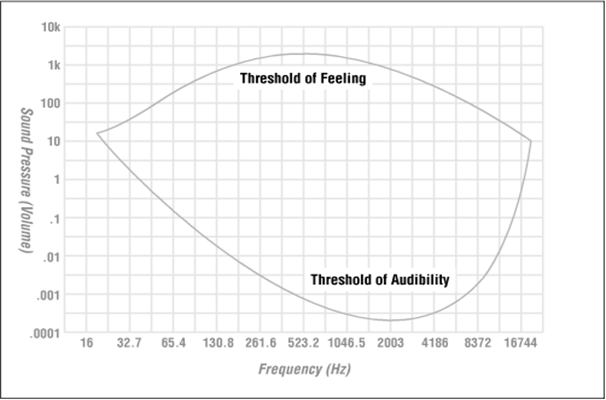

# Media Representations - Audio

* Audio Signals
  * Sampling
  * Quantization
* Audio file format
  * WAV/MIDI
* Human auditory system 

## Audio Signals

### What is Sound?

* Sound is a wave phenomenon, involving molecules of air being compressed and expanded under the action of some physical device.
  * A speaker (or other sound generator) vibrates back and forth and produces a *longitudinal* pressure wave that perceived as sound.
  * Since sound is a pressure wave, it takes on continuous values, as opposed to digitized ones.
    * If we wish to use a digital version of sound waves, we must form digitized representations of audio information.

### Sound Recording and Reproducing

* Thomas Edison's Phonograph 1877 
  * first device to record and reproduce sound
  * Medium: a tinfoil sheet phonograph cylinder.
* Alexander Graham Bell's improvement in 1880s (电话发明者)
* Emile Berliner’s gramophone 
  * double-sided discs 
* Audio tapes, and later Compact Disc (CD)

### Physical World is often Analog !

* Microphone - capture analog sounds, translate the analog sound into electrical signals by coil(线圈)

  

* Speaker - translate electrical signals to analog (exactly the reverse operation with microphone)

   

* 电信号也算是一种模拟信号

### Digitization

* 1-dimensional nature of sound: **amplitude** (sound pressure/level) depend on a 1D variable, the **time**. 

  * Input from microphone is analog signal

  

* **Digitization**: conversion to a stream of numbers, and preferably these numbers should be integers for efficiency.

  * in computer, float numbers are also represented by integers

* Digitization must be in both time and amplitude

  * **Sampling**: measuring the quantity we are interested in, usually at evenly-spaced intervals

* First kind of sampling, using measurements only at evenly spaced time intervals, is simply called **sampling**.

  * The rate is called the *sampling frequency*
  * For audio, typically from 8 kHz (8,000 samples per second) to 48 kHz (determined by Nyquist theorem discussed later).

* Sampling in the amplitude or voltage dimension is called **quantization**

##### Sampling and Quantization

(a) - sampling

(b) - quantization


### Audio Digitization (PCM)

PCM = pulse coded modulation 脉冲编码调制


### Parameters in Digitizing

* To decide how to digitize audio data we need to answer the following questions:
  1. What is the sampling rate?
  2. How finely is the data to be quantized, and is quantization uniform(均匀量化)?
     * (How many bits you need?)
  3. How is audio data formatted? (file format)
     * How will the data represent?

### Sampling Rate

* Signals can be decomposed into a sum of sinusoids. 

  ​    -- weighted sinusoids can build up quite a complex signals

  ​         (recall Calculus and linear algebra)

  $f(x) = \sum f'(y)$, any signal (function $f(x)$, x is along the time) can be represented by a series of $sin$ functions with different ways.

  

  e.g. Piano - every key on piano is a sin function, play a series of keys would produce a combined sin function over time

* If sampling rate just equals the actual frequency

  * a false signal (constant ) is detected

* If sample at 1.5 times the actual frequency

  * an incorrect (**alias**) frequency that is lower than the correct one 
    * it is half the correct one (better than previous one) -- the wavelength, from peak to peak, is double that of the actual signal

 

### Nyquist Theorem

* For correct sampling we must use a sampling rate equal to at least *twice the maximum frequency* content in the signal. This rate is called the **Nyquist rate**.
* Sampling theory – Nyquist theorem 

​     If a signal is **band(frequency)-limited**, i.e., there is a lower limit $f_1$ and an upper limit $f_2$ of frequency components in the signal, then the sampling rate should be at least $2(f_2 − f_1)$ or $2f_2$ if $f_1=0$ ($0Hz$ is the natural frequency)

Proof and more math: http://en.wikipedia.org/wiki/Nyquist-Shannon_sampling_theorem

### Quantization (Pulse Code Modulation)

* At every time interval the sound is converted to a digital equivalent
* Using 2 bits the following sound can be digitized
  * Tel: 8 bits
  * CD: 16 bits 


### Digitize audio

* Each sample quantized, i.e., rounded
  * e.g., 28=256 possible quantized values
* Each quantized value represented by bits
  * 8 bits for 256 values
* Example: 8,000 samples/sec, 256 quantized values --> 64,000 bps
* Receiver converts it back to analog signal:
  * some quality reduction
* Example rates
  * CD: 1.411 Mbps
  * MP3: 96, 128, 160 kbps (with compression)
  * Internet telephony: 5.3 - 13 kbps (with compression)

### Audio Quality vs. Data Rate


### More on Quantization

* Quantization is lossy !
* Roundoff errors => **quantization noise/error** 


### Quantization Noise

* **Quantization noise**: the difference between the actual value of the analog signal, for the particular sampling time, and the nearest quantization interval value.
  * At most, this error can be as much as half of the interval.
* The quality of the quantization is characterized by the **Signal to Quantization Noise Ratio** (**SQNR**).
  * A special case of SNR (Signal to Noise Ratio)

### Signal to Noise Ratio (SNR)

* *Signal to Noise Ratio* (**SNR**): the ratio of the power of the correct signal and the noise

  * A common measure of the quality of the signal
  * The ratio can be huge and often non-linear

* So practically, SNR is usually measured in log-scale: decibels (**dB**)(分贝), where 1 dB is 1/10 **Bel**. The SNR value, in units of dB, is defined in terms of base-10 logarithms of squared voltages, as follows:

  

  in Physics, $P = V^2/R$, where $R$ is the resistor and $P$ is the power. so we can use the ratio of voltages to represent power

  $10$ in the front of the formula represent dB, if we delete it, the formula represents bel.

* The actual power in a signal is proportional to the square of the voltage. For example, if the signal voltage $V _{signal}$ is 10 times the noise, then the SNR is $20log_{10}(10)=20dB$.

  * if the power from ten violins is ten times that from one violin playing, then the ratio of power is 10dB, or 1B.

##### Common sound levels (in decibels)

sound level = $20 log_{10}(V_S/V_T)$, where $V_T$ is a constant and $V_S$ is the sound you hear

| common sound                      | levels (in decibels) |
| --------------------------------- | -------------------- |
| Threshold of hearing (最小可听值) | 0                    |
| Rustle of leaves (树叶的沙沙声)   | 10                   |
| Very quiet room                   | 20                   |
| Average room                      | 40                   |
| Conversation                      | 60                   |
| Busy street                       | 70                   |
| Loud radio                        | 80                   |
| Train through station             | 90                   |
| Riveter                           | 100                  |
| Threshold of discomfort           | 120                  |
| Threshold of pain                 | 140                  |
| Damage to ear drum                | 160                  |

* human is sensitive to low level sound, but not that sensitive to high level sound.
  * e.g. for first 5 kind of sounds, it is easy to tell the difference, but we count the rest all as loud sound, so human hearing is non-linear.

### Quantization Noise Ratio

* Aside from any noise that may have been present in the original analog signal, there is also an additional error that results from quantization.

  (a) If voltages are actually in 0 to 1 but we have only 8 bits in which to store values, then effectively we force all continuous values of voltage into only 256 different values.  $ 256 = 2^8$

  (b) This introduces a roundoff **error**. It is not really "noise". Nevertheless it is called **quantization noise** (or quantization error).

### Signal-to-Quantization Noise Ratio (SQNR)

* The quality of the quantization is characterized by the Signal to Quantization Noise Ratio (**SQNR**).

  (a) **Quantization noise**: the difference between the actual value of the analog signal, for the particular sampling time, and the nearest quantization interval value.  

  (b) At most, this error can be as much as half of the interval. (here's the $\frac{1}{2}$ comes from)

* For a quantization accuracy of $N$ bits per sample, the peak SQNR can be simply expressed: 

  ​		

  * $6.02N$ is the worst case. 

Note: We map the maximum signal to $2^{N−1} − 1 (≃ 2^{N−1})$ and the most negative signal to $−2^{N−1}$.

**Dynamic range**: the ratio of maximum to minimum absolute values of the signal: $V_{max}/V_{min}$. 

The max abs. value $V_{max}$ gets mapped to $2^{N−1} − 1$;

 the min abs. value $V_{min}$ gets mapped to 1. $V_{min}$ is the smallest positive voltage that is not masked by noise. 

The most negative signal, $−V_{max}$, is mapped to $−2^{N−1}$.

## Audio file format

### Audio File Format: .WAV

* **Interleaved** multi-channel samples

  en.wikipedia.org/wiki/WAV

  stereo 立体声 - 2 channels


###### Example

Create this figure in Matlab:

```matlab
x = wavread(‘horn.wav’);
plot(x(:, 1));
plot(x(4000:10000, 1));
```


Note: `Wavread()` normalizes the Samples to the range of [-1, 1].

### Audio File Format: MIDI

* **MIDI: Musical Instrument Digital Interface** 乐器数字接口
  * A simple scripting language and hardware setup 
  * **MIDI Overview**
  * MIDI codes “events" that stand for the production of sounds. E.g., a MIDI event might include values for the pitch of a single note (单个音符的音高), its duration, and its volume.
  * MIDI is a standard adopted by the electronic music industry for controlling devices, such as synthesizers (合成器) and sound cards, that produce music.
  * Supported by most sound cards

## Human auditory system

### Computer vs. Ear

* Multimedia signals are interpreted(理解) by humans!
  * Need to understand human perception
* Almost all original multimedia signals are analog signals:
  * A/D conversion is needed for computer processing

 

### Properties of HAS: Human Auditory System

* Range of human' hearing: 20Hz - 20kHz

  * Minimal sampling rate for music: 40 kHz (Nyquist frequency)
  * CD Audio:
    * 44.1 kHz sampling rate
    * each sample is represented by a 16-bit signed integer
    * 2 channels are used to create stereo system
      * 44100 * 16 * 2 = 1,411,200 bits / second (bps)
  * Speech signal: 300 Hz – 4 KHz
    * Minimum sampling rate is 8 KHz (as in telephone system)
    * The extremes of the human voice
      * **http://www.noiseaddicts.com/2009/04/extremes-of-human-voice/**

* Hearing threshold varies dramatically at different frequencies

* Most sensitive around 2KHz

  

  

* Hearing Loss Test
  * http://www.noiseaddicts.com/2010/10/hearing-loss-test/
  * http://www.freemosquitoringtones.org/hearing_test/
* Can you hear like an audio engineer ?
  * http://www.noiseaddicts.com/2010/03/can-you-hear-like-an-audio-engineer/
* Can you hear which is louder ?
* http://www.noiseaddicts.com/2010/03/sound-challenge-can-you-hear-which-is-louder/
* Can I hear ultrasonic ringtones ?
  * http://www.ultrasonic-ringtones.com/
* **Mosquito Ringtones** (>17Khz, not auditable by 30+ age)
  * http://www.noiseaddicts.com/2011/06/mosquito-ringtones/
  * **http://www.freemosquitoringtones.org/**

###### Critical Bands 临界带

* Our brains perceive the sounds through 25 distinct *critical bands*. The bandwidth grows with frequency (above 500Hz).
* At 100Hz, the bandwidth is about 160Hz; 
* At 10kHz it is about 2.5kHz in width. 


###### Masking effect 遮蔽效果

* what we hear depends on what audio environment we are in
* One strong signal can overwhelm/ hide another


The masking effects in the **frequency domain**: A masker inhibits perception  of coexisting signals  below the masking threshold. 

* Masking thresholds in the time domain:

  

  * **Simultaneous masking**: Two sounds occur simultaneously and one is masked by the other.
  * **Backward masking (Pre)**: A softer sound that occurs prior to a loud one will be masked by the louder sound. 
  * **Forward masking (Post)**: softer sounds that occur as much as 200 milliseconds after the loud sound will also be masked.
  * 会发生这些的原因: 人类大脑需要储存处理这些signal，处理中被更强的信号打断，就会忘记之前的，而去处理更强的那个信号，处理这个信号也需要时间，所以即使强信号过后，依然有段时间无法处理较弱的那个信号，即使较弱的信号持续时间比强信号久

### HAS: Audio Filtering

* Prior to sampling and AD (Analog-to-Digital) conversion, the audio signal is also usually *filtered* to remove unwanted frequencies. 
  * For speech, typically from 50Hz to 10kHz is retained, and other frequencies are blocked by the use of a **band-pass filter** that screens out lower and higher frequencies
  * An audio music signal will typically contain from about 20Hz up to 20kHz
  * At the DA converter end, high frequencies may reappear in the output (Why ?)
    * because of sampling and then quantization, smooth input signal is replaced by a series of step functions containing all possible frequencies
  * So at the decoder side, a **lowpass** filter is used after the DA circuit

### HAS: Perceptual audio coding

* The HAS properties can be exploited in audio coding:
  * Different quantizations for different critical bands
    * Subband coding
  * If you can't hear the sound, don't encode it
  * Discard weaker signal if a stronger one exists in the same band (frequency-domain masking)
  * Discard soft sound after a loud sound (time-domain masking)
  * Stereo redundancy: At low frequencies, we can't detect where the sound is coming from. Encode it mono. (立体声冗余：在低频下，我们无法检测到声音的来源。 将其编码为单声道)
* More on later (MP3/AAC/OPUS, FLAC/APE…)