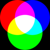
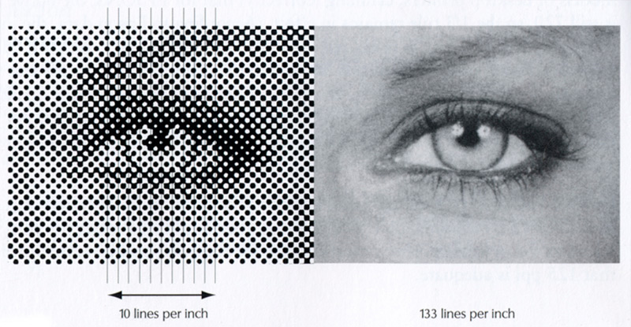

# Media Representations - Image

### What is image / picture?

* A 2D signal
  * X*Y pixels after sampling
  * Captured by CCD/CMOS (Charge Coupled Device 电荷耦合器件) / (Complementary Metal-Oxide-Semiconductor Transistor 互补金属氧化物半导体)
* Each pixel has a color
  * Image (2D)-> Pixel -> Color 
    * color itself is a multi-dimensional vector, unless for black/white (0/1) or grayscale (scalar)

## Color Space: RGB

### Color Space

* Light and Spectra (光谱)

  * **Light** is an electromagnetic wave. Its color is characterized by the wavelength content of the light
    * Short wavelengths produce a blue sensation, long wavelengths produce a red one
  * Laser light consists of a single wavelength: e.g., a ruby laser produces a bright, scarlet-red beam
  * Most light sources produce contributions over many wavelengths
  * However, humans cannot detect all light, just contributions that fall in the "visible wavelengths"

* Visible light

  * Electromagnetic wave in the range 400 nm to 700 nm (where nm stands for nanometer, $10^{−9}$ meters)

  * White light contains all the colors of a rainbow.

    Sir Isaac Newton's experiments. *By permission of the Warden and Fellows, New College, Oxford.*

### Human Visual System


* Three layers:

  * Sclerotic coat (角质层)
    * Includes cornea(角膜)
  * Choroid coat (脉络层)
    * Includes iris(虹膜), pupil(瞳孔)
  * Retina(视网膜): contains light receptors
    * Rods(棒条体)
    * Cones(视锥细胞) that absorb **red light** (long-wavelength)
    * Cones that absorb **green light**
    * Cones that absorb **blue light** (short wavelength)

* All color can be created by mixing basic components

* Different ways of choosing basic color components

  1. RGB Color Space
     * R, G, B components 
     * Usually 8 bits per components: [0, …, 255]
     * Widely used: BMP, TIFF, PPM …
  2. RGBA Color Space
     * RGB with Alpha (for transparency)
     * Used by PNG format

  

  

### PPM and PGM Formats for Raw Images

|                                  | PPM (Portable Pixel Map) 便携式像素映射                   | PGM (Portable Gray Map) 便携式灰色地图                    |
| -------------------------------- | --------------------------------------------------------- | --------------------------------------------------------- |
|                                  | for color images                                          | for grayscale images                                      |
| Fixed  identifier (the 1st byte) | P6                                                        | P5                                                        |
| comment                          | \# optional comments                                      | \# optional comments                                      |
| Image size                       | 512 512                                                   | 512 512                                                   |
| Max value                        | 255                                                       | 255                                                       |
| Binary data                      | (R, G, B) of Pixel (1, 1), (R, G, B) of Pixel (1, 2), … … | Grayscale of Pixel (1, 1), Grayscale of Pixel (1, 2), … … |

* Both can be read by `imread()` in Matlab.
* CRW .CR3 .CR2 file format (Canon RAW) 
* NEF (Nikon RAW)
* DNG (Open source)

For raw image, they have different standards, but just minor difference between different stardards.

For compressed image, they have the unique standard - JPEG

No widely accepted standard yet

##### Other Formats for Raw Images

* .3fr ([Hasselblad](http://en.wikipedia.org/wiki/Hasselblad))
* .ari ([ARRIFLEX](http://en.wikipedia.org/wiki/Arriflex_D-20))
* .arw .srf .sr2 ([Sony](http://en.wikipedia.org/wiki/Sony))
* .bay ([Casio](http://en.wikipedia.org/wiki/Casio))
* .[crw](http://en.wikipedia.org/wiki/Camera_Image_File_Format) .cr2 ([Canon](http://en.wikipedia.org/wiki/Canon_(company)))
* .dcs .dcr .drf .k25 .kdc ([Kodak](http://en.wikipedia.org/wiki/Kodak))
* .erf ([Epson](http://en.wikipedia.org/wiki/Epson))
* .fff ([Imacon](http://en.wikipedia.org/w/index.php?title=Imacon_(company)&action=edit&redlink=1))
* .mef ([Mamiya](http://en.wikipedia.org/wiki/Mamiya))
* .mrw ([Minolta](http://en.wikipedia.org/wiki/Minolta))
* .nef .nrw ([Nikon](http://en.wikipedia.org/wiki/Nikon))
* .[orf](http://en.wikipedia.org/wiki/Orf_format) ([Olympus](http://en.wikipedia.org/wiki/Olympus_Corporation))
* .pef .ptx ([Pentax](http://en.wikipedia.org/wiki/Pentax))
* .pxn ([Logitech](http://en.wikipedia.org/wiki/Logitech))
* .raf ([Fuji](http://en.wikipedia.org/wiki/Fujifilm))
* .raw .rw2 ([Panasonic](http://en.wikipedia.org/wiki/Panasonic))
* .raw .rwl .dng ([Leica](http://en.wikipedia.org/wiki/Leica_Camera))
* .srw ([Samsung](http://en.wikipedia.org/wiki/Samsung))
* .x3f ([Sigma](http://en.wikipedia.org/wiki/Sigma_Corporation))
* Most are variation of TIFF (Tagged Image File Format) -- Adobe as the copyright holder

Standard ? 

ISO 12234-2, [TIFF/EP](http://en.wikipedia.org/wiki/Tag_Image_File_Format_/_Electronic_Photography)?

Adobe's [DNG (Digital Negative)](http://en.wikipedia.org/wiki/Digital_Negative_(file_format))?


## Color Space: YUV and more 

### Color Space

* RGB components of an image are strongly correlated (高度相关)

  * correlated
    * Although R G B are different pictures, they are quite similar, they have many duplicated information (e.g. hat, eye, ... are in all pictures), they are related.

  

  * rich texture - high frequencies
    * but this picture also has low frequency part
    * this picture doesn't have many colors, but it does have rich gray scale (very dark, very bright ones)

  MATLAB code: 

  ```matlab
  x = imread(‘lena.ppm’);
  figure; imshow(x);
  figure; imshow(x(:,:,1));
  figure; imshow(x(:,:,2));
  figure; imshow(x(:,:,3));
  
  Note: 
  Size of x: (512, 512, 3)
  ```

### Color Space: RGB -> YUV

* Solution: convert to other spaces 
* Why ? Display device, compression... is not that perfect using RGB

* YUV represents same color use different bases for the color
  * In YUV space, Y U V have minimum correlation.
* But, RGB is the most suitable one for human


### Color Space

* 3. YUV color space (used by PAL TV system)

  * Y: Luminance component (brightness) 亮度分量

  * U, V: Chrominance components (blue and red) 彩色分量

    * the difference between a color and a reference
    * 任意一种颜色与亮度相同的一个指定的参考色之间的差异，如彩色电视采用白色为参考色

  * white at the same luminance

    * 图中原点是pure white color, 其他点有color difference with same grayscale
    * the pixels on the picture have the same grayscale(brightness level)
    * In Photoshop, you can adjust the centration to make the picture more beautiful. It's quite hard to do this in RGB

    

* 4. **YCrCb** **Space (used in image/video coding)**

  * Derived from YUV
    * U,V shifted by 0.5
  * Components approximately uncorrelated

### YUV Decomposition


### Color space


* RGB are correlated, Y Cb Cr are not 
* Most information is in Y channel (brightness)
  * Cb and Cr are small -> easier for compression
* Human eyes are not sensitive to color error
  * Don't need high resolution for color component

### Color Space: YUV

YUV codes a luminance signal Y ′ - brightness

**Chrominance** refers to the difference between a color and a reference white at the same luminance. → use color differences *U*, *V*:
$$
U = B′ − Y′ , V = R′ − Y′
$$


​	$Y' = 0.299R' + 0.587G' + 0.114B'$

​	$U = -0.299R' + (-0.587)G' + 0.886B'$

​	$V = 0.701R' + (-0.587)G' + (-0.114)B'$

From the equation, the *green* color is more sensitive for human

This matrix is called conversion matrix.

For a gray color, *R′* = *G′* = *B′*, the luminance *Y′* equals to that gray, since 0.299+0.587+0.114 = 1.0. And for a gray (“black and white”) image, the chrominance (*U*, *V* ) is zero.

### Color Space: YCoCg

* Problems of YUV:

  * Floating point implementation (floating calculation in today's computer, it's quite slow)
  * Rounding error during RGB -> YUV -> RGB

* 5. **YCoCg** Space (used in H.264 MPEG/AVC
     * Co: Orange
     * Cg: Green
     * Fixed-point implementation (only add & shift are required)

   

  * Still has rounding error if implemented directly.

* Lossless Implementation via Lifting Steps 通过提升步骤实现无损

  * **Lifting**: elementary matrix row operation

  

* Still reversible when quantization is used in lifting step

  

* Allow integer-to-integer lossless transform

  * since all these are integer calculation

* Lossless implementation of **YCoCg** via Lifting

  

* Cg and Co are scaled by 2

### Color Space: Down-sampling

* Down-sampling color components to improve compression

  

  * Luma sample 亮度样本
  * Chroma sample 色度样本
  * this example is a 4x4 block (modern computers use 8x8, but also has others)

* 1st picture

  * 4x4 pixels
  * YUV 4:4:4 - no down-sampling of Chroma

* 2nd picture

  * X here is the Y in YUV
  * here X still 4x4
  * reduced U V for half size
  * YUV 4:2:2 

* 3rd picture

  * X still 4x4
  * YUV 4:2:0 
  * this is actually 4:1:1, but before this method came up, there's a 4:1:1 exist, so this one cannot use this name

### Raw YUV Data File Format

* In YUV 4:2:0, number of U and V samples are 1/4 of the Y samples

* YUV samples are stored separately: 
  * Image: YYYY…..Y UU…U VV…V
    * (row by row in each channel)
  *  Video: YUV of frame 1, YUV of frame 2, ……
  
  
  
* CIF (Common Intermediate format) 通用影像传输格式: 
  
  * 352 x 288 pixels for Y, 176 x 144 pixels for U, V
  
* QCIF (Quarter CIF): 176 x 144 pixels for Y, 88 x 72 pixels for U, V

* CIF, and QCIF formats are widely used for video conference

  


MATLAB code:

```matlab
readyuv('foreman.qcif',176, 144, 1, 1);
```

## Gamma correction

* Display device vs. Human Vision System (non-linear)

  

  ​	the two picture above may be a same picture displayed on different machines.

* Light emitted is roughly proportional to the voltage *raised to a power (exponent g) --* **gamma**,    

  * If the file value in the red channel is *R*, the screen emits light proportional to $R^g$. 

  * Typical gamma is around 2.2.

  * **Gamma-correction:** raising to the power ($1/g$) before transmission. Thus arrive at **linear signals**:

    

###### Example


* **left** - appear on an un-corrected monitor 
* **centre** - look right on a monitor with a gamma of around 1.8
* **right –** display with a linear response [gamma of 1.0] (the printer also has its own gamma)

###### analysis


* Left: light output from CRT with no gamma-correction applied. -- Darker values are displayed too dark.
* Right: pre-correcting signals by applying the power law 
* Normalization (0-1) ?

## Graphics / Image Data Types

* The number of file formats used in multimedia continues to proliferate(激增). 

  

### **1-bit Images**

Monochrome 1-bit Lena image: 


* Each pixel is stored as a single bit (0 or 1), so also referred to as **binary image**.
  * 0 - black
  * 1 - white
* Such an image is also called a 1-bit **monochrome** image since it contains no color.
* the fig shows a 1-bit monochrome image (called "Lena" by multimedia scientists — this is a standard image used to illustrate many algorithms).

### 8-bit Gray-level Images


* Each pixel has a gray-value between 0 and 255. Each pixel is represented by a single byte; e.g., a dark pixel might have a value of 10, and a bright one might be 230.

* **Bitmap**: The two-dimensional array of pixel values that represents the graphics/image data.

* **Image resolution** refers to the number of pixels in a digital image (higher resolution always yields better quality).

  * Fairly high resolution for such an image might be 1,600 x 1,200, whereas lower resolution might be 640 x 480.

* **Frame buffer**(帧缓冲器): Hardware used to store bitmap.

  * **Video card** (actually a *graphics card*) is used for this purpose.
  * The resolution of the video card does not have to match the desired resolution of the image, but if not enough video card memory is available then the data has to be shifted around in RAM for display.

* 8-bit image can be thought of as a set of 1-bit **bit-planes**(位平面), where each plane consists of a 1-bit representation of the image at higher and higher levels of "elevation": a bit is turned on if the image pixel has a nonzero value that is at or above that bit level.

  

  video card read bits as: read all the 1st bits in all bytes in Plane 0, then read all 2nd bits in all bytes in Plane 0, ...

  After finish reading the Plane, the video card will refine it to plane 1 but not read all bits in plane 2, 3, 4 ....

### Grayscale Image

* Each pixel -> a byte (a value between 0 to 255)

  * 640x480 grayscale image requires 300 kB of storage (640  *x* 480 = 307, 200).

* Print a grayscale image on Black/White newspaper (or laser printer) ? 

  * A note: A black/white newspaper displays black (one dot) or white (no dot) only, so does a black/white laser printer !
  * **Dithering**(混色) is used, which trades intensity resolution for spatial resolution to provide ability to print multi-level images on 2-level (1-bit) printers.

  

### Dithering 混色

* **Rationale:**(基本原理) calculate square patterns of dots such that values from 0 to 255 correspond to patterns that are more and more filled at darker pixel values, for printing on a 1-bit printer. 

* **Strategy:** Replace a pixel value by a larger pattern, say 2x 2 or 4 x 4, such that the number of printed dots approximates the varying-sized disks of ink used in analog, in **halftone printing**(半色调印刷) (e.g., for newspaper photos). 用较大的图案（例如2x 2或4 x 4）替换像素值，以便在半色调印刷（例如，报纸照片）中，打印点的数量近似于模拟中使用的各种尺寸的墨水盘 ）

  1. Half-tone printing is an analog process that uses smaller or larger filled circles of black ink to represent shading, for newspaper printing.

  2. For example, if we use a 2 x 2 **dither matrix**

     

     we can first re-map image values in 0..255 into the new range 0..4 by (integer) dividing by 256/5. Then, e.g., if the pixel value is 0 we print nothing, in a 2 x 2 area of printer output. But if the pixel value is 4 we print all four dots.

* The rule is:

   If the intensity is > the dither matrix entry then print an on dot at that entry location: replace each pixel by an *n x n* matrix of dots.

  e.g. If the intensity is 3, then the dither matrix is 

  ​	

  ```
  1	1
  0	1
  ```

* Note that the image size may be much larger, for a dithered image, since replacing each pixel by a 4 x 4 array of dots, makes an image 16 times as large. 

### Ordered Dithering

* A clever trick can get around this problem. Suppose we wish to use a larger, 4 x  4 dither matrix, such as

 

```
 0 8 2 10				 7 10 11 12 			1	1	1	1
12 4 14 6				 4 14  8  9				0	1	0	1
 3 11 1 9 				 7 13  8  1		=>		1	1	1	0
15 7 13 5 				 7 13  8  1				0	1	0	0
```

* An **ordered dither** consists of turning on the printer out-put bit for a pixel if the intensity level is greater than the particular matrix element just at that pixel position.
* Fig. 4 (a) shows a grayscale image of “Lena”. The ordered-dither version is shown as Fig. 4 (b), with a detail of Lena's right eye in Fig. 4 (c).


(a) 8-bit grey image "lenagray.bmp". 

(b) Ordered dithered version of the image. 

(c) Detail of dithered version.

* Algorithm for ordered dither, with *n x n* dither matrix, is as follows:

  ```pseudocode
  BEGIN
  		for x = 0 to xmax 		// columns
  			for y = 0 to ymax 	// rows
  				i = x mod n
  				j = y mod n
  				// I(x, y) is the input, O(x, y) is the output,
  				//D is the dither matrix.
  				if I(x, y) > D(i, j)
  					O(x, y) = 1;
  				else
  					O(x, y) = 0;
  END
  
  ```

### Colored Dithering

* Apply dithering to each color
* http://en.wikipedia.org/wiki/Dither

### 24-bit Color Images

* In a **color 24-bit image**, each pixel is represented by **three bytes**, usually representing **RGB**.
  * 24-bit color also called true color
  * This format supports 256x 256x 256 possible combined colors, or a total of 16,777,216 possible colors.
  * However such flexibility does result in a storage penalty: A 640x480 24-bit color image would require 921.6 kB of storage without any compression.
* **An important point**: many 24-bit color images are actually stored as 32-bit images, with the extra byte of data for each pixel used to store an *alpha* value representing special effect information (e.g., transparency).
* Fig. 5 shows the image **forestfire.bmp**, a 24-bit image in Microsoft Windows BMP format. Also shown are the grayscale images for just the Red, Green, and Blue channels, for this image.


### Beyond 24-bit Color Images

* More information about the scene being imaged can be gained by using more accuracy for pixel depth (64 bits, say); or by using special cameras that view more than just three colors (i.e., RGB)
  * use invisible light (e.g., infra-red, ultraviolet) for security cameras: "dark flash"
  * use higher-dimensional medical images of skin (> 3-D) to diagnose skin cancer. 
    * high resolution
    * beyond 3-D
    * beyond 24-bit color space
  * in satellite imaging, use high-Depth to obtain types of crop growth, etc.
* Such images are called *multispectral*(多谱段的) (more than 3 colors) or hyperspectral (a great many image planes, say 224 colors for satellite imaging)

### 8-bit Color Images

* Many systems can make use of 8 bits of color information (the so-called “256 colors”) in producing a screen image. Why ?

  * it does not necessary mean that 2 bits for R, 2 bits for G, 4 bits for B, or 3 bits for R, 3 bits for G, 2 bits for B.

  * If using this way, the color resolution will much coster.

  * Many pictures don't have many colors, so we don't usually use all 8 bits

    

* Many systems can make use of 8 bits of color information (the so-called “256 colors”) in producing a screen image.

* Such image files use the concept of a **(color index) lookup table** to store color information.

  * Basically, the image stores not color, but instead just a set of bytes, each of which is actually an index into a table with 3-byte values that specify the color for a pixel with that lookup table index.

* Example of 8-bit color image

  

* Note the great savings in space for 8-bit images, over 24-bit ones: a 640x480 8-bit color image only requires 300 kB of storage, compared to 921.6 kB for a color image (again, without any compression applied).

### Color Look-up Tables (LUTs)

* The idea used in 8-bit color images is to store only the index, or code value, for each pixel. Then, e.g., if a pixel stores the value 25, the meaning is to go to row 25 in a color look-up table (LUT).

* Color LUT for 8-bit color images

  

* (a): A 24-bit color image of “Lena”

  (b): The same image reduced to only 5 bits via dithering 

  (c): A detail of the left eye

  

### More about Histogram(直方图) (and the power of digitization)

* histogram - the distribution of the grayscale or the brightness; in colored case, this is the brightness for each channel or combined.
  *  From this histogram, you can see if the picture is too dark or over-exposure (too much brightness).
* Auto levels - colors will become more balanced and more vivid


 

  

* The 2nd picture is better than the 1st one
  * By looking up the histogram, 1st one is under-explored, it's too dark
  * 2nd one contains more information

  

 

* The first one is too dark ,a typical under-explored picture.
* 2nd histogram simply stretched the 1st one.
  * stretch - using cumulative distribution and extend each bar in the histogram.

