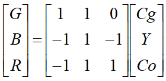

##### 1.5 Q5

**Discover a current media input, storage, or playback device that is analog. Is it necessary to convert to digital? What are the pros and cons to be analog or digital?**

A current media input device using analog is microphone. It is necessary to convert the signal to digital since almost all sounds are stored in computers or transmitted over Internet, which are using digital signals. Thus, to either store or transmit sounds information, we need to convert the signal to digital.

Analog:

* pros: 
  * The resolution of analog signals is much higher than digital signals, and it doesn't have quantization noise, which means it does not include any errors due to quantization. It is the real value of the original information.
  * Processing analog signals is much easier than digital signals since we only need simple machine to process them. However, to process digital signals, we need to design complex algorithm for each type of information, i.e. sounds, images, or videos.
* cons:
  * The original file of analog signals are much large, which increase the difficulty to store them. 
  * It's hard to edit analog signals since they are continues signals. 
  * Analog signals are easier to be affected by noise, especially when propagating these signals.

Digital:

* pros:
  * digital signals are easier to understand by computers since they are discrete signals. 
  * Since it's easier for computer to understand, it's more convenient to store, transmit, and edit digital signals.
  * Since digital signals only contain 0s and 1s, it is more robust for interference (or noise). 
  * The file size is much smaller than analog signals after quantization and compression, which also contributes to easier storing and transmitting.
* cons: 
  * The quantization noise may be large due to improper sampling method been chosen, which may cause errors on the signals. 

##### 6.4

###### Q1

**We wish to develop a new Internet service, for doctors. Medical ultrasound is in the range 2 - 10 MHz; what should our sampling rate be chosen as?**

According to Nyquist Theorem, our sampling rate should be chosen at least twice as the highest frequency of the original signal. 

Here the highest frequency is 10 MHz, so our sampling rare should be at least 20 MHz.

###### Q2

**My old SoundBlaster card is an 8-bit card.**

**(a) What is it 8 bits of?**

8-bits means this SoundBlaster card use 8 bits to represent a sample when doing sampling during digitization.

**(b) What is the best SQNR (Signal to Quantization Noise Ratio) it can achieve?**

$SQNR = 20 log_{10} \frac{V_{signal}}{V_{quan\_noise}} = 20log_{10} \frac {2^{8-1}}{1/2} = 48.16$ 

where $V_{quan\_noise}$ = 1/2 since the maximum of an error can be is half of the interval.

The best SQNR it can achieve is 48.16 dB.

###### Q3

**If a tuba is 20dB louder than a singer's voice, what is the ratio of intensities of the tuba to the voice?**

$SQNR = 10 log_{10} (\frac{V_{tuba}}{V_{singer\_voice}})^2 = 20 dB$

So $ (\frac{V_{tuba}}{V_{singer\_voice}})^2 = 100$

Since $\frac{P_{tuba}}{P_{singer\_voice}}$ =  $(\frac{V_{tuba}}{V_{singer\_voice}})^2$ = 100, the ratio of intensities of the tuba to the voice is 100.

###### Q4

**If a set of ear protectors reduces the noise level by 30dB, how much do they reduce the intensity (the power)?**

$SQNR = 10 log_{10} (\frac{V_{noise}}{V_{protector}})^2 = 30 dB$

So $(\frac{V_{noise}}{V_{protector}})^2 = 1000$

Since $\frac{P_{noise}}{P_{protector}}$ =  $(\frac{V_{noise}}{V_{protector}})^2$ = 1000, the intensity (the power) reduced to 1/1000 of the original noise.

###### Q5

**It is known that a loss of audio output at both ends of the audible frequency range is inevitable due to the frequency response function of audio amplifier.**

**(a) If the output was 1 volt for frequencies at mid-range, after a loss of -3dB at 18kHz, what is the output voltage at this frequency?**

$SQNR = 20 log_{10} \frac{V_{midRange}}{V_{output}} = 20log_{10} \frac {1}{V_{output}} = 3dB$, so $V_{output} = 0.708 $ volt

The output voltage at this frequency is 0.708 volt.

**(b) To compensate the loss, a listener can adjust the gain (and hence the output) at different frequencies from an equalizer. If the loss remains -3 dB and a gain through the equalizer is 6dB at 18 kHz, what is the output voltage now?**

$SQNR = 20 log_{10} \frac{V_{output}}{V_{midRange}} = 20log_{10} \frac{V_{output}}{1} = 6dB + (-3dB)$, so $V_{output} = 1.413 $ volt

The output voltage now is 1.413 volt.

###### Q8

**The dynamic range of a signal V is the ratio of the maximum to the minimum, expressed in decibels. The dynamic range expected in a signal is to some extent an expression of the signal quality. It also dictates the number of bits per sample needed in order to reduce the quantization noise down to an acceptable level; e.g., we may like to reduce the noise to at least an order of magnitude below $V_{min}$**.

**Suppose the dynamic range for a signal is 60 dB. Can we use 10 bits for this signal? Can we use 16 bits?**

The maximum absolute value of the signal $V_{max} = 2^{N-1}$, where $N$ is the number of bits for the signal.

The minimum absolute value of the signal $V_{min} = 1$, which is the smallest positive voltage that is not masked by noise. 

Then the dynamic range = $\frac{V_{max}}{V_{min}}$ = $\frac {2^{N-1}}{1}$ = $2^{N-1}$ = $60$ dB. 

$N \approx 8$.

Since both $10 > 8$ and $16 > 8$, they both can be used for this signal. But because 8 bits is enough, more than 8 bits would generate larger files, which is cumbersome. 

##### 4.4

###### Q1

**Consider the following set of color-related terms: **

**(a) wavelength**

**(b) color level**

**(c) brightness**

**(d) whiteness**

**How would you match each of the following (more vaguely stated) characteristics to each of the above terms?**

**(a) luminance**

**(b) hue**

**(c) saturation** 

**(d) chrominance**

(a) - (d): Chrominance is the quality of light that causes the sensation of color, and human sense different wavelength color differently.

(b) - (b): a hue is a color, which indicates a particular color level.

(c) - (a): In the YUV space, luminance component is the brightness.

(d) - (c): saturation is the difference or freedom from white, so it is a characteristics of whiteness.

###### Q8

**(a) Suppose images are not gamma-corrected by a camcorder. Generally, how would they appear on a screen?**

It appears darker than the original object.

**(b) What happens if we artificially increase the output gamma for stored image pixels? (One can do this in Photoshop.) What is the effect on the image?**

When we artificially increase the output gamma, the light emitted for each voltage raise to a power, the formula is:
$$
R' = R^{\frac{1}{\gamma}}
$$
where R is the value of the pixels in the original file, R' is the value after increasing the output gamma.

Effect: The output image would be lighter than the original image. 

###### Q9

**Suppose image file values are in 0 ... 255 in each color channel. If we define  $\overline {R} = R/255$ for the Red Channel, we wish to carry out gamma correction by passing a new value $\overline {R}'$ to the display device, with $\overline {R}' \simeq \overline {R}^{1/2.0}$. ** 

**It is common to carry out this operation using integer math. Suppose we approximate the calculation as creating new integer values in 0 ... 255 via $(int) (255·(\overline {R}^{1/2.0}))$**

**(a) Comment (very roughly) on the effect of this operation on the number of actually available levels for display. **

**Hint: coding this up in any language will help you understand the mechanism at work better-and as well, then you can simply count the output levels.**

$(int) (255·(\overline {R}^{1/2.0})) = (int)(255·(R/255)^{1/2.0}) = (int)(\sqrt{255R})$

Since $\sqrt{255R} \ge \sqrt{R·R} = R$, the number would be larger than the actual number, but when $R = 0$ or $R = 255$, they are equal. 

Hence the effect is that it doesn't affect the end of the levels, but for each level in between, it would display a lighter value.

**(b) Which end of the levels 0 ... 255 is affected most by gamma correction, the low end near 0 or the high end near 255? Why? How much at each end?**

The low end near 0 affected most by gamma correction. 

As shown in the graph below:

The graph increase more rapidly near $R = 0$, but slightly near $R=255$ comparing with the purple line which is the values before gamma correction. Therefore, the low end near 0 affected most by gramma correction.

When $R=0$, the value is $0$.

When $R = 255$, the value is 255. 

##### 3.3

###### Q2

**Suppose we decide to quantize an 8-bit grayscale image down to just 2 bits of accuracy. What is the simplest way to do so? What ranges of byte values in the original image are mapped to what quantized values?**

The simplest way to do it is to use the first 2 bits only in the original image.

mapping:

0000 0000 ~ 0011 1111	-> 	00

0100 0000 ~ 0111 1111	-> 	01

1000 0000 ~ 1011 1111	-> 	10

1100 0000 ~ 1111 1111	-> 	11

###### Q3

**Suppose we have a 5-bit grayscale image. What size of ordered dither matrix do we need to display the image on a 1-bit printer?**

In the 5-bit grayscale image, there are total $2^5 = 32$ levels, so we need at least 32 bits to represent one pixel.

Suppose the size of the ordered dither matrix is $n$.

Then $n^2 + 1 = 32$, we get $n = \sqrt{31} \approx 6$.

Therefore, the size of the ordered dither matrix is 6.

##### EX1

**In a very quiet room, a mic's output voltage is 0.5V. When this mic is moved to a busy street, what will be the output voltage? What about moving to station with a train passing through? And two trains simultaneously?**
**(Use slide 22 in Audio representation as a reference; for two trains, just assume the their sounds are additive; no need to consider other factors)**

When the mic is in a very quiet room, sound level = $20 log_{10}(V_{quite\_room}/V_T)$, so $20 dB = 20 log_{10}(V_{quite\_room}/V_T)$, we can find out that $V_T = 0.05V$

When the mic is in a busy street, sound level = $20 log_{10}(V_{busy\_street}/V_T)$, so $70 dB = 20 log_{10}(V_{busy\_street}/0.05)$, we can find out that $V_{busy\_street} = 158.11V$

When the mic is in a station with a train passing through, sound level = $20 log_{10}(V_{one\_train}/V_T)$, so $90dB = 20 log_{10}(V_{one\_train}/0.05)$, we can find out that $V_{one\_train} = 1581.14 V$

When the mic is in a station with two train passing through, sound level = $20 log_{10}(V_{two\_train}/V_T)$, so $180 dB = 20 log_{10}(V_{two\_train}/0.05)$, we can find out that $V_{two\_train} = 5,000,000V$

##### EX2

**Design a lifting network to convert Y, Co, Cg to R, G, B.**

According to the conversion matrix on lecture notes: 

we get the following formulas:

$G = Y + Cg$
$ B = Y - Cg - Co$ 
$ R = Y - Cg + Co$

Thus, the lifting network can be:

