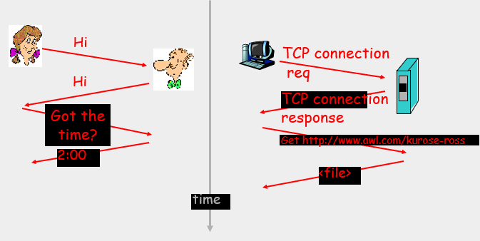
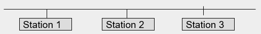
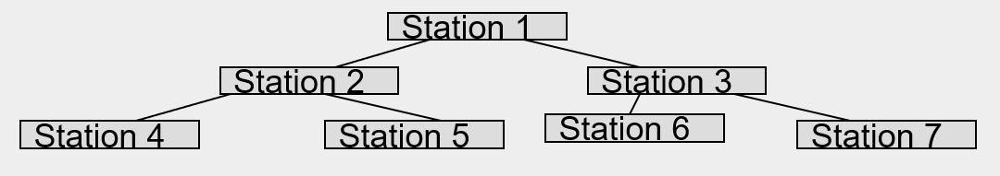
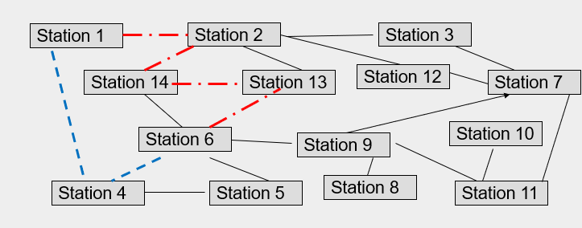
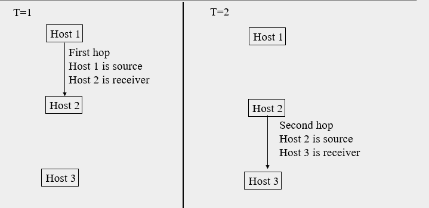

### What is the Internet

* Networks include many connected devices: 
  * workstations, laptops, tablets, mobile devices, TVs, other "Things" in the IOT (Internet of things)
    * IOT = smart devices connect to Internet, such as smart TV, smart washing machine, toaster, light switches, blender 
  * Routers, switches, servers, base stations ...
    * router, an equipment on the network, it allows information to be sent from one network to another, or from one part of the network to another.
    * Base Station 基站，又称基地台，是固定在一个地方的高功率、多信道、双向无线电发送机。
* The Internet is a collection of networks
* Networks of connected devices use protocols to communicate. 
* Communication = 
  * sending and receiving messages
  * taking actions on receiving or sending messages (or other events).


### End systems: the network edge 终端系统：网络边缘

* An end system (host) can be a source system, and/or a destination system at the edge of the Internet.
* 端系统 - 通常把与因特网相连的计算机和其他设备成为端系统。
  * 端系统也成为主机，因为它们容纳（即运行）应用程序。
* End systems connect to the network using <u>communication links</u> (通信链路). 
  * wired - Guided media 引导媒体: Copper wire (coaxial 同轴的, twisted pair 双绞线), optical fiber
    * loss a little bit power by going down the wire, but it's not spreading on all direction.
  * wirelessly - Unguided media: air (radio, microwave, IR ...)
    * by default, things will go all direction.
* End systems are also referred to as hosts(主机). They may clients and/or servers 
  * A **client** *consumes* a service - 非正式地等同于桌面PC、移动PC和智能手机等
  * A **server** *provides* a service - 非正式地等用于更为强大的机器，用于存储和发布Web页面、流视频、中继电子邮件等。
  * An end system can be a consumer of one service and a provider of another service. 

##### Examples of end systems

* Mobile phone
* Personal computer
* Server supporting a service
* Tablet
* TV
* Gaming Console
* GPS
* Others?

### Access Network 接入网

* 接入网 - 指将端系统连接到其边缘路由器(edge router)的物理链路。
* 边缘路由器 - 是端系统到任何其他远程端系统的路径上的第一台路由器。

##### 家庭接入：DSL、电缆、FTTH、拨号和卫星

###### 数字用户线 DSL - Digital Subscriber Line

* 住户从提供本地电话接入的本地电话公司处获得DSL因特网接入。（因此，使用DSL时，用户的本地电话公司也是他的ISP）
* 每个用户的DSL调制解调器使用现有的电话线（双绞铜线）与位于本地电话公司的本地中心局（CO）中的数字用户线接入复用器（DSLAM）来交换数据。
* 家庭的DSL标志解调器得到数字数据后将其转换为高频音，以通过电话线传输给本地中心局
* 来自许多家庭的模拟信号在DSLAM处被转换回数字形式


### Services the Internet provides

* **Communication** between end systems
* Communication supports many applications. Some applications include:
  * WWW (world wide web)
  * Email, chat, video
  * E-Commerce, E-banking
  * Games, social media

### Data Communications

* Many ways to transmit the information
  * Voice - in person, by telephone, Internet, physically sending recorded media, wireless
  * Data - on paper disk or tape, vocally(声音地) or digitally using LAN, WAN, internet, or wireless
* Want to send information from one location to another efficiently and accurately
* Many transmission methods have independently evolved for particular types of data. 
* Different transmission methods, used for voice, data, internet and video have converged(融合). 
* all this information translates to electrical signals.

### Source Systems, Transmission 源系统，传输

* **Source System**: Includes *data source* and *transmitting device* which encodes data into electromagnetic(电磁) signals suitable for transmission through the transmission medium. 
* Example of Source Systems
  * Smartphone
  * Personal Computer

### Destination Systems  目标系统

* **Destination System**: Includes a *receiver* to intercept the transmitted electromagnetic signals from the transmission system and to decode/demodulate the those signals into a form appropriate for the destination device. 

### Examples of Source and Destination Systems

* Landline Telephone 固定电话
  * encodes/modulates voice or data into electrical signals to be carried through a line and a switching system. The switching system decides where to go next, and it takes the information to another switching system, ... , and eventually it will connect to the receiving phone. It forms a path, and all the information travel alone back and forth on that path. 
  * decodes/demodulates signals carried through a line and a switching system into voice or data.
  * most of the old phones are using analog signal.
  * nowadays, most of landline telephone are digital phones, that's why landline phone and Internet are same company, they are sharing a line. the way to transmit and encode will determine how the line is shared, and which part of the bandwidth or frequency are available.
* Cellular Telephone, Satellite or Radio
  * encodes/modulates voice or data into signals to be sent through an antenna(天线).
    * The information translate into binary data.
  * decodes/demodulates electromagnetic signals received by an antenna into voice or data. 
* Personal Computer
  * encodes/modulates a data stream of binary bits to a form that can be efficiently carried through a computer network. 
  * decodes/modulates an electromagnetic signals from a computer network and reconstructs the information that was sent. 

### Transmission of Information

* Information is sent from a source system to a destination system.
  * The information must be fed into the source system 
  * The information must be encoded into a form the source system can send (usually into an electromagnetic signal)
  * The information travels through some transmission medium to the destination system
  * The destination system must be able to interpret (decode) the received signal
  * The decoded signal must be translated into a form that the operator of the destination system can understand

### Simplified Communications Model


### Data Communication Networking

* The problem is more complex than point to point connection
  * Source and destination may be separated by large physical distances. 
  * Links may only be needed for a short time, dedicated links(专用链路) would be too expensive.
  * Many devices, any of which may be the source or destination at a given time. 
  * Multiple pairs of source and destination may wish to communicate through the same medium at the same time. 
* These problems are addressed using *networking protocols*
  * All devices communicate via a net of connections
  * Efficiency and accuracy is maintained using protocols

### What is a protocol?

**Network protocol** are sets of established rules that dictate how to format, transmit and receive data so computer network devices - from servers and routers to endpoints - can communicate regardless of the differences in their underlying infrastructures, designs or standards. 

一个**协议**定义了在两个或多个通信实体之间交换的报文格式和次序，以及报文发送和/或接收一条报文或其他事件所采取的的动作。

A **human protocol** and a **computer network** protocol:



### Why a Network  /  why do we use network

* The number of stations is large, it is not possible to have dedicated connections to all other end systems. 
* The distance between two stations may be long enough that the transmission media cannot carry the signal from the source to the receiver without introducing many errors, going through intermediate devices will fix this problem. 
  * as the signal travel down the cable, some energy radiated(放射).
* Worldwide connectivity is desired. 

### Station Interconnection  

* The number of station is large.

##### method 1: direct connection

* Direct connection between all stations is not practical: $n(n-1)/2$ connections are needed
* Connection using a shared bus limited by distance (long paths with loss of signal due to attenuations(衰减)). Bus can carry information, lacks redundancy(冗余) (any failure of link destroys connectivity), and allows only 1 message to travel at a time.




##### method 2: tree routes

* connection in a tree routes too much traffic through the root. 

  

* Connection through a Partially Connected Network distributes traffic(流量) and provides redundancy. Also provides a mechanism for repeating signals to enable long distance propagation(传播). 

  * redundancy(冗余) - 信息的冗余度是指同一信息通过不止一种媒介披露，或通过同一媒介披露不止一次。

##### method 3: Station Interconnection

* Connection through a Partially Connected Network provides redundancy and intermediate stations along the path to act as repeaters(中继站).

* Why is a shorter wire better?

  * guided wave transmission. Stations going through wires. When a signal goes through wire, it lose power. If the wire is too long, then the signal will not have enough power at the end.

* What would power loss look like in the signal?

  * as the power lose, the difference between the two signals gets closer and closer, then it's hard to tell the difference.

  ```
  ---------------------------
  						|									-----------------
  						|							==>      				 |
  						|													|
  						|													---------------
  						-------------------------								
  		high power, high amplitude									low power, low amplitude
  ```

  


### Wide Area Networks (WAN) 广域网

* A WAN covers a large geographical area
* A WAN often uses common carrier or public right-of-ways. (广域网通常使用公共运营商或公共通行权)
* A WAN uses internal nodes to move data through network. 


### Local Area Networks (LAN)

* A LAN interconnects a variety of devices in a small area: Building or campus scope.
* LAN is usually owned / controlled and managed by one organization. 
* Most common types of LANs are 
  * Ethernet 以太网 (TCP/IP)
  * ATM = Asynchronous Transfer Mode 异步传输模式 (protocols used mostly by phone companies)
  * Wireless 

### Travel through a network

* Does all data in a message take the same path? No.
* What happens to data between each hop, what does each station do to the data passing through it?
  * hop - a step from one station to another.
    * e.g., station 11 ~ 9, 13 ~ 6 (相邻)
  * The stations do calculations to figure out which of the possible wires connected to it is the best to send the signal through to get the destination fastest.
* Data can travel along different paths from one station to another through the network.
* Which device chooses which path is faster?
  * normally it's the router. 
  * It can be a hardware, like the one we usually use at home.
  * It can be a software on a computer.
  * The hardware is faster, but both work.
  * There are lists, routing table and forwarding table, and the forwarding table will figure out where the data goes.
* If a router determines the fastest path, does it mean that each router knows the locations of all other router?
  * No. The way it determines the fastest path is called routing. Algorithms will supply either the information about neighbour that the closest, or the information about all routers in the local networks. That information can be used to make the forwarding table, which determines the interface we should send out of.
* e.g. from station 1 ~ 6:
  * there are more than one path
  * the time it takes to travel one station to another through a path is strongly related to the number of hops.
  * so, the blue path should be faster than the red path.
  * but, the data are divided into small packets, different packets may transmitted on different path, so the receiver does not always receive packages in order that we sent them.
  * If there is no congestion in the network, and there's no conflicting algorithms affecting things, it will always use the blue path, because it's faster.
  * If there's another application sending and receiving data from station 1~6, and it defined only use the blue path. Then it may be more efficient to send information along the red path, because the other one is very congestion.



### Approached to network travel

We can take different approaches to managing data

* **Circuit switching (电路交换)**: make a connection along a particular path and send all data in the message through that path.  
  * dedicated connection
  * as the data go through each stations, we are going to decide this is the path that everything will take. 
  * like going through an old telephone switching network. You get to the central switch, and it makes a physical connection, and send the signal to next switch, and that switch makes the physical connection to next switch, until it gets to the final destination.
* **Packet switching (分组交换)**: break the message into pieces and send each piece separately along its own path.
  * shared connection
  * How does a message divide into packets?
    * TCP/IP has a protocol, it defines the max size of a packet. It divide the packets to its max size. The last packets may not be the max size. It may send together with next message, depends on whether it send to the same place or they are the same software.
* **Virtual circuit switching (虚拟电路交换)**: break the message into pieces, use software to simulate a connection in a packet switched network.
  * **虚拟电路**（英语：Virtual circuit，缩写为 VC），又称为**虚电路**、**虚连接**或**虚通道**，在*分组交换*的计算机网络上，交换数据的传输方式之一。它是一种预接式（connection-oriented），或线路交换式（circuit-switched）的数据传输方法，在两个终端系统（End system）间，创建一条连线，来进行数据交换。在使用虚拟电路之前，必须先在两个节点或软件应用程序间创建连线。在创建连线之后，两个节点之间，就可以进行数据流的交换。概念来自于电路交换，其运作方式就如同在两个端点间，创建起专用的物理层线路连线一般，因此又称为虚拟连线（virtual connection）或虚拟通道（virtual channel）。

#### Circuit Switching 电路交换

* Connection Oriented
  * A path or circuit, or series of hops through the network, from the sending station to the receiving station is established, used as dedicated link, then disconnected. 
  * The communications links used for the dedicated link are not available to other users for making other connections. 
* Origin: analog telephone networks
* A path or circuit through the network is established. This path consists of a series of hops between nodes or switches, then a final hop to the receiver. 
* Every time it gets to the switch, it gets amplified, so that it won't lose power.
* The switches have the intelligence to help determine a path through the network and allocate available resources.
* Once the circuit is established it is used as dedicated link. 
* Data is transferred through that circuit, flow control is end to end (not hop by hop).
  * we create the path hop by hop, but not transfer information.
* If data is in the form of a series of bursts, the time between bursts is not utilized. The utilization of the connection will be low if the data is a series of bursts. 
* When the session is over the circuit is closed. 

###### What does the term "burst" mean?

* Burst is a term used in a number of information technology contexts to mean a specific amount of data sent or received in one intermittent operation. It can be contrasted with streamed, paced, or continuous.
* Considering sending data from source, it will be sending at a continuous rate, one packet after another, unless we have applications that are competing (let's ignore this).
* So the data leaves the source at a evenly spaced sequence of packets, but as it traverse through the network, it can be broken into chunks. We may have a series of packets that arrived and a few packets missing. We need to wait for those missed packets, which means by the time we get those missed packets, it took a long time to get there or to resend, we have a whole large chunk of packets that are ready to process.
* If we get a large burst, because we are waiting for a packet. When all the data has arrived, or they generate a large bunch, then that burst will all go through it at the same time. 
* The problem comes when the burst is big enough, that the real time reception and processing has a break where no packets are available because the burst is been put together. 
* Then we get a blank space in the transmission, so we get a corrupted piece of video or silence audio.

###### Advantages

* provides a dedicated link
* efficient for continuous transmission
* do not have delay of waiting for packets to arrive before data can be forwarded along the next hop of the path.
* easier to implement control for quality of service
* guaranteed bandwidth

###### Problems

* inefficient when data comes in bursts, during the time between bursts the connection is allocated but not being used.  (not use the full power of the available connection)
* overhead required to establish and break circuit
* connection must be reestablished if there is a problem with any switch along the established path. 
* cannot send at a rate higher than your allocated share of resources even if you are the only user. (即使您是唯一的用户，也无法以高于分配的资源份额的速率发送(信息)。)

### Packet Switching

* Packet Switching: Connectionless
* the message sent is broken into small pieces called packets.
* each packet is sent through the network separately and can take a different path through the network. 
* At each hop the packet must be forwarded to the next host along the path to the destination.
* each packet is transferred 1 hop at a time, the intermediate stations need only wait for the end of the packet not the end of the message.
* the communications links used to send the packet are not reserved for any particular connection and are available to all end systems.
* No call setup or call termination required.
* Each packet, referred to as a datagram(数据电报), is sent individually, and is routed through the network individually. 
* packets with the same source and destination may take different paths through the network, and thus may arrive at the receiver out of order. 
* flexible reaction to congestion and failure. (对拥塞和故障的灵活反应。)
* robust delivery of packets, less loss of information in lost packet than in broken virtual connection when a node fails. (可靠的数据包传送，与节点故障时断开的虚拟连接相比，丢失的数据包中的信息丢失更少。)

###### Packet travel times

* packet travel time - the time from the packet left the sender, until it arrives the destination.
  * it includes the time to encode and decode the message to bits.
* packets can travel along different paths from one station to another
* different paths have different travel times
* packets that leave in order A-B-C may arrive in any order, because they travel along different paths with different travel times
* having more than one available path provides a more reliable transmission system. If one path fails, a different path can be used. 
* binary information in the packet need to be translated bit by bit into electrical signal, then it goes into a wire or the air. So it takes particular length of time to send a single bit, and if we multiply the length of the packets in bits by the time to send a bit, then we get the time to send/push the packet into a wire or the air. This usually equals to the time for the receiver to receive and decode the packet. 
  * This time is significantly larger than the travel time. 

###### Store and Forward node

* a router or a host running routing software.
* As each packet arrives,
  * the header arrives, that tell us where the packet wants to go.
  * then the rest of the packets arrives.
  * after processing, then the router has to think about where to send it, the forwarding.
  * notice that we have to store the whole packet before forward it, because we need to make sure that all the data has arrived and not corrupt.
    * it needs to be stored because we can't finish calculating whether the packet is corrupted until we have the whole packet.
  * once we done that, we've done the routing. Then we can forward the packet to next host.
* A network node that 
  * receives and stores incoming packets.
  * checks incoming packets for bit level errors
  * forwards the correct packets to the next store and forward node
* important: think of each hop as a separate communication.
  * source sends packet
  * receiver receives packet and queues it
    * if the queue is full, the receiver drops the packet
  * receiver checks the packet for correctness.
    * if a packet is not correct, the receiver may drop the packet (best effort transmission 尽力而为传输)
  * otherwise the receiver then passes packet on to another connection. 
* at each store and forward node, delay is introduced
  * waiting for the whole packet to arrive before forwarding the packet.
  * checking the packet for transmission errors.
  * forwarding the packet
  * waiting in the transmission queue
  * sending the packet
  * as the packet travels to the next node

### Virtual Circuit Switching

* used in packet switched networks
* uses software to simulate a connection
* at any time any station can have multiple virtual circuit connections to the same or different destinations. 
* virtual circuits allow retransmission of data packets that arrive with errors. 
* Error / Flow control is associated with the virtual circuit. 
* at the beginning of each data exchange between a source and a receiver, a single path or virtual circuit from the source to the receiver is established and all packets in the exchange follow this path. Since packets follow the same path they arrive in order. 
* the virtual circuit is not dedicated. Each packet will be queued for transmission at each hop along with any other traffic traveling cross that particular link. Thus, when the virtual circuit connection is not being used by the source and receiver in this exchange it may be used by other exchanges. 

### What is a hop

*  hop - a step from one station to another.



### Delays in each node

the blue square: router / host

☺: **Transmission delay**: wait for the whole packet to arrive (or be sent)

A: **Processing delay**: check that packet has not been corrupted

1: **Processing delay**: forwarding, calculate which interface should the packet leave through

(the processing delay begins at the first bit arrive, ends at the final bits arrived and finish the calculating of the packet is corrupt or not.)

**Queueing delay**: time waited until packet begins to be transmitted. (not the property of a packet, it's the property of how busy the interface is)

The three delay happens in order: processing delay -> queueing delay -> transmission delay -> processing delay -> queueing delay -> ...


##### Can a router have more than one inbound link? 一台路由器可以有多个入站链接吗？

Yes. In the picture above, we have more than one outbound links, we also have more than one inbound link, because each of the links in the picture is a network card that allows two-way travel.

##### As such, how does it manage to process data from all inbound links?

For any inbound link, we will use the same set of processors, it will use the routing table / forwarding table, take the destination address out of the packet, using the forwarding table to decide where to send the packet. 

##### Does the router process the multiple inbound links simultaneously?

Not quite simultaneously. Each of the network card doing some of the processing themselves when the packets arrive and are sent. Only when the packets comes out of the network card that we can routed and decide which interfaces it goes. 

### Queuing delay

* After processing the packet is forwarded to the interface through which it will be transmitted. 
* There may be other packets that have arrived from any interface on the router / host that are already waiting to be transmitted. 
* The time from when the packet is placed in the queue to be transmitted until the time that it begins to be transmitted is the queueing delay.
* after a packet arrives at a store and forward node and is processed by that node it may experience a queueing delay.
* unlike other delays, the queueing delay is independent of the properties of the packet experiencing it.
* usually analyze queuing delays statistically
* we can't send two packets at the same time, so we can't have multiple packets arriving at the same time, they will arrive one after another.

### Processing delay

* when a packet reaches a store and forward node
  * its header must be read and analyzed to determine which interface to send the packet out through
  * its contents must be checked for bit level errors. Completing this check requires the whole packet. 
* the time taken to do these calculations (and perhaps some others) is the processing delay.

### Transmission delay

* when a packet is sent the hardware used translates one bit at a time and inserted it onto the transmission medium
  * consider the link can send R bits per second
* the time taken for all L bits in the packet to be inserted into the transmission medium is the transmission delay, L/R.

### Propagation delay 传播延迟

* each bit must travel from the source to the destination through the transmission medium.

* the time taken by each bit to travel distance $d$ from the source to the destination is the propagation delay.

* This time is short (travels near light speed)

  $d_{prop} = d/v$ 	velocity $v$ is $2-3*10^8$

* Delay in the store and forwarding node does include the propagation delay, but usually the propagation delay is very small, and it's not a significant part of the delay. 

### Delay Types

What are the delays introduced as a packet travels from one end system to another?

* $d_{proc}$ 	Processing delay
* $d_{queue}$	Queuing delay
* $d_{trans}$	Transmission delay
* $d_{prop}$	Propagation delay
* $d_{head}$	Transmission delay (for header)
* $d_{data}$	Transmission delay (for data)

### Packet loss

* The length of the queue is finite, therefore when the system is busy it is possible for a packet to arrive and find there is no room in the queue: such a packet is dropped. 
  * in this situation, the queuing delay is ∞.
* A packet may have bits corrupted in transmission. Such a packet will not pass the tests for bit level errors and will thus not reach the queue at all.

###### what happens if a packet missed?

* Depends on protocols it uses.
* TCP - if a packet missed, the missed packet will be request again and resent, hopefully this time it will be received successfully, it may be request and resent for several times to make sure it received successfully.
* UDP - best effort protocol. It's not the responsibility for UDP to recover and resend the packet if it doesn't get there. 
  * so your application should be designed to check it.
  * or the application allows miss the data without damage.

###### Difference between router and switch?

* a router is in the network layer, and it takes cares of addressing and getting things to the right place according to IP addresses. 
* a switch is something more general, it can exist in different layers, there are different kinds of switches, and switches are simpler
* a switch in a network layer is very similar to a router.
* a switch can be in a lower layer working with hardware addresses instead. 

###### two main things to cause corrupted:

* attenuation (衰变，稀释) - if the data come through a long wire, it radiate a little power. By the time it gets the destination, the total amplitude may be small enough, it is hard to tell the difference between levels (0 or 1).
* every wire access an antenna(天线), we use antenna both to send and receive signals. The attenuation is sending the signal out of wire. 
  * The wire can also pick up other signals, if this happens, the other signals will add to the signal on the wire already. 

### Optimal Packet Size

* Consider the next 3 figures. The packet takes a 2 hop path through the network
  * message could sent as a single packet: message switching
  * message could be broken into smaller packets: packet switching
  * message could be sent through a connection: connection oriented
* How do we determine the optimal size for a packet / message?
* what delays are involved in each case?

#### Message Switching

* assume $t_{queue} = 0$
* message is in $1$ packet: $d_{trans} = d_{head} + d_{data}$
* overhead includes $1*d_{head}$ for each transmission.
* Consider the figure below. The packet takes a 2 hop path through the network.
  * $1st$ vertical line: the host sending the packet
  * $2nd$ vertical line: the router in between
  * $3rd$ vertical line: the destination
  * upper dotted line: the first bit in the packet
  * lower dotted line: the last bit in the packet
* Message is sent as a single packet: message switching
  * The amount of added overhead due to packet headers is minimal since only one packet header is needed.
  * The intermediate nodes must wait until the entire packet has arrived before the packet can be FCS checked and queued for transmission across the next hop.


### End to end delay

* for a single packet the delay at each router is $d_{nodal} = d_{proc} + d_{prop} + (d_{data} + d_{head}) + d_{queue}$
  * $d_{nodal}$ is the delay from one node to another
  * nodes = source, destination or any routers between them.
* ignore the queuing delay (statistical)
* consider a single packet (or message)
  * the delay between the source and the receiver (the end to end delay) will be $d_{endtoend} = \{d_{proc} + d_{prop} + (d_{data} + d_{head})\} * N_{trans}$

### Packet switching

* assume $t_{queue}=0$
* message is in 3 packets: $d_{trans} = d_{head} + d_{data} / 3$
* overhead includes $3*d_{head}$, 1 header for each packet for each transmission.
* Consider the figure below. The packets take a 2 hop path through the network.
* When the message is broken into smaller packets (packet switching)
  * the amount of added overhead due to packet headers increases as the size of the packet decreases
  * the delay, waiting for each packet to arrive, at each intermediate node is reduced as the length of the packets is reduced
  * the amount of data to be re-transmitted if a packet is lost is reduced as packet length decreases


### Effect of packet size

Here we didn't add the transmission time, so the packets arrive flat at the top.

The size here is based on TCP/IP, but TCP/IP only gives a range of the size. It is possible to change the maximum size, is not usually done in the application. The application usually call functions to send packets from the source to the destination.


### End to end delay: 1 packet

* first consider the delay for the single packet case: 

  $d_{endtoend} = \{d_{proc} + d_{prop} + (d_{data} + d_{head})\} * \{1 + (3-1)\}$ 

  $d_{endtoend} = \{d_{proc} + d_{prop} + (d_{data} + d_{head})\} * \{N_{pack} + (N_{trans}-1)\}$

  where

  ​	$d_{data}$ 	transmission time of the packet

  ​	$d_{head}$ 	transmission time of the header

  ​	$d_{prop}$ 	propagation time per transmission

  ​	$N_{trans}$ 	# of time the signal is transmitted

  ​	$N_{pack}$ 	# of packets

### End to end delay: 2 packets

* When there are 2 packets, 

  * the first packet travels from the 2nd node to the 3rd node
  * at the same time the 2nd packet travels from the 1st node to the 2nd node

* The delay becomes

  $d_{endtoend} = \{d_{proc} + d_{prop} + (d_{data} + d_{head})\} * \{2 + (3-1)\}$

  $d_{endtoend} = \{d_{proc} + d_{prop} + (d_{data} + d_{head})\} * \{N_{pack} + (N_{trans}-1)\}$

### End to end delay: 5 packets

* For the 5 packet case: 

  $d_{endtoend} = \{d_{proc} + d_{prop} + (d_{data} + d_{head})\} * \{5 + (3-1)\}$

  $d_{endtoend} = \{d_{proc} + d_{prop} + (d_{data} + d_{head})\} * \{N_{pack} + (N_{trans}-1)\}$ 

### Packet size considerations

* Delay is introduced by requiring packet, or section of message, to arrive at an intermediate station before the message is forwarded is smaller than for message switching.
* Packet headers add additional overhead that increases as the size of the packet decreases.
* Waits for next link will be minimized if smaller packets of data are being transmitted as single units.
* Shorter packets are less likely to contain errors and require re-transmission than long messages.
* Required re-transmissions are shorter, and add less additional load to the system.
* As the size increase, the delay decrease first, then increase.
* The packet sizes decreasing would not lead the processing delay decrease. It makes the packet receive faster, but it already counted in the transmission delay. So it would not make a lot of difference to the processing delay.
* Is there a formula to calculate the best packet size?
  * 

### Packet Switching

* no call setup or call termination required.
* each packet, referred to as a datagram(电报), is sent individually, and is routed through the network individually.
* Packets with the same source and destination may take different paths through the network and thus may arrive at the receiver out of order.
* flexible reaction to congestion and failure
* robust delivery of packets, less loss of information in lost packet than in broken virtual connection when a node fails.

### Circuit switching

* message is in 1 block
* no headers
* overhead includes establishing and breaking connection
  * if someone does not send data continuously, the bandwidth will be not be used, the efficiency goes down
* the call request signal - to request the connection
* the connection is dedicated - the direction connection will be made physically through a switching array.
* any further information passing through after that connection been made will go through directly.
* once we establishing the dedicated connection / the dedicated bandwidth for all information, we can send as much information as we like.
* when finishing the call, we can send a end-call signal to the system to break the connection and to release the hardware for someone else to use.
* ack - acknowledgement 确认 = which says the endpoint received the data.


### End to End Throughput 端到端吞吐量

* The amount of data that can pass through from one edge system to another: 
  * (瞬时的)Instantaneous end to end throughput: rate data is passing between the end systems at a particular instant
  * average end to end throughput: rate data is passing between the end systems averaged over a specified length of time.

### End to end throughput considerations

* for some processes like video, efficient operation requires a minimum level of instantaneous throughput over time and a minimum level of average end to end throughput.
  * if the throughput below the minimum level of average throughput for a short time, there will not be enough data to keep the process running.
* for some processes like mail, efficient operation requires only a minimum average end to end throughput level.
  * the requirement is only it arrives.

### Bottleneck Link: throughput

吞吐量等于*瓶颈链路*（bottleneck link）的传输速率.

As B>>C, when data comes into Router2 in rate B, out in rate C, the queue in Router2 eventually fill up and start to dropping packets, because it can't transmission out as it comes in, there is a bottleneck.

Same situation in Router3 when transferring data from A to C.

To send data without losing data, the speed should be the minimum capacity through the path.


###### How does the server/client know to send a lower rate? Does a router report its connection speed?

* If using UDP, it may not know, it will just lose packets; (best-effort)
* if using TCP, it will detect that more and more packets are being lost, and when it detect it has to re-send more and more packets, it will send the packets at a lower speed. 

### Access Networks 接入网络

* Mobile Networks
* National ISP (Internet Service Provider)
* Local ISP
  * ISPs use ADSL(非对称数字用户环线(Asymmetrical Digital Subscriber Loop)), Cable, wireless, fiber
* Enterprise (business) network
* Home network

### Multiplexing 多路复用

* When multiple signals are carried through a single transmission medium at the same time, the signals are multiplexed.

  * the ISP combine a lot of people' signal together, and put them onto the pipe all at once.

* Multiplexing allows the efficient use of wider band transmission media. Such media can carry multiple narrower band signals. 

  * Long haul links (远程连接) are frequently examples of high capacity channels. (长途链路通常是高容量信道的示例。)

* The multiple signals must be combined or multiplexed in such a way that the individual signals can be easily extracted from the composite signal (demultiplexed) on reception.

  (必须以这样的方式对多个信号进行组合或复用，以便在接收时可以轻松地从复合信号中提取单个信号（解复用）)

### Methods of Multiplexing 

（MUX = multiplexor, DEMUX = de-multiplexor）

* Frequency Division Multiplexing 分频多路传输
  * give each signal a range of frequency
* Time Division Multiplexing 分时多路复用 - divide into chunks the flow of time. 
  * *Synchronous* 同步的 - User A will use n milliseconds long, user B will use n milliseconds long, and C will use n milliseconds long, ...
  * *Statistical*
* Code Division Multiplexing (spread spectrum) 码分复用（扩频）
  * CDMA telephone
  * it divides the signals between the basis functions.


### Frequency Division Multiplexing 分频多路复用

* When the transmission media has a bandwidth many times larger than the bandwidth of the signal to be transmitted, it makes sense to transmit more than one signal at a time through the medium.
* each of the signals to be transmitted are modulated to a different carrier frequency. 
* the different carrier frequencies are separated by at least the bandwidth of the individual signals to be transmitted
* the frequency bandwidth is shared by the signals being simultaneously transmitted.
* $f_i$ is the central frequency of each frequency range


* examples of FDM include multiplexing of voice signals over telephone lines, and multiplexing of cable channels into the allocated cable frequency band.
* FDM can be done in stages. M signals can be multiplexed into a particular frequency band. Groups of M signal can then be combined and multiplexed into a larger frequency band.


##### FDM and voice signals: 1

* A typical voice signal has an effective spectrum(频谱) of 300 to 3400Hz. When multiplexing signals the signals must be adequately separated, so allow 4KHz bandwidth for each voice signal.
* A voice signal can be modulated so that the spectrum of the modulated signals has a center frequency at the frequency of the modulation carrier $f_c$.
* If the carrier has a bandwidth between $f_1$ Hz and $f_2$ Hz then $f_c$ would be chosen to be $f_1+4KHz$

### Cable and ADSL

* ADSL uses the fixed telephone system. (FDM)
  * each user has a dedicated connection to the end office
  * user must be close enough to the end office
  * each of these connections use twisted pair
  * capacity of twisted pair less than capacity of cable
  * uses FDM
* Cable(电缆) shares a higher capacity coaxial cable between multiple users. (TDM)
  * available capacity may be higher or lower than ADSL
  * can intercept packets of other users on the same link (可以拦截同一链接上其他用户的数据包)
  * uses TDM


#### ADSL

* Asymmetric Digital Subscriber Line, to 20Mbps downstream and 100 Mbps upstream (Typically 512 kbps and 64 kbps)
* Provides high speed access over twisted pair telephone wires. Up to 256 4MHz channels available
  * Normal telephone connection filtered to 4KHz bandwidth at end office (switching station)
  * For ADSL filter is removed making entire capacity of the twisted pair (category 3) available to the user. The capacity and attainable speed depend on the distance from the end office (length of connection).
* Typical user needs more downstream capacity than upstream capacity for internet applications.
* Uses FDM and/or discrete multitone (DMT)


#### Wavelength Division Multiplexing 波分复用

* used with optical fibre
* light passing through the fiber consists of many colors or wavelengths (frequencies)
* each wavelength carries a signal
* the fiber can carry many signals at the same time, as signals with different wavelengths
* as many as 160 channels at 10 Gbps
* used for cable (between central offices)

### TDM (Time Division)

* The data are organized in frames
* Each frame contains a cycle of time slots
* a sequence of slots dedicated to one source is a channel
* data from different sources is inserted into slots or channels in some sequence
  * Synchronous TDM slots are filled from a predetermined sequence of sources. If there is no data to transmit an 'idle' signal is sent (circuit switching)
  * Statistical TDM fills slots as data is available. There is not preset sequences. Therefore, data must be associated with the source by address. No empty or 'idle' slots are sent if any source has data ready to transmit. Idle is sent only if all channels have no data to transmit (packet switching)

#### Synchronous TDM


#### Statistical TDM

* Time slots are not pre-allocated to particular sources, they are allocated on demand.
* There are M sources, N available channels .: M>=N
* Rather than transmitting an idle signal when no data is available from a source i, data from source j can be transmitted.
* The data rate of the transmission line can be smaller than the sum of the data rates for all sources being serviced (传输线的数据速率可以小于正在服务的所有源的数据速率之和)
* At peak times the data rate of received data from the sources may exceed the data rate of the transmission media. In these cases excess data must be buffered in the multiplexer for later transmission.
* Statistical TDM is most useful is systems where sources do not broadcast continuously.
* If each source broadcasts 80% of the time. Statistical TDM can handle 20% more channels than asynchronous TDM
* There are overhead costs associated with this gain in efficiency. 
* Sources are not transmitted in a predetermined order, so there is not a direct way to know which source is being transmitted in a given channel. Thus, each channel must contain an address that indicates the source

### Internet over Cable

* HFC (Hybrid Fiber and Coax systems 混合光纤和同轴电缆系统)
  * Coaxial cables for users and local branches
  * Branches connecting to optical fiber trunks
* Use a cable modem connected to your computer 
* Cable modems follow DOCSIS (Data Over Cable Service Interface Specification 电缆数据服务接口规范)
* Asymmetric data flow 非对称数据流


### Data transfer using cable

* Upstream channel (from user) is divided into slots. Each modem is assigned a slot. More than one modem can be assigned to a particular slot causing possible contention(争夺)
* A user will request downstream capacity, be granted(授予) the capacity and then receive the information at the appointed time (指定的时间)

### Cable Modem TDM Scheme


