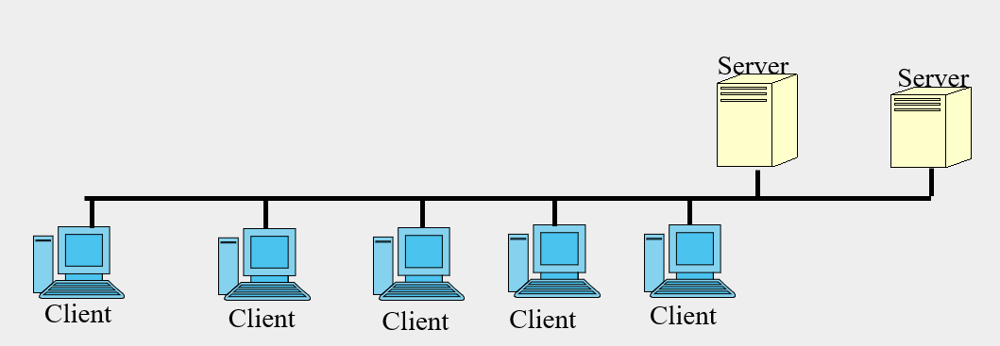
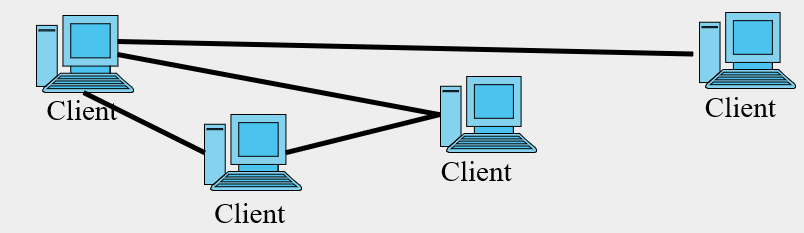

### What is in the application layer

* All user applications
  * Electronic mail, instant messaging, telephony(电话学)
  * Web, video, music, social networking
  * Remote login
  * File transfer and file sharing
  * Multiplayer networked games
  * Shopping, point of sale apps
  * What else? Netfilx, zoom, discord, VPN, YouTube

### Principals and Goals

* Application programmer will 
  * write apps in various languages that will run on multiple different end systems
  * Choose best application architecture
* Application programs use APIs to access services that 
  * allow your information to travel through the network core (application programmer does not write these services)

### How do apps communicate

Applications may be built on a reliable network (TCP) or a best effort network (UDP). In the case of the best effort network the application itself must take care of assuring the communications are as reliable as necessary.

Applications usually use socket library to connect another application.

TCP will wait an answer from the destination that every packet has received acknowledgement. 

### Some Application layer Protocols 

* Users most commonly directly use application layer protocols like Hypertext Transfer Protocol (HTTP), File Transfer Protocol (FTP), Simple Mail Transfer Protocol (SMTP); Telnet,
* Other common application layer protocols help facilitate the use and management of TCP/IP networks: These include Domain Name System (DNS), the Simple Network Management Protocol (SNMP).

### Network application architectures 网络应用程序架构

* Client server
  * Servers provide services to other hosts, always available
  * Clients request services from other hosts, when needed (not always connected)
  * Examples include, web, file servers, e-mail
  * When a service is heavily used it may be provided by a group of servers, not just one (load balancing)

* P2P (peer to peer)

  * Arbitrary pairs of hosts directly communicating (no server)
  * Easily scalable, each host both services and makes requests
  * Decentralized, highly distributed, may be difficult to manage to provide reliable service
    * If only one host has the information and it leaves the application the information is lost
  * Examples: bit torrent, Skype, instant messaging

  

### Hybrid(混合的) client-server and P2P

* Instant Messaging
  * Sending messages is P2P
  * Central server manages 
    * client detection (are you on right now?)
    * Searching for friends addresses 
* Skype
  * Voice over IP is a P2P application
  * Your client accesses a centralized server to manage addresses and memberships

### Issues with P2P

* P2P distributes the function of the server over many users, this increases upstream traffic, stresses ISPs with asymmetric services (**A**DSL, download faster than upload)
* Difficulty in proving security in P2P apps
* Perception that supporting P2P is supporting "illegal" applications

### Communication between processes

* In order to build an application that communicates between processes (on the same or different hosts) need a way to send information, (data messages) from one process to another.
* To write a user application you need not know how this communication works in detail, but you need a set of services that allows you to send messages.
  * The interface for sending messages will likely be the interface to the transport layer.
* Think in terms of a client server architecture: 
  * If your architecture is P2P think of the peer that is requesting (receiving) as the client and the host that is replying (sending) as the server. 
* Any communication can be thought of in terms of a series of communications from one process to another
  * If your architecture is P2P, the identity of the client and server may reverse for different communications in the series

### Building an application

* How do we build a communication channel in an application?
* Usually use the socket API
  * A **socket** is one end of a communication connection
  * A process may include more than one communication connection, that is more than one socket
  * Your application will build the needed sockets, then connect them (or wait for them to be connected to) to the socket at the other end of the communication.
* We will look at sockets in much more detail when we discuss the transport layer.

### Socket API

* Basic ideas: how to use the socket API
  * A socket is one end of a communication connection
  * A socket includes  
    * The address of the host running the process (IP address)
    * The address of the process running on the host (port)
    * A specification of the transport protocol to use (TCP, UDP).
  * Your application will build needed sockets
  * Each socket will
    * Wait for a request to connect to another socket
    * Make a request to connect to another socket

### After connection?

* What happens after we build our sockets and connect them to each other so the two processes can communicate?
* The purpose of the connection is to enable the transfer of information between the processes, so the next step will be transferring information.
* To transfer information we send messages from one process to the other through the communication connection
* To transfer information we send messages from one process to the other 
* The application level protocol developed for the particular application will define
  * The types of messages
  * The syntax of each message (layout and number of fields)
  * The semantics of each message (the content of each field, its meaning and use)
  * Rules for processing each type of message and building replies
  * (who can connect who)
  * (when you can connect)
  * (what you can send through the connection)
  * (How long you can keep the connection open)
  * (whole series of other questions)
  * (what the reply/request look like)
  * (what the packets containing them look like)
  * ...

### Transport requirements

* Some application will tolerate some data loss 
  * Voice, some interactive games, and video will 可以容忍数据丢失
  * file transfer, many web apps, and email will not 不可以容忍数据丢失
    * cannot lose any bit of data. eg. scientific data
* Some apps are time sensitive 
  * video games, video conferencing, streamed video
  * what if there's a long break when streaming video? If there's a long break, then transmit another bunch of packets, even if they all arrive, some of them may be too late to fit the stream of the music or video, so it will damage the audio or video.
* Some apps are bandwidth sensitive and require continuous minimum throughput
  * audio, video, telephony
* Some apps can tolerate bursts of throughput (elastic throughput) email, file transfer, …

### Available Transport services

* TCP
  * connection oriented (not a physical connection)
  * Reliable (guaranteed delivery)
  * No guarantee on the rate of delivery, will slow down transmission in case of congestion
  * Available congestion control mechanisms
* UDP
  * Simple, efficient
  * Best effort delivery, no guarantee of delivery
  * No congestion control, will not slow down transmission in case of congestion.
  * Can to a certain extent build guarantee into your application and avoid congestion control slowdowns to support rate critical (inelastic) applications 
* When designing application, you can choose to use UDP and add just the little part of TCP you need (implementing yourself), you get the advantage of efficiency (not have the entire TCP stack there) while still get the information you need for your application.

### 

