### Internet applications (TCP、HTTP)

| Application   | protocol         |
| ------------- | ---------------- |
| e-mail        | SMTP [RFC 2821]  |
| remote access | Telnet [RFC 854] |
| Web           | HTTP [RFC 2616]  |
| file transfer | FTP [RFC 959]    |

## HTTP

* HyperText Transfer Protocol
  * The main application layer communication protocol of the world wide web (WWW)
* For detailed information on any protocol refer to the RFC documents (Request for comment认证请求), these are the standard reference documents defining protocols. (有关任何协议的详细信息，请参阅RFC文档（征求意见），这些是定义协议的标准参考文档。)
* For HTTP see RFC 1945 and RFC 2616
* You will not be expected to read all the RFC's for this course. 

### WWW: objects

* When we use WWW we provide a URL and expect to see the web page displayed by our browser
* Each web page is made up of many **objects** including images, text, audio or video clips, animations, applets(小程序) and other components
* Each web page is described by an HTML file 
  * The HTML file will include a reference (a separate URL) for each of the objects on the page. The HTML file is an object
  * After the HTML file is requested and received in response to the HTML request, the objects embedded in it can be individually requested 
  * All the requested embedded objects can then be assembled in the displayed page

### WWW: using agents

* Each browser is called an **agent**  
  * agent - the tool used to request information from web servers
* Agents use HTTP to communicate across the Internet.
* Agents are clients, they request information, the objects on a web page
* For any operating system your agent is always uses HTTP to communicate across the Internet
  * Different implementation on different OS

### WWW basic operation

* Your agent (browser) is the client in a client server system
* The hosts containing the objects that make up your web page are servers
* You (the client) must request the objects from the servers (which store and provide the objects) using HTTP 
* HTTP is an application layer protocol

### Access a web page

* When we type a URL into our browser we expect to see a page displayed. How does it happen?
  * URL corresponds to a file containing HTTP requests and some other information that allow us to actually build the page.
* HTTP is used to send requests from your browser to the web server 
* HTTP is used by the server the send a replies to your HTTP requests
  * server send a copy of the HTTP file that has all the structure of the webpage and a list of all the objects in the webpage.
  * Then agent will interpret this file and send addition request (usually one request for each object on the page to the server)
  * The objects arrives at different time
  * When the answers to those request come back, begin to put the objects on the right place on the webpage and building the webpage.

### Steps to access an object

* The web server must first be located: use the URL 
* A TCP (reliable transport protocol) connection is made between the client and the server
  * make a TCP connection: send request to the server and ask to make a TCP connection. The server will look at the property of the requested connection, and it will either response 'no' or 'yes' or 'yes, but not quite with the parameters of the connections you chose' and it will send back a packet saying "yeah, I'll connect, and here's the parameters I'm willing to use"
* The client sends a HTTP request for the object to the server, (or a series of HTTP requests)
* The server will process the request and if appropriate sends a HTTP reply containing the requested object to the client
* The client will add the object to the page and request the next object
  * The client receives the message and usually accept what the server said and acknowledge that they do accept that, and then we have the connection. 
  * Using this connection, we can ask for objects

### Non-persistent connections 非持久链接

* In the original version (1.0) of HTTP it was assumed that a TCP connection would be made to transfer each object. 

  * every object make a TCP connection
  * one for the original file
  * one for each object

* As soon as the single object had been transferred the connection would be terminated

* A new connection would be made for the next object that needed transferring between the same client server pair

* Early web pages contained one or a very small number of objects, this was not a critical problem

* Today web pages contain many objects and the extra load of creating and terminating connections would place a significant extra load on the internet 

* A non-persistent connection transports at most 1 HTTP request and 1 HTTP reply

* Each time a non-persistent connection is made, it is necessary to initialize and terminate a TCP connection

  * Send request to make/break connection A-B
  * Send back a response agreeing to make/break connection (B-A)
  * Send an acknowledgement that the connection has been made/terminated.
  * solid line = SYN
  * dotted line = ACK (change a bit in the header)
  * FIN  = Finish

  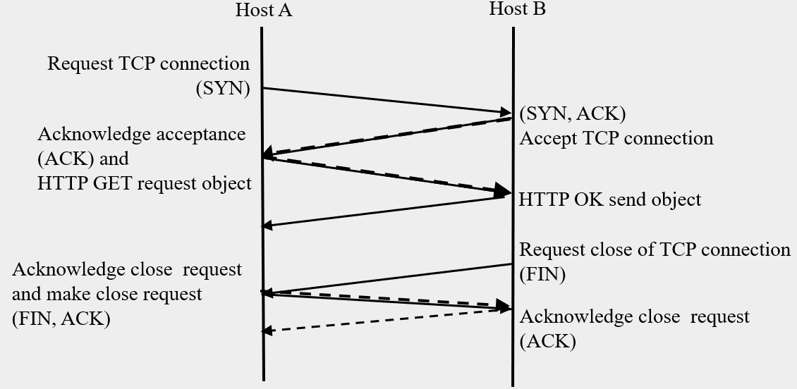

#### Efficiency: non-persistent connections

* Each time a non-persistent connection is made, it is necessary to initialize and terminate a TCP connection
* The RTT (round trip travel time 往返旅行时间) is the time it takes to propagate from A to B and back to A
* For each connection it take $3$ round trip travel times to make and break the connection. 
* If many objects are to be transmitted this extra delay becomes significant. How can we increase the efficiency? 
  * By sending multiple objects through each connection.

### Persistent connections

* In the late 1990’s HTTP 1.1 came into use
* The default in HTTP1.1 is a persistent connection
* When a web page is requested the client requests a TCP connection to the Web server
* Many objects on the requested web page are then transferred through that connection before it is terminated.
* In fact when the web page has been completely sent, the connection will remain open
  * It is likely if one page has been retrieved from the server another will be retrieved soon after
* The connection can be terminated by the client or the server, or will be closed after a "reasonable" time has elapsed without any traffic passing through the connection.
* Each time an object is sent through a persistent connection 
  * Send request for the object to the server
  * Send back a response containing the object
  * Send an acknowledgement that the object has been received
* We wait for the first object to be received before requesting the next object.
  * piggyback - the original ACK received, and the SYN packet which contains negotiations about parameters. Send them as one packet is called piggyback ACK. The only thing to change is in one of the files of the IP header, we have to set a flag called the ACK flag that indicates this packet is acknowledgement. Can be used in both non-persistent connection and persistent connection. If there's no data to send, we put the acknowledgement packet without data.

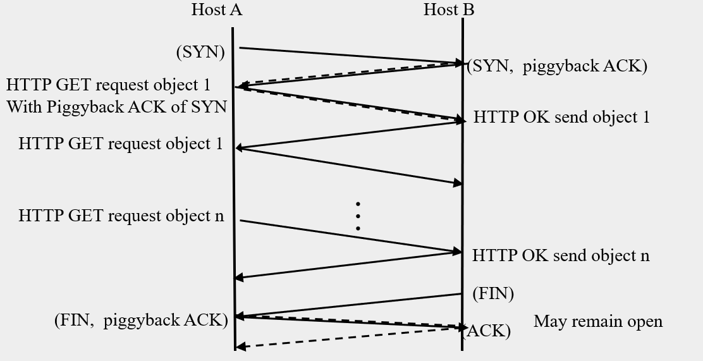

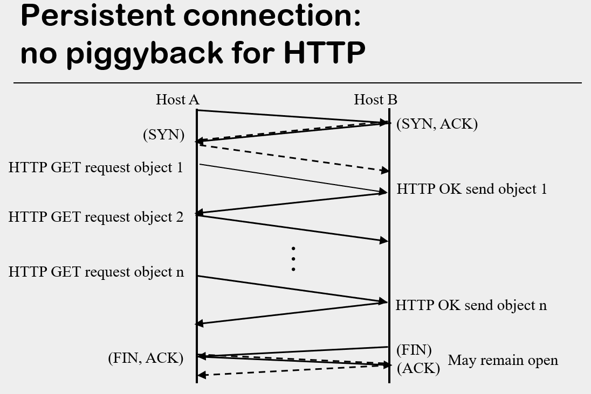

#### Efficiency: persistent connections

* The server must wait 1 RTT between the end of transmitting one object and the start of transmitting the next object 
  * Transmission time plus ½ RTT for the end of the message to reach the client,
  * ½ RTT for the client to make the next request
* If we pipeline, that is allow the next request to be made before finishing the present request we can improve efficiency by removing the need for this 1 RTT per object wait.

### pipelining

* A series of objects can be requested 
  * As the user's agent tries to display a web page it may encounter embedded objects that need to be requested
  * With pipelining these objects are requested as soon as the agent knows they are needed.
  * At the web server the requests are queued and replied to (by sending the object) sequentially 
  * At the web server the requests are queued and replied to sequentially 
  * As soon as the web server has transmitted one object it can begin servicing the next request (sending the next object)
  * Eventually all requests have been serviced and the connection becomes idle
  * After the connection is idle for a short time (usually 10s of seconds) it will be closed
* HTTP 1.1 does not support pipelining, HTTP 2 supports it.

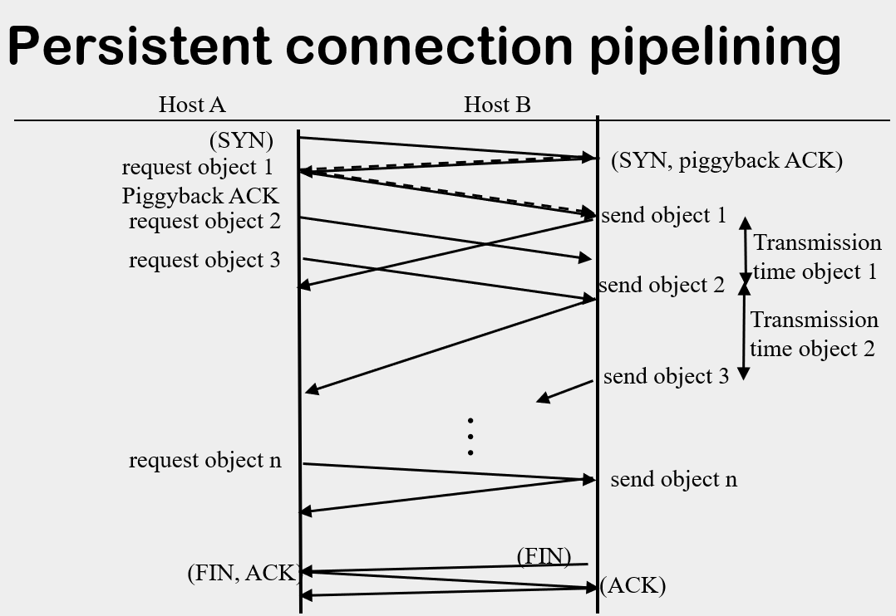

* As soon as the request for object 1 send to Host B, Host A send the 2nd request.
* As soon as the last bit of object 1 send to Host A, Host B start to process the next request in the queue (i.e. send object 2). 

### HTTP request messages

* HTTP request messages are sent by the agent to request that the server provide an object. Each request message includes a method (a command to indicate what is requested)
  * GET most common, gets an object
  * POST to send user (client) input information
  * HEAD (like GET, but no object in response)
  * Others in HTTP v1.1, e.g. PUT, DELETE 
* **GET** the most commonly used method 
  * request objects from a web server (expecting object to be returned)
  * any object is ok.
* **POST** 
  * may send data entered into an online form to the webserver 
  * return back a page that include user input data
  * For example if the data being sent was variables name and password the POST request would use a url with the form:  www.somewhere.com/login?name&password
* **HEAD** (similar to GET)
  * response does not include requested object (primarily for debug)
* Others available only in HTTP v1.1 (LATER)
  * **PUT**
    * uploads file in entity body to path specified in URL field
  * **DELETE**
    * deletes file specified in the URL field

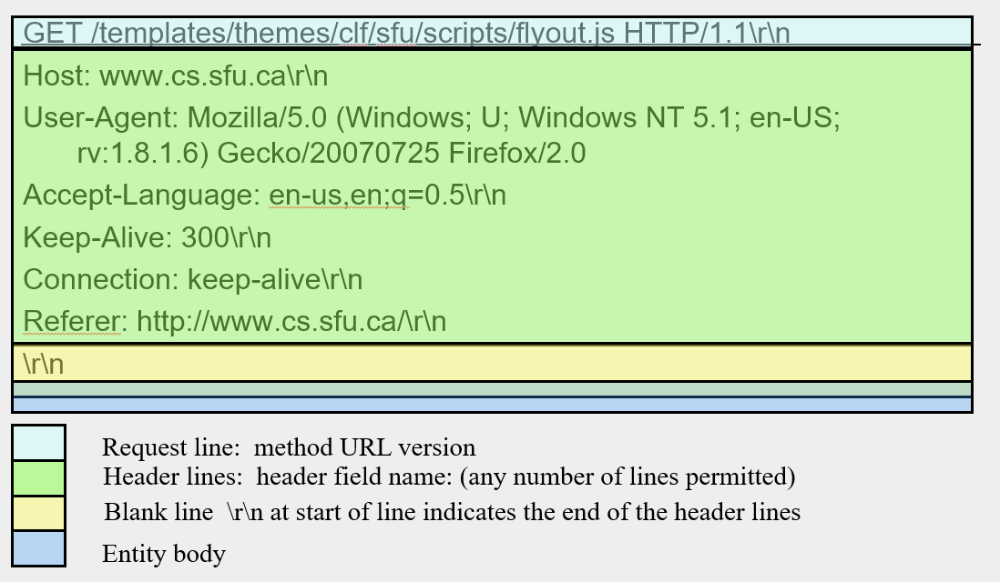

* Connection & Keep-Alive: whether or not we're keep-alive and for how long
* Referer: the network where it comes from
* Blue part: the actual data

### Request message format

* A request line indicating
  * Method, URL, HTTP version
* A header section including details of the request. Each line in the header section includes
  * A field name
  * A value for that field
* A blank line follow
* The entity body for a GET request message is empty so the CRLF indicating the blank line is the last thing in the request message
* Request messages for other methods may include an entity body. For example a POST request message 

### HTTP post message

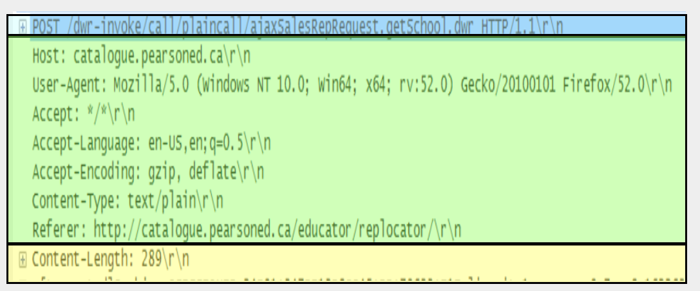

Yellow box: contains additional data sending to the server

### HTTP response messages

* HTTP response messages: sent by the server to provide information and or to send objects back to the agent. 
* Each response begins with a status line containing the HTTP version a status and a phrase
* Header with format the same as header for request
* A blank line 
* Returned object is in the entity body
* Each response begins with a status line: with the HTTP version, a status and a phrase
  * The status is a number
  * The phrase is a name for the status in English
  * Each status is associated with one phrase (list in RFC)
  * OK if everything worked as expected
  * CREATED, ACCEPTED, MOVED, NOT FOUND, NOT IMPLEMENTED, …  (more in your text, see RFCs for complete list)

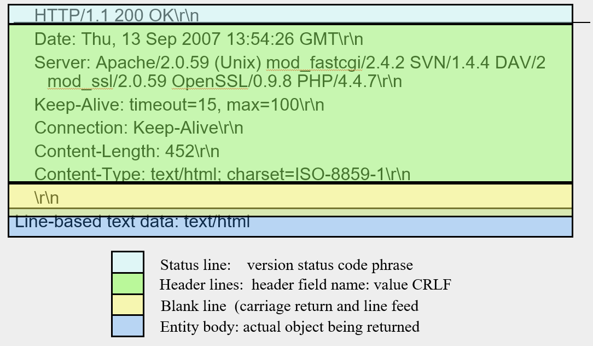

* Blue box: Entity body, this is the actual information, either a HTML file coming back, or one of the objects request in this field.

### What if there is a problem?

* Status code appears in 1st line in response message. Example codes:
  * **200 OK**
  * **301** **Moved** **Permanently** (location given later in msg)
    * the page is moved to another location.
  * **400** **Bad** **Request** (request not understood by server)
    * the request made by applications contains error(s)
    * the request may build in-correctly 
    * the request may be corrupt during transmit
  * **404** **Not** **Found** (requested doc not found on server)
  * **505** **HTTP Version Not Supported**
    * HTTP version: 1.0 1.1 2

### Cookies

* Used by web-sites to identify users and keep track of information about users
* aim to make a faster connection to the server
* Need 4 components to use cookies
  * A cookie file kept on the users machine managed by the users browser
  * A data-base of information kept at the website
  * Information passed between the two above using both the a cookie header line in the HTTP request message and a second cookie header line in the HTTP reply message 

##### Example using cookies (text)

* Susan uses her PC to access the internet
* She visits an e-shopping site for the 1st time 
* Her interaction with the site includes sending HTTP requests to the site create
  * A unique ID stored in a cookie on her computer 
  * An entry in the e-shopping sites database for her account

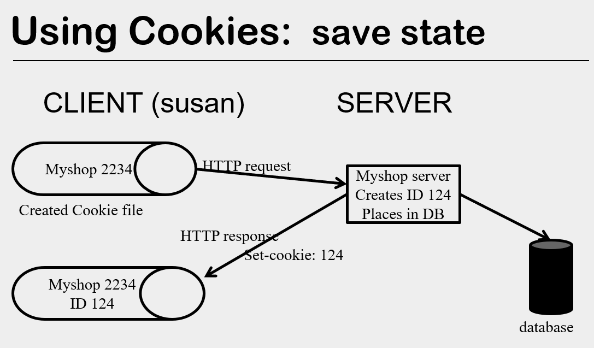

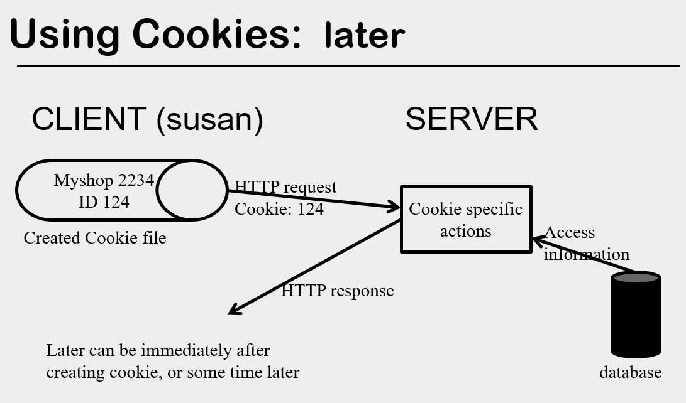

### Controversy 争议

* Cookies can be considered an invasion(侵犯) of privacy or a security risk?
  * May be companies share your cookies with each other
* How do you avoid the risk?
  * accept cookies when interaction with the company, but always delete all the cookies when close the browser.
* What happens if you remove cookies?
* What happens when sites try to prevent you from removing their cookies?

### Caching

* All objects used to display a requested web page may be stored in a cache 
* When your request the same page or a another page containing some of the same objects, the objects you already have in the cache may not need to be downloaded again, they can simply be loaded from the cache

### Proxy web cache 代理网页缓存

* A proxy server is a host that provides a service to users. One such service may be a web cache
* To the client sending the HTTP request the Proxy server appears to be the web server
* To the web server the Proxy server appears to be the web client
* Proxy servers are most commonly used by ISPs, institutions (e.g. university, government) or companies

### HTTP request using a web cache

* The local agent (browser) on the users host connects to the proxy server using TCP then makes an HTTP request (for a particular object) to the proxy server
* The proxy server's web cache application checks the web cache to see if the requested object is in the cache
* If the requested object is in the cache, the web cache application will send the object from the cache to the local agent in an HTTP reply.
* This reduces response time and traffic on external access link (to server)
* If the requested object is not in the cache the web cache will make a TCP connection to the web server, send a HTTP Get requesting the object, and receive an HTTP reply containing the object from the web server.
* The object returned in the HTTP response from the web server, will be placed in an HTTP reply to the client and then sent to the HTTP client 
* The object returned in the HTTP response will also be placed in the web cache

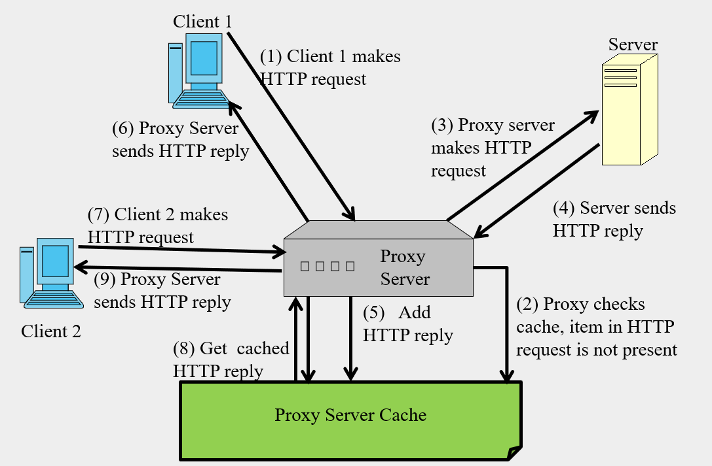

* Proxy Server can exist on any local server, it's usually a software inside some computer server.
  * It can be stored on memory or on a filesystem-backed file. It's usually stored on memory because it's faster.

### Why does caching help

* Reduces load on the Internet, fewer copies of the same object are requested
* Improved security
* Reducing bottlenecks in bandwidth

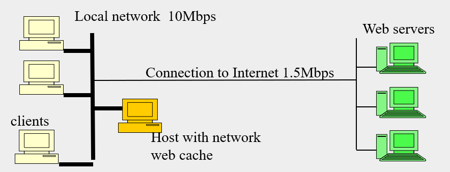

* If there's modification in Web servers, cache server will send a "if-modified" request to the Web server.

##### Caching example (from text)

* Average object size, 100k bits

* Average request rate from institution net 15 / sec

* Utilization of institutional network 

  * 15 * 100K / 10 Mbps = 15% (14.3%, if 1Mb = 220 )

* Utilization internet connection for requests (no cache)

  * 15 * 100K /1.5 Mbps = 100%  (97.7%, if 1Mb = 220 )

  very high utilization implies major delays (minutes)

###### Solution 1: Upgrade speed of internet link (expensive)

* Upgrade speed of internet link (expensive)
* Utilization of institutional network 
  
  * 15 * 100K /10 Mbps = 15%
* Utilization internet connection for requests (no cache)
  * 15 * 100K /10 Mbps = 15%  

   modest utilization implies minor delays (msecs)

###### Solution 2: Install a cache on the local network. Assume 40% of requests are satisfied by the cache

* Install a cache on the local network. Assume 40% of requests are satisfied by the cache

* Utilization of institutional network 

  * 15 * 100K / 1O Mbps = 15%

* Utilization internet connection for requests (with cache)

  * (1-0.4) * 15 * 100K /1.5 Mbps = 60%  

  significant utilization implies small delays (10 msecs)

### Caching

* Caching can increase efficiency
* However, one must also assure that the objects in the cache are current. 
* If an object has changed since it was downloaded, then it should be downloaded again before being displayed as part of the web page
  * Don't want to display material that is out of date

### Keeping the cache current

* How do we assure that the objects displayed on our webpage are up to date 

  * If the object is cached there is a possibility it has changed since it was downloaded
  * Before we display the object, our cache sends a conditional HTTP get message to the server.
  * Have the server send back the cached information again only it has changed.

* To make a Get message conditional the header section must include a If-Modified-Since: header line 

   **If-Modified-Since: Wed, 2 May 2003 10:26:11**

* The date in the header line is the Last-Modified time that was returned in the HTTP response that originally downloaded the object (the date is saved with the object)

* When the request is processed the web server will compare its Last-Modified date of its local copy of the object with the If-Modified-Since date in the request packet

* If the object has not been modified since it was last downloaded the server will return a response that includes a status of Not Modified, and does not include the object in the entity body

* If the object has been modified the modified object will be returned and replace the old copy in the cache, and be displayed as part of the webpage