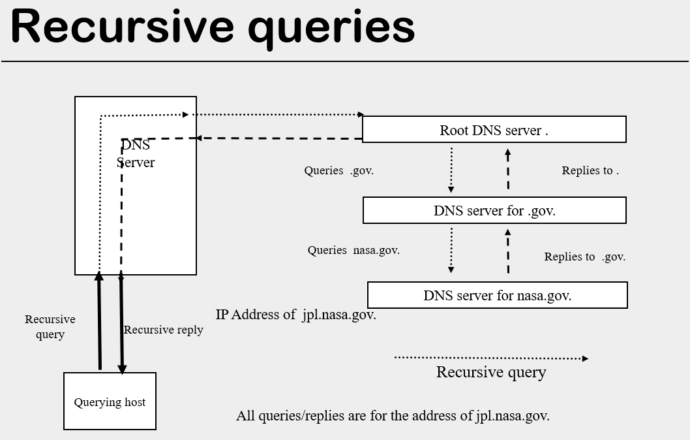

# DNS

### Host names 主机名

* Our computer can have more than 1 IP addresses depending on how many Interface cards we have and how many network we are connected to.
* In addition to identifying a host by the IP address of a connected interface we also identify the interface by an hostname
* Hostnames are easier for a human to use and remember than the IP address
* In the early Internet names were recorded at a central registry(登记处) at the Network Information Center (NIC) .
  * New hosts/names were submitted to the central registry and added to the hosts file
  * The hosts file was available for distribution to all other sites.
* This was a flat naming structure (平面命名结构)

### Hierarchical name space

* The central naming system worked well until the Internet grew larger than it could handle (soon after TCP/IP was adopted)
  * The central servers could no longer deal with the volume of traffic
  * The manual updating of names was slow, and maintaining network wide consistency was difficult
  * Enforcing the use of unique names became more difficult (then impossible) (强制使用唯一名称变得更加困难（当时不可能）)
* The hierarchical DNS name system was designed to replace this original flat namespace in which each machine had a unique name
  * Administration was decentralized using a distributed database
  * Local administrators were given responsibility for building and maintaining a database relating IP address and name for their designated groups of local networks

### DNS (Domain Name System)

* Application runs in the application layer
* The primary use of DNS is to answer queries requesting the IP address that corresponds to a given host name.
* Reverse queries, finding the name of a host with a particular IP address are also possible
* DNS can also support multiple, different names for the same host (computer, mail server, …).
  * The primary name of a host is the **canonical hostname** (规范主机名)
  * A host can be called by names other than it's canonical hostname, these alternate names are called **aliases**(别名)
* DNS can also support multiple IPs for the same canonical hostname (used to distribute load)

### Addresses and names

* IP address is a hierarchical system. (32 bits address, 8 bits for each part)
  * An IP address consists of four integers between 0 and 256 separated by .'s  (example 192.168.3.1) . 
  * As we scan each group starting at the left and proceeding towards the right we obtain more and more specific information
* DNS also uses a hierarchical classification system for domain names. 
  * Domain names may represent a network a sub network or even a host
  * Consists of . separated names. As we read from left to right each name represents a smaller and more localized network or even a single host

### DNS Name Tree

* Labels may have up to 63 characters
* Labels (names) may refer to domains (hosts + nets) hosts or networks 
* 最上面的那个点(**·**)是root
* 第二层叫做 top level domain
  * arpa = advanced research projects agency (高级研究规划局), com = commercial, edu, gov are separated by use.
  * us, uk, ca, fr are separated by country


* Children of different parents can have the same name
* All children of a given parent must have unique names


### Constructing names: name tree

1. Start at the leaves of the tree
2. The domain for the chosen leaf will be the first part of the name. 
3. Add a period to the first part of the name
4. Check the domain name of the root of the current position in the tree. 
   1. If it is not the root of the tree
      1. The domain name of the root of the current position in the tree is added after the period
   2. If it is the root of the tree the name is complete
5. Repeat steps 3 and 4 until the name is complete

###### example: jpl.nasa.gov.


### Fully Qualified Domain Name 全称域名

* DNS uses fully qualified domain names
* FQDNs are complete domain names including all parts of the domain name from the domain of interest up to the root 
  * Ends in a . to indicate root. For example fraser.sfu.ca.
  * The terminating . Indicates that the name is absolute  ( relative to root, not to any other position in the DNS tree)

###### Why is FQDN important?

* Because when we search an IP address to go with the domain, we need to start with the FQDN.
* Some of resolvers, a software on our local machines, can be used to make request will allow partial DNS names.

##### Domain Names: not fully qualified

* Domain names that are not fully qualified (do not end at root, like fraser.sfu) may be interpreted by **some** software as relative to some particular location (other than root) in the DNS tree. 
* Your host must be configured to tell these software applications how to complete a domain name that is not fully qualified (how to convert it to a fully qualified domain name). You must tell the software what locations these names may be relative to.  (LINUX /etc/resolv.conf)

### Knowing where to look

* First, we need a resolver - a tool that make DNS request, and try to find IP address by particular DNS name or make a reverse request.

* Dig and other applications that need to look up DNS information must know where to go to find or ask for the information

* The list of locations to look (on a Linux system) can be found in /etc/resolv.conf. The locations will be queried in the order given

  * /etc/resolv.conf.  is a system file
  *  /etc/resolv.conf.  is a local DNS server we can request names from.

* /etc/resolv.conf Will look something like

  ```
  search cs.sfu.ca css.sfu.ca ensc.sfu.ca math.sfu.ca 
  nameserver 199.60.1.1
  nameserver 142.58.103.1
  nameserver 142.58.103.2
  ```

* If we have a partial name, it is going to look in some of the local networks. 

  * In this case, it will look at cs.sfu.ca
  * if it does find it there, it will look at css.sfu.ca
  * ...

* We can use partial names if our systems can properly configure to deal with partial names. 

* If there are two host have the same name but in different DNS servers, using not fully qualified domain name may result in wrong results.

  * eg. zero.cs.sfu.ca and zero.math.sfu.ca both exist, if we want to get the IP address of zero.math.sfu.ca, only use "zero" will return back the IP address of zero.cs.sfu.ca

#### resolv.conf: search

* search followed by a series of domain names (defaults are generated, in addition you can set the list yourself in versions 4.9 and later)
  * If a query for the address of draconis is made, since draconis is not fully qualified it will not be found
  * Then the resolver will append the first domain name in the search list (usually the domain of the host making the request.) to the requested name, and then make a request for then if the query for draconis.cs.sfu.ca. That request will produce a result
  * If that request did not produce a result the resolver would make requests for draconis with each of the domain names in the search list (in the same order as the list is given) and would stop if and when one of those requests produced a match

### Authority for the DNS namespace (DNS名称空间的权限)

* Authority - organization running the DNS servers for a particular domain, those DNS servers are authoritative domain, which means that domain has been delegated from the higher authority above it on the next level up of the nodes.
* The central internet authority was ICANN (Internet corporation for assigned numbers and names) and is now IANA (Internet assigned numbers authority). 
* Responsibility for the root level **.** domain rests with IANA
  * TLDs, top level directories for the internet namespace
    * include generic TLDs (gTLDs) like .com or .org for classification of domain names by type of use
    * include country code TLDs (ccTLDs) like .ca or .us for geographical classification of domain names
  * Responsibility for administering the TLDs has been delegated to other contractors by IANA. (IANA已将管理顶级域名（TLD）的职责委托给其他承包商)
* Any organization to which responsibility for a DNS domain is delegated 

  * must provide at least two independent DNS servers to service that domain 
    * These DNS servers must be geographically separated
      * if one server doesn't work properly, the other one can continue to support the requests, so that the DNS network will not failed.
      * SFU's another DNS server is in UBC, and UBC's another DNS server is in SFU.
    * These servers must be configured to provide continuous service
  * may delegate authority for parts of the DNS domain for which they are responsible to other organizations.
* Each DNS server must know the name/address of the servers it has delegated responsibility to.

  * The delegator of authority need not inform all organizations it delegates to of changes made by other such organizations. This is an unreasonable load in a rapidly growing/changing internet.

  * The delegated authority has a responsibility to inform the delegator if address or name of the DNS name server changes. This is necessary to guarantee that address queries can be passed down the tree.

### DNS Name Tree: Domains

* Root domain 只包含第二级的domain names
* e.g. sfu is authoritative/responsible for all host under sfu node that have not been delegated to another authority. 


###### Examples of delegation(授权)

* TLD .ca delegates authority to sfu to manage the domain sfu.ca
* TLD .ca delegates authority to BC to manage top level domain .bc
* Domain .bc delegates authority to the BC government to manage domain gov.bc.ca


### How many DNS servers?

* Extrapolating this model we discussed before would have a DNS server for each domain
* What is the smallest domain?
  * 1 host, host name = domain name
    * Clearly this makes too many servers
  * 1 local network = 2 DNS servers
    * Still too many (lots of small networks)
* At some reasonable point we need to stop delegating authority

### Domain Name System

* A DNS domain is a sub tree 
  * The name of the domain is the domain name of the node at the root of the sub tree
  * The domain includes all domains and hosts below the root of the sub tree
    * us domain, includes .ca domain and .ny domain
    * mycomp domain include .mynet domain and host .myhost
  * The administrative responsibility for the domain and its subdomains may be arranged in different ways

### Dividing Authority

* What about domains that include both hosts and multiple sub-domains?
  * Can delegate the sub-domains, what about the hosts?
  * What if you want to delegate only some of the sub-domains?
* Need some more flexible administrative unit, the zone

### Zone

* An administrative division (rather than a logical division) of the domain name tree
  * Each zone is the responsibility of one administrative authority
  * A zone may include hosts and sub-domains 
  * Sub domains in a zone may or may not have authority delegated to other administrative authorities. Any subset of sub-domains may be delegated
  * The domain name of the zone is the domain name of domain with the same root domain name

### Domain Name System - zone

* A DNS zone is a subtree 
  * Any delegated subtree
  * The administrative authority for the zone must maintain at least two completely independent DNS servers for the zone
  * A given zone will have a corresponding zone in the arpa subtree to be used for inverse queries
  * A zone may delegate some of its sub domains and not other

###### DNS Name Tree: zones


### Authority for the DNS namespace

* A particular DNS name server will service a zone. Its database of name information will contain 
  * entries for any hosts in the zone 
  * delegation information for domains or zones that have been delegated to other authorities
    * Includes the address of (pointer to) the DNS servers for the delegated domains or zones
    * excludes information about further delegation of authority in delegated zones or hosts in delegated domains
  * Root servers contain the delegation information for all TLDs

### Difference between domains and zones

* Zones are x	
* Domains are subtree

### Operation of a DNS server

* A DNS name server is initialized, knowing the addresses of the root servers, knowing the addresses of some other servers, or with the zone data files for one or more zones. 
* As queries are made the information received from the queries is added to a cache.
  * Entries generally have a long (hours to days) lifetime.
  * Lifetime (TTL) is set by administrator when configuring the server, or reset by the administrator at a later time
    * Shorter lifetime keeps information up to date but causes increased load of queries to the DNS server
    * TTL = time to live 一个封包在网络上可以存活的时间
* When further queries are made the cache is checked before queries are transmitted

### How DNS server answer a query

* There are two approaches to answering a query
  * **Iterative:** the name server receiving the query, responds with either the IP address of the host or the name of the next server it would consult (next higher server in the tree)
  * **Recursive:** The name server receiving the query, responds with either the IP address of the host or a negative response indicating that the address of the host is not available. The queried server may make additional requests to obtain the address to return.

### Submitting a query from a host

* A host Drab, in domain cs.sfu.ca requests IP address for ftp.isc.org
  * Drab expects to receive the IP address of ftp.isc.org without making additional queries. 
  * The resolver (resolving software such as dig) on Drab it is making a recursive request that requires the local DNS server (symour) to 
    * Make an additional request or requests. 
    * Analyze the reply or replies to the request/s
    * Supply the resulting IP address and potentially other related information to Drab.

### Query from the local DNS server

* The DNS server must then determine the desired IP address. It will make a series of iterative requests for information on the address of ftp.isc.org. (This example assumes the DNS server has not recently resolved a .org address and does not have cached information on these addresses)
  * The DNS server, seymour, will send a request to one of the root servers. The longest match the root server can make will be to the TLD .org (because .org has been delegated)
    * The root server will send back a response with the IP address and name of an authoritative server for the .org domain (plus other information) 
* The DNS server's resolving software will process the returned data, add the DNS server for the .org domain to the cache, and formulate a request to the DNS server for the .org domain 
* The local DNS server will send a request to one of the DNS servers for the domain .org 
  * The DNS server for the domain .org will send back a response with the IP address and name (plus other information) of an authoritative server for the isc.org domain. The isc.org domain has been delegated by the .org DNS server to the ISC, so no longer domain name match can be made (因此无法再进行域名匹配).
* The local DNS server's resolver will process the returned data, add the DNS server for the isc.org domain to the cache, and formulate a request to the DNS server for the isc.org domain
* The local DNS server's resolver will send a request to one of the DNS servers for the domain isc.org 
  * The DNS server for the domain isc.org will send back a response with the IP address and name (plus other information) of ftp.isc.org.
* The local DNS server's resolver will process the returned data,  
  * add an entry for the ftp.isc.org to the cache
  * formulate a reply to the original request from host Drab
* This is a iterative queries between DNS servers.


### Using the Cache: subsequent queries

* A later query to [ftp.isc.org](ftp://ftp.isc.org/) will find the IP address available in the local DNS servers cache. The DNS server will send back the results without making further queries
* A later query to [ftp2.isc.org](ftp://ftp2.isc.org/) will find the entry for isc.org DNS server in the cache of the local DNS server. A single query to the isc.org DNS server will provide the needed information
* A later query to qu.openoffice.org will find the entry for .org DNS server in the cache of the local DNS server. Two queries to the .org and the openoffice.org DNS servers respectively will provide the required information. There is no need to contact the root server

### Authoritative Responses 权威回应

* An authoritative response is an answer that (directly) comes from the DNS server responsible for the zone containing the domain name being queried.
  * If you make a request to another server that have the address you're look for in its cache because someone has already ask for it, then it will send back an answer immediately and that answer will not be authoritative because it does not come back from the DNS server that are responsible for the particular host you are asking about.
* The local DNS server will cache results from each external query
* If an additional query for the same address is made soon after the first, the results will be found in the cache of the DNS server. No contact will have been made with the authoritative server.
  * The received response is not from the authoritative server and may be labelled as an non-authoritative response

###### Why is it important to get authoritative responses?

* Things can change. If you don't have an authoritative answer, you cannot be 100% sure.
* By getting an authoritative responses and requesting responses, you know that no one in the middle has been either damaging, changing, or corrupting the entry. So you can be more sure it is correct.
* However, for most applications, they just taking the one from the first place they found.

### Recursive Requests

* In the example above the resolver on the host made a recursive request, and the DNS server made only iterative requests.
* DNS servers can also make recursive requests. However, busy DNS servers are often configured to accept only iterative requests. (this way they do not need to process the returning results as well, this reduces load on the busy server). Therefore, the iterative approach is more commonly used by DNS servers
* This recursive queries put a lot of load on the root server if everyone made recursive request to the root server instead of iterative request. 
* If from experience the DNS server on the left knows some of the server on the right don't accept the DNS server   request, it will send recursive request to the root server but not iterative request to that server.
* In recursive queries, it will be cached on each level, so the intermediate server have a heavy load. :(



### Domain Server Message

* Messages exchanged between clients and servers
* identification
  * help us match the request and reply
* number of questions / answers / authority / additional
  * we can make more than one request in a single request message
  * each request we made is one single question (what is the IP address of sfu.ca.)
  * when sending the request message, all are empty except 'number of questions'
  * response message will include number of answers section
  * number of authority section tells us the names/addresses of the intermediate DNS servers that were referred to us.


###### example using dig (sending from the server)

```
jregan15: dig ftp.isc.org
; <<>> DiG 9.2.1 <<>> ftp.isc.org
;; global options:  printcmd
;; Got answer:
;; ->>HEADER<<- opcode: QUERY, status: NOERROR, id: 33180
;; flags: qr rd ra; QUERY: 1, ANSWER: 1, AUTHORITY: 4, ADDITIONAL: 5

;; QUESTION SECTION:
;ftp.isc.org.                   IN      A

;; ANSWER SECTION:
ftp.isc.org.            2898    IN      A       204.152.184.110

;; AUTHORITY SECTION:
isc.org.                2898    IN      NS      ns-ext.lga1.isc.org.
isc.org.                2898    IN      NS      ns-ext.nrt1.isc.org.
isc.org.                2898    IN      NS      ns-ext.sth1.isc.org.
isc.org.                2898    IN      NS      ns-ext.isc.org.         
(// 2898 = seconds it will be hold in the cache before the cache entry expires)

;; ADDITIONAL SECTION:
ns-ext.lga1.isc.org.    75012   IN      A       192.228.91.19
ns-ext.nrt1.isc.org.    75012   IN      A       192.228.90.19
ns-ext.sth1.isc.org.    75012   IN      A       192.228.89.19
ns-ext.isc.org.         29497   IN      A       204.152.184.64          // IPv4 address
ns-ext.isc.org.         155246  IN      AAAA    2001:4f8:0:2::13        // IPv6 address

;; Query time: 1 msec
;; SERVER: 199.60.1.1#53(199.60.1.1)
;; WHEN: Fri Nov  5 06:21:09 2004
;; MSG SIZE  rcvd: 236
```


