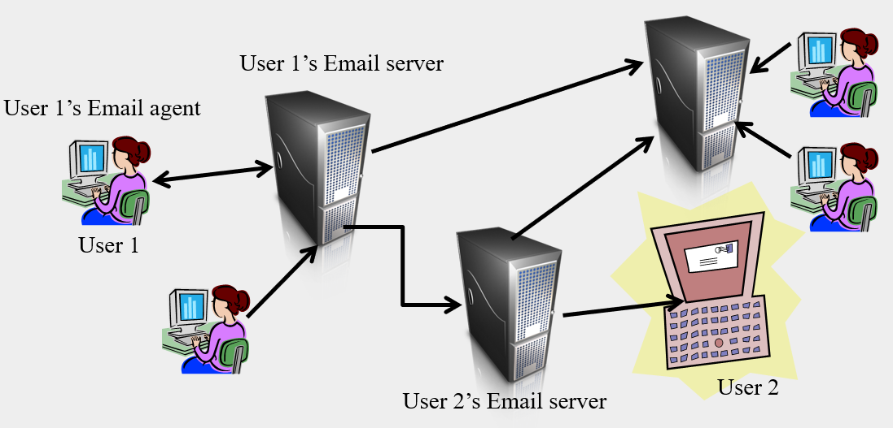
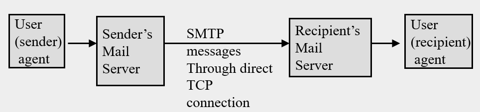
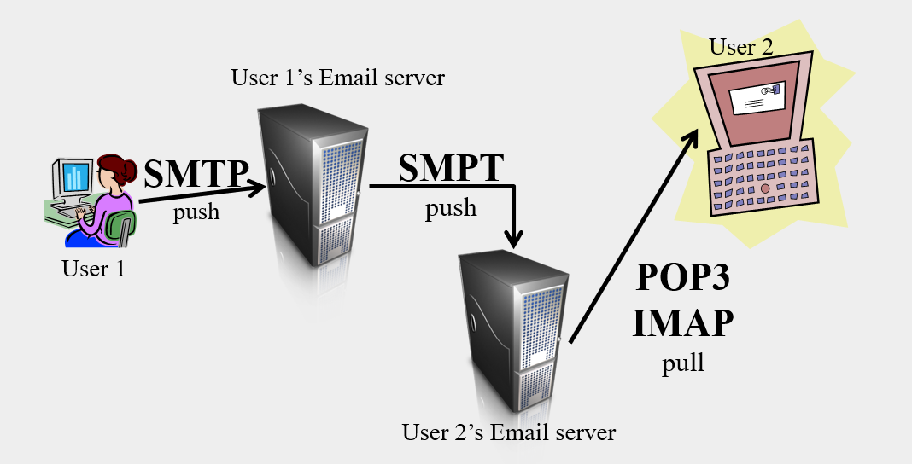

# SMTP

### SMTP

* Simple Mail Transfer Protocol
  * An application supporting email communication across the Internet. 
    * (application layer)
  * We can use SMTP without connecting through the WWW
  * Primarily a push protocol (sends to server)
    * sending data to server without server request it.
  * In contrast HTTP is a pull protocol (requests from server)
* Part of the Internet email system which includes
  * User agents (your mail browser) 
    * Applications like outlook, Thunderbird are not web oriented
    * web oriented clients send mails either using SMTP or the web.
    * SMTP is not the only protocol to send mails
  * Email servers
  * SMTP is a protocol to communicate between user agents and Email servers, and between different Email servers
* For SMTP see RFC 1982 and RFC 2821

### Mail user agents

* A user agent will provide the tools to
  * Compose mail 生成邮件
  * Read mail
  * Send mail (to a recipient through their mail server) 
  * Receive mail (download mail from the server)
  * Archive received mail 归档接收到的文件
  * Forward mail
* Examples of agents 
  * Thunderbird
  * Eudora
  * Outlook 

### Infrastructure of the Email system

* Every Email server includes both a SMTP client (some are also have HTTP client) and an SMTP server
  * Users sending Email are SMTP clients
  * Email servers sending mail are SMTP clients
  * Email servers receiving mail are SMTP servers
  * Every Email server communicates directly (TCP) with other Email servers it wishes to send Email to. 
    * Emails are sent directly from the senders Email server to the receivers Email server. No other Email servers take part in the transfer of the email.

### Sending Email

* Each ISP has one or more email servers, so when you send emails, that where the emails goes.
* When user is sending email, SMTP and TCP is used to send to mail server
* when mail server sending to another mail server it is using both TCP and SMTP
  * make a TCP connection first, then transmit messages using SMTP
* 笔记本电脑那里的箭头指向笔记本电脑: the emails are pushed to the laptop because the this user running a local SMTP server. 



* How a email sending?
  1. send the email to local email server
  2. local email server make a TCP connection to destination email server and queuing in destination email server
  3. the destination email server process the message and place it to the mail box  of the correct recipient
  4. Later on, the recipient will request that email and pull it down from the server.

### Mail servers

#### normal operation

* When user 1 sends an Email to user 2. The Email will
  * be sent to user 1's mail server 
  * be queued on user 1's mail server 
* User 1's mail server will then use TCP to connect to User 2's Email server
* User 1's mail server will then use SMTP to 
  * send the Email to the user 2's mail server
* When an Email arrives at user 2's mail server it is placed in user 2's mail box
* User 2 can later retrieve(取回) the message

#### problems?

* When user 1's mail server uses SMTP to try to send an Email to user 2's mail server 
  * User 1's server will try to create a TCP connection to the user 2's server
* Why might it be impossible to reach user 2's server?
  * The requested server is down (not operating)
  * The requested server does not exist
  * The requested server is too busy and can not accept the senders TCP connection

#### If user 2's Email server is not reached

* What happens if user 2's mail server is not available
  * User 1's Email server will leave the message in its own queue and try to resend it again later
  * After some number of retries user1 will received a mail from his mail server indicating that the mail he sent could not be delivered
  * The email user1 sent will be dropped from user 1's mail server's queue by the mail server

### SMTP: legacy protocol (遗留的协议)

* SMTP is an relatively old protocol
  * It requires all messages be sent in ASCII (text) format
  * If the message is not in text format then it must be somehow translated into text format (even if you are sending images)
* Unlike SMTP the newer protocol HTTP does not require this translation



### MIME extensions

* multipurpose Internet mail extensions 多用途因特网邮件扩充
* For inclusion of non text information in mails
* Provides methods for translation of non-text information into text for transmission using SMTP
* Information on encodings used will be placed in the header by the sending agent so that the receiving agent can decode the information and reconstruct the non textual information
* Other information like the RECEIVED line that indicates when the message arrived and from where are added by the receiving mail server before being forwarded to the receiving agent
* For details see RFC 2045
* HTTP mail is a much more modern protocol and translations are not necessary required.

### You own SMTP server?

* Where should the SMTP server be?
* If we place the server on our PC or MAC
  * Machines (receiver and sender) must always be on
  * Machines must always be connected to internet
  * Machines must run server software itself
* Usually better to have email servers on a network server that is maintained, always on, and always accessible

### Sending Email: user1 to user2



### Agents communicate with servers

* Mail access protocols are used by agents communicating with mail servers to request download of mail (pull operation not push so we don't use SMTP)
* Such protocols include
  * POP3 (post office protocol v3)  邮局协议
  * IMAP (internet mail access protocol) 互联网邮件访问协议
  * HTTP (hotmail and webmail)

### POP3 (post office protocol)

* Details in RFC 1939
* A simple mail server access protocol (for downloading received mail)
* The user agent connects to the mail server through a TCP connection
* Once the connection is made POP3 will check the authorization (username, password etc.) of the user
* The user agent then performs transactions needed to download the user's Email

#### POP 3: login session

C - client

S - server

```
S: +OK POP3 server ready
C: user janice
S: +OK
C: pass tigermoth
S: +OK user successfully logged on
```

#### POP 3: download session

* User selects "download only" or "download and delete". `dele` commands only used when "download and delete" mode is selected 
* "download and delete" is default
* disadvantages
  * choose download and delete, then only one machine can have the email, cannot see it in other devices even if you can login on that device
  * 客户端不同步 - Managing folders, make different folders, done by your local email client, but you must done it again on other devices.
  * always download the whole message but not download the desired messages. 

```
C: list
S: 1 765
S: 2 225
S: .
C: retr 1
S: <what is in the body and header of message 1>
S: .
C: dele 1
……
C: retr 2
S: <what is in the body and header of message 2>
S: .
C: dele 2
C: quit
S: +OK POP3 server signing off
```

#### POP3

* The user agent then performs transactions
  * retrieves the users messages from the mail server across the TCP connection (may delete messages as they are retrieved or not. Two modes available)
  * records agent requested deletions etc. and replies to such requests
* The agent breaks the connection and then the server completes outstanding deletion/modification requests from the agent (代理断开连接，然后服务器完成来自代理的未完成删除/修改请求)
* Once mail is downloaded the user agent allows classification into folders locally. (Not on the mail server)

#### Pop 3 from multiple clients

* If a user accesses her email from two different locations, her office and her home then POP has some limitations
* If POP uses download and delete mode any messages accessed at home have been deleted and cannot be accessed from the office
* If POP3 uses download only, then the user needs to remember to manually delete mail that she has downloaded in both places
* If the user wants to sort into folders they must manage the downloaded mail on each client: Repeat the organization on each client
* If the user wants to search through email they can only search through email that has been downloaded to the client
* The server generally has no ability to support folders or sorting.

### IMAP

* Details in RFC 2060
* A more complex and feature rich mail server access protocol (一种更复杂且功能更丰富的邮件服务器访问协议)
* Allows organization of mail into folders on the mail server, so that those folders can be accessed from anywhere, (not just the machine they were downloaded to in the case of POP3)
* (Disadvantages) This requires more commands in the communication protocol to allow the user to instruct the server to move files and save them in particular folders, to create and move those folders
* Even more flexibility.
  * Accessing from low bandwidth location you can request only message headers be downloaded, than only download the desired messages that are immediately needed.

#### IMAP more flexibility

* Mail will be associated with an inbox folder on arrival
* The user organize the mail into user created into folders on the server from any client. The organization of the mail is stored on the server
* The changes on one client will be visible when the user logs into another client
* All mail can be searched

