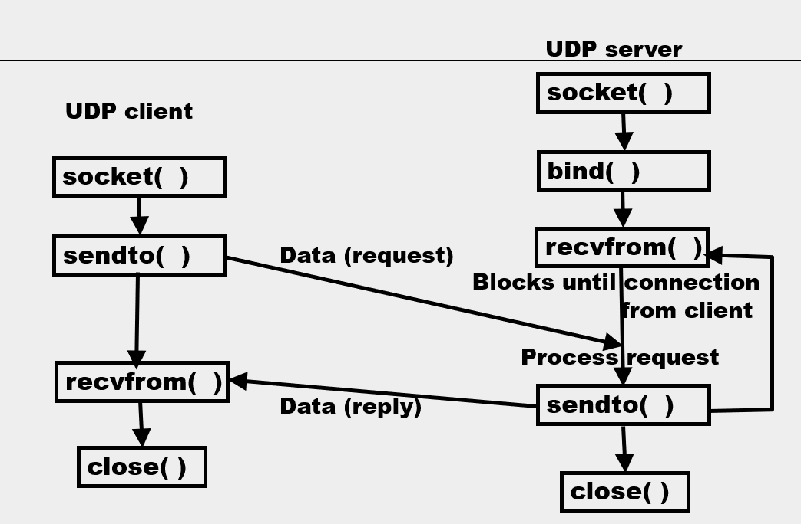

# Socket Programming

### The socket interface

* The socket interface is used in application programs to specify the interface between the application program and the transport layer protocol software (TCP, UDP) (套接字接口在应用程序中用于指定应用程序和传输层协议软件之间的接口)
* The form of the interface (API) may vary for different OS's and between different computer languages. 
* The socket interface discussed here is the Python interface which is based on the BSD UNIX sockets
* The Python interface is similar to the BSD UNIX C interface but easier to use.

### IO: <u>FILE</u> vs. NETWORK

* When reading or writing a file, a file descriptor is used to specify the file referred to
  * A file is opened using a particular file descriptor, binding the file or device to that file descriptor 
  * Data is read from and/or written to file 
  * to read or write, need at least three pieces of information
    1. File descriptor
    2. Buffer (holds data read from file or data being written to the file)
    3. Number of bytes to read/write (or size of buffer)
  * File is closed

### NETWORK IO

* A socket is a communication endpoint, the socket descriptor is an integer describing a particular socket
* A socket is not automatically bound to a particular IP or port
* The application programmer can choose when to bind the socket to a IP and port, or to let the OS bind to a IP and port at runtime (应用程序程序员可以选择何时将套接字绑定到IP和端口，或者让操作系统在运行时绑定到IP和端口。)
* Two sockets can be connected to form a connection
* When a connection is made it is assigned a connection identifier
* When sending or receiving data across a network connection we write or read to a connection identifier

create a socket -> binding it to an appropriate port & IP address -> connect to another socket 

### IO: FILE vs. <u>NETWORK</u>

* When reading or writing through a socket a connection descriptor is used to specify the particular connection
  * A socket is connected to another socket (communication endpoint) to create a connection
  * A created connection has a connection identifier, the identifier is used to tell the system where to send data.
  * Data can then be transferred from one endpoint to the other. Once the sockets are connected the connection descriptor can be used like a file descriptor
  * When the data transfer is complete the connection is closed

### UDP Data Transfer



* The functions includes parameters, but for clear, they are not show up here.
* `socket()` - create a socket
* `sendto()` - receiving the data from the application, put it into a TCP segment, send the segment to other end of the connection. Then send back a reply (acknowledgement)
* `process request` - send data up to the next level
* When finishing sending data, either timed out or send a request `close()`, to close the connection.

### UDP client

```python
from socket import *
serverName = 'localhost' #定义serverName为'localhost',a lable for loop back address, means sending from this process to another process on the same machine
serverPort = 50007 #定义serverPort为50007
#create a socket, AF_INET,SOCK_DGRAM are constants from socket library
#AF_INET - replacing a value for the type of the network / packets we are sending, this is IPv4 packet
#SOCK_DGRAM - sending a socket datagram, a UDP packet
clientSocket = socket(AF_INET, SOCK_DGRAM) 
message = input('Input lowercase sentence:')
clientSocket.sendto( message.encode(),(serverName, serverPort) )
modifiedMessage, serverAddress = clientSocket.recvfrom(2048)
print (modifiedMessage.decode())
clientSocket.close()
```

#### Import and localhost

`from socket import *`

* Imports the python socket library into your code
  * The python library is built on the BSD socket library

`serverName = 'localhost'`

* This example talks between a server and client on the same machine. 
  * The name of the host that is used to connect to other processes on the same host is localhost (or lo)
  * To connect to another host this would be the DNS FQDN name of the host

#### Storing port and address

`serverName = 'localhost'`

`serverPort = 50007`

* This set values for two variables that will be reused by the UDP client
* Note in this example I use a different port for the server
  * 1200 (text used in the example) is the "well know" port for UDP. Your system UDP server will use this port. 
  * I am using an unassigned port that will not interact with any UDP servers already running on your machine

#### Create and send a message

`clientSocket = socket(AF_INET, SOCK_DGRAM)`

* First need to create a best effort socket
  * `SOCK_DGRAM` tells the client to create a UDP socket
  * `AF_INET` tells the client to create and IPv4 socket
  * The name the socket is referred to by the rest of the statements in the client will be `clientSocket`

#### The socket method:

`socket(AF_INET, SOCK_STREAM, PROTOCOL )`

* The family indicates the family of protocols that will use the socket (AF_INET for IPv4,  AF_INET6 for IPv6)
* The type indicates the particular type of transfer that will be used (SOCK_STREAM for TCP, SOCK_DGRAM for UDP, SOCK_RAW for raw data, SCTP 流控制传输协议 (stream control transmission protocol) more secure)
* The protocol indicates the particular protocol to use (usually 0) This argument is optional (defaults to 0)

#### Creating a socket

`socketfd = socket( AF_INET, SOCK_STREAM);`

* `socketfd` is the socket descriptor / identifier for the newly created IPv4 TCP socket
* This socket is not yet associated with any communication endpoint (IP address, port pair)
* The socket is an active socket (for use in active connection mode) 
* You can see all the possible values for protocol family, protocol type and protocol in the descriptions of the python interface available online

#### Create and send a message

`message = input('Input lowercase sentence:')`

`clientSocket.sendto( message.encode(), (serverName, serverPort) )`

* First create the message called **message**
* **Send message** through socket `clientSocket`
  * The message will be sent to the Ip address that corresponds to the DNS FQDN in variable `serverName`. 
  * The ip address will be found using a DNS query made by the `sendto` method
  * When the message arrives at the destination ip address it will be sent to the process at port `serverPort`

#### Receiving a reply

`modifiedMessage, serverAddress = clientSocket.recvfrom(2048)`

* When the server receives the message the message will be processed and will produce a reply
* The client needs to receive the reply
  * Here `modifiedMessage` is the reply
  * The reply arrives from the host with ip address `serverAddress`
  * The reply is received by `clientSocket`

#### Close your socket

* After all information has been transferred close your client’s socket

* In our example the name of the client's socket is clientSocket, so to close the socket 

  `clientSocket.close()`

