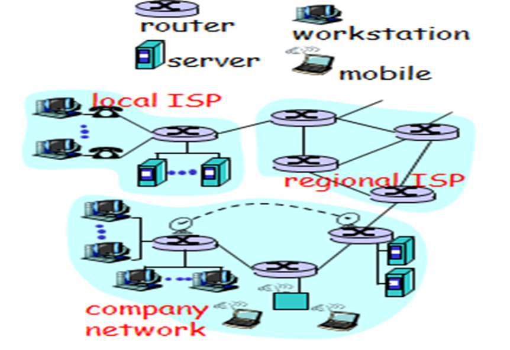
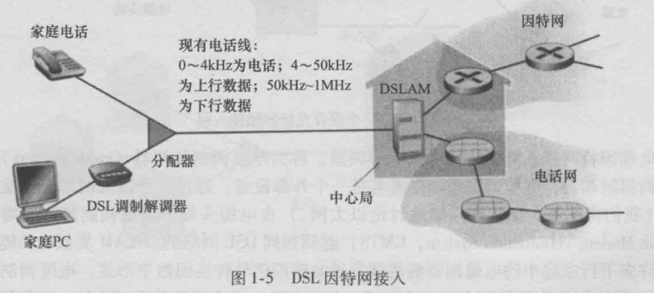
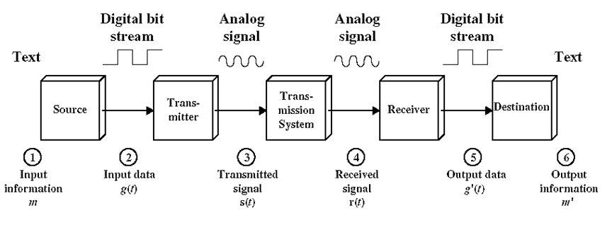
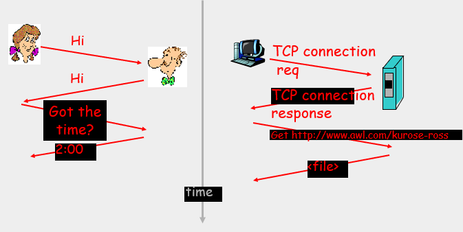
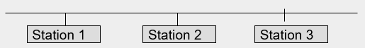
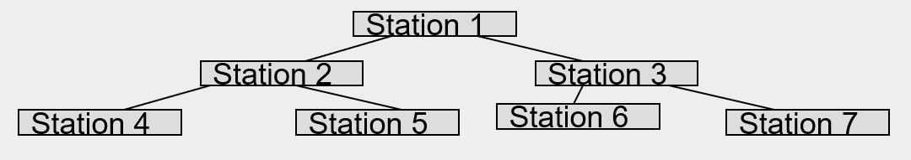
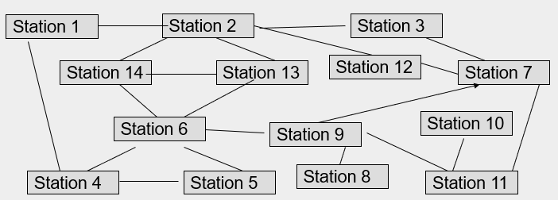
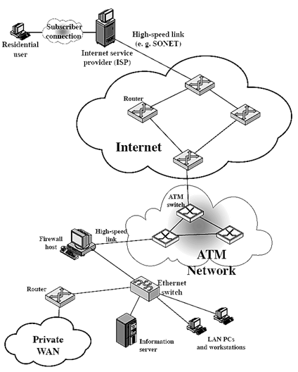
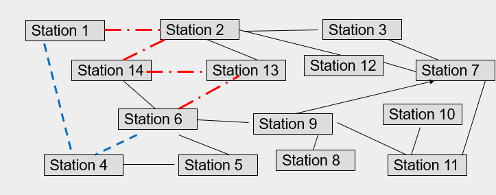
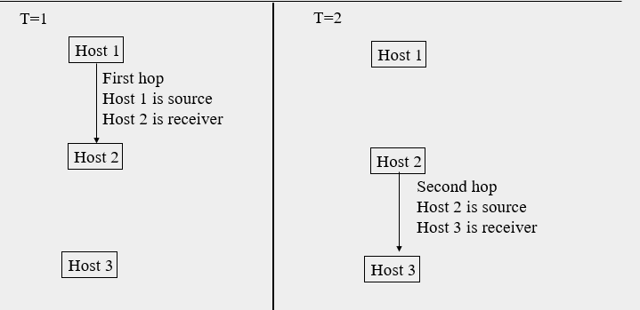

### What is the Internet

* Networks include many connected devices
  * workstations, laptops, tablets, mobile devices, TVs, other "Things" in the IOT (Internet of things)
  * Routers, switches, servers, base stations ...
  * Base Station 基站，又称基地台，是固定在一个地方的高功率、多信道、双向无线电发送机。
* The Internet is a collection of networks
* Networks of connected devices use protocols to communicate. 
* Communication = 
  * sending and receiving messages
  * taking actions on receiving or sending messages (or other events).

### End systems: the network edge 终端系统：网络边缘

* An end system (host) can be a source system, and/or a destination system at the edge of the Internet.
* 端系统 - 通常把与因特网相连的计算机和其他设备成为端系统。
  * 端系统也成为主机，因为它们容纳（即运行）应用程序。
* End systems connect to the network using <u>communication links</u> (通信链路). 
  * Guided media 引导媒体: Copper wire (coaxial 同轴的, twisted pair 双绞线), optical fibre
  * Unguided media: air (radio, microwave, IR ...)
* End systems are also referred to as hosts(主机). They may clients and/or servers 
  * A **client** *consumes* a service - 非正式地等同于桌面PC、移动PC和智能手机等
  * A **server** *provides* a service - 非正式地等用于更为强大的机器，用于存储和发布Web页面、流视频、中继电子邮件等。
  * An end system can be a consumer of one service and a provider of another service. 

##### Examples of end systems

* Mobile phone
* Personal computer
* Server supporting a service
* Tablet
* TV
* Gaming Console
* Others?

### Access Network 接入网

* 接入网 - 指将端系统连接到其边缘路由器(edge router)的物理链路。
* 边缘路由器 - 是端系统到任何其他远程端系统的路径上的第一台路由器。

##### 家庭接入：DSL、电缆、FTTH、拨号和卫星

###### 数字用户线 DSL - Digital Subscriber Line

* 住户从提供本地电话接入的本地电话公司处获得DSL因特网接入。（因此，使用DSL时，用户的本地电话公司也是他的ISP）
* 每个用户的DSL调制解调器使用现有的电话线（双绞铜线）与位于本地电话公司的本地中心局（CO）中的数字用户线接入复用器（DSLAM）来交换数据。
* 家庭的DSL标志解调器得到数字数据后将其转换为高频音，以通过电话线传输给本地中心局
* 来自许多家庭的模拟信号在DSLAM处被转换回数字形式

### Services the Internet provides

* Communication between end systems
* Communication supports many applications. Some applications include:
  * WWW (world wide web)
  * Email, chat, video
  * E-Commerce, E-banking
  * Games, social media

### Data Communications

* Many ways to transmit the information
  * Voice - in person, by telephone, Internet, physically sending recorded media, wireless
  * Data - on paper disk or tape, vocally(声音地) or digitally using LAN, WAN, internet, or wireless
* Want to send information from one location to another efficiently and accurately
* Many transmission methods have independently evolved for particular types of data. 
* Different transmission methods, used for voice, data, internet and video have converged(融合). 

### Source Systems, Transmission 源系统，传输

* **Source System**: Includes *data source* and *transmitting device* which encodes data into electromagnetic(电磁) signals suitable for transmission through the transmission medium. 
* Example of Source Systems
  * Smartphone
  * Personal Computer

### Destination Systems

* **Destination System**: Includes a *receiver* to intercept the transmitted electromagnetic signals from the transmission system and to decode/demodulate the those signals into a form appropriate for the destination device. 

### Examples of Source and Destination Systems

* Landline Telephone
  * encodes/modulates voice or data into electrical signals to be carried through a line and a switching system.
  * decodes/demodulates signals carried through a line and a switching system into voice or data.
* Cellular Telephone, Satellite or Radio
  * encodes/modulates voice or data into signals to be sent through an antenna(天线).
  * decodes/demodulates electromagnetic signals received by an antenna into voice or data. 
* Personal Computer
  * encodes/modulates a data stream of binary bits to a form that can be efficiently carried through a computer network. 
  * decodes/modulates an electromagnetic signals from a computer network and reconstructs the information that was sent. 

### Transmission of Information

* Information is sent from a source system to a destination system.
  * The information must be fed into the source system 
  * The information must be encoded into a form the source system can send (usually into an electromagnetic signal)
  * The information travels through some transmission medium to the destination system
  * The destination system must be able to interpret (decode) the received signal
  * The decoded signal must be translated into a form that the operator of the destination system can understand

### Simplified Communications Model

### Data Communication Networking

* The problem is more complex than point to point connection
  * Source and destination may be separated by large physical distances. 
  * Links may only be needed for a short time, dedicated links would be too expensive.
  * Many devices, any of which may be the source or destination at a given time. 
  * Multiple pairs of source and destination may wish to communicate through the same medium at the same time. 
* These problems are addressed using networking protocols
  * All devices communicate via a net of connections
  * Efficiency and accuracy is maintained using protocols

### What is a protocol?

**Network protocol** are sets of established rules that dictate how to format, transmit and receive data so computer network devices - from servers and routers to endpoints - can communicate regardless of the differences in their underlying infrastructures, designs or standards. 

一个**协议**定义了在两个或多个通信实体之间交换的报文格式和次序，以及报文发送和/或接收一条报文或其他事件所采取的的动作。

A **human protocol** and a **computer network** protocol:

### Why a Network

* The number of stations is large, it is not possible to have dedicated connections to all other end systems. 
* The distance between two stations may be long enough that the transmission media cannot carry the signal from the source to the receiver without introducing many errors, going through intermediate devices will fix this problem. 
* Worldwide connectivity is desired. 

### Station Interconnection

* The number of station is large.

##### method 1: direct connection

* Direct connection between all stations is not practical: $n(n-1)/2$ connections are needed
* Connection using a shared bus limited by distance (long paths with loss of signal due to attenuations(衰减)). Bus can carry information, lacks redundancy (any failure of link destroys connectivity), and allows only 1 message to travel at a time.

##### method 2: tree routes

* connection in a tree routes too much traffic through the root. 

  

* Connection through a Partially Connected Network distributes traffic(流量) and provides redundancy. Also provides a mechanism for repeating signals to enable long distance propagation(传播). 

  * redundancy(冗余) - 信息的冗余度是指同一信息通过不止一种媒介披露，或通过统一媒介披露不止一次。

##### method 3: Station Interconnection

* Connection through a Partially Connected Network provides redundancy and intermediate stations along the path to act as repeaters.

### Wide Area Networks (WAN)

* A WAN covers a large geographical area
* A WAN often uses common carrier or public right-of-ways.
* A WAN uses internal nodes to move data through network. 

### Local Area Networks (LAN)

* A LAN interconnects a variety of devices in a small area: Building or campus scope.
* LAN is usually owned / controlled and managed by one organization. 
* Most common types of LANs are 
  * Ethernet 以太网
  * ATM = Asynchronous Transfer Mode 异步传输模式
  * Wireless

### Travel through a network

* Does all data in a message take the same path? No.
* What happens to data between each hop, what does each station do to the data passing through it?
* Data can travel along different paths from one station to another through the network.

### Approached to network travel

We can take different approaches to managing data

* **Circuit switching (电路交换)**: make a connection along a particular path and send all data in the message through that path.  
* **Packet switching (分组交换)**: break the message into pieces and send each piece separately along its own path.
* **Virtual circuit switching (虚拟电路交换)**: break the message into pieces, use software to simulate a connection in a packet switched network.

#### Circuit Switching 

* Connection Oriented
  * A path or circuit, or series of hops through the network, from the sending station to the receiving station is established, used as dedicated link, then disconnected. 
  * The communications links used for the dedicated link are not available to other users for making other connections. 
* Origin: analog telephone networks
* A path or circuit through the network is established. This path consists of a series of hops between nodes or switches, then a final hop to the receiver. 
* The switches have the intelligence to help determine a path through the network and allocate available resources.
* Once the circuit is established it is used as dedicated link. 
* Data is transferred through that circuit, flow control is end to end (not hop by hop).
* If data is in the form of a series of bursts, the time between bursts is not utilized. The utilization of the connection will be low if the data is a series of bursts. 
* When the session is over the circuit is closed. 

###### Advantages

* provides a dedicated link
* efficient for continuous transmission
* do not have delay of waiting for packets to arrive before data can be forwarded along the next hop of the path.
* easier to implement control for quality of service
* guaranteed bandwidth

###### Problems

* inefficient when data comes in bursts, during the time between bursts the connection is allocated but not being used. 
* overhead required to establish and break circuit
* connection must be reestablished if there is a problem with any switch along the established path. 
* cannot send at a rate higher than your allocated share of resources even if you are the only user. (即使您是唯一的用户，也无法以高于分配的资源份额的速率发送(信息)。)

### Packet Switching

* Packet Switching: Connectionless
* the message sent is broken into small pieces called packets.
* each packet is sent through the network separately and can take a different path through the network. 
* At each hop the packet must be forwarded to the next host along the path to the destination.
* each packet is transferred 1 hop at a time, the intermediate stations need only wait for the end of the packet not the end of the message.
* the communications links used to send the packet are not reserved for any particular connection and are available to all end systems.
* No call setup or call termination required.
* Each packet, referred to as a datagram(数据电报), is sent individually, and is routed through the network individually. 
* packets with the same source and destination may take different paths through the network, and thus may arrive at the receiver out of order. 
* flexible reaction to congestion and failure. (对拥塞和故障的灵活反应。)
* robust delivery of packets, less loss of information in lost packet than in broken virtual connection when a node fails. (可靠的数据包传送，与节点故障时断开的虚拟连接相比，丢失的数据包中的信息丢失更少。)

###### Packet travel times

* packets can travel along different paths from one station to another
* different paths have different travel times
* packets that leave in order A-B-C may arrive in any order, because they travel along different paths with different travel times
* having more than one available path provides a more reliable transmission system. If one path fails, a different path can be used. 

###### Store and Forward node

* A network node that 
  * receives and stores incoming packets.
  * checks incoming packets for bit level errors
  * forwards the correct packets to the next store and forward node
* important: think of each hop as a separate communication.
  * source sends packet
  * receiver receives packet and queues it
    * if the queue is full, the receiver drops the packet
  * receiver checks the packet for correctness.
    * if a packet is not correct, the receiver may drop the packet (best effort transmission 尽力而为传输)
  * otherwise the receiver then passes packet on to another connection. 
* at each store and forward node, delay is introduced
  * waiting for the whole packet to arrive before forwarding the packet.
  * checking the packet for transmission errors.
  * waiting for the system to check the packet for transmission errors.

### Virtual Circuit Switching

* used in packet switched networks
* uses software to simulate a connection
* at any time any station can have multiple virtual circuit connections to the same or different destinations. 
* virtual circuits allow retransmission of data packets that arrive with errors. 
* Error / Flow control is associated with the virtual circuit. 
* at the beginning of each data exchange between a source and a receiver, a single path or virtual circuit from the source to the receiver is established and all packets in the exchange follow this path. Since packets follow the same path they arrive in order. 
* the virtual circuit is not dedicated. Each packet will be queued for transmission at each hop along with any other traffic traveling cross that particular link. Thus, when the virtual circuit connection is not being used by the source and receiver in this exchange it may be used by other exchanges. 

### What is a hop

### Queuing delay

* as the packet travels to each intermediate or final destination there are possible additional delays
* each time a packet arrives at a host or router or switch there is a possibility that it must enter a queue of packets waiting to be processed. 
* the time the packet resides in this queue, before the processing of the packet begins is the queuing delay. 
* when a packet arrives at a store and forward node, if the store an forward node is busy processing another packet it will be placed in a queue waiting for its turn. 
* unlike other delays, different for different packets because variations in the length of the queue independent of the packet (队列长度的变化与数据包无关).
* usually analyze queuing delays statistically

### Processing delay

* when a packet reaches a store and forward node
  * its header must be read and analyzed
  * its contents must be checked for bit level errors. 
* the time taken to do such checks is the processing delay.

### Transmission delay

* when a packet is sent the hardware used translates one bit at a time and inserted it onto the transmission medium
  * consider the link can send R bits per second
* the time taken for all L bits in the packet to be inserted into the transmission medium is the transmission delay, L/R.

### Propagation delay 传播延迟

* each bit must travel from the source to the destination through the transmission medium.

* the time taken by each bit to travel distance $d$ from the source to the destination is the propagation delay.

* This time is short (travels near light speed)

  $d_{prop} = d/v$ 	velocity $v$ is $2-3*10^8$

  