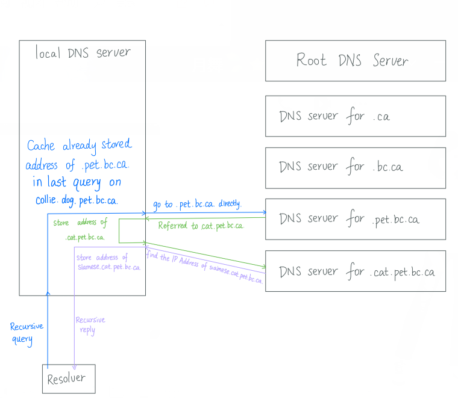

**1) A system uses statistical time division multiplexing, there are 80 channels (80 different signals) being combined into one multiplexed signal. Each channel carries frames that contain 45 bytes of header and 1155 bytes of data (a total of 1200 bytes). Each channel supports a maximum data rate of 2.5MB per second (1KB = 1024 bytes, 1MB = 1024 KB, 1GB = 1024 MB). Assume that the average data rate passing through each channel is 0.5 MB/s. Assume that the bandwidth capacity of the line carrying the multiplexed signals is 50 MB/s.** 

​	**a) [3 points] What is the average percentage of the time each channel is used?**

​		Since each channel supports a maximum data rate of 2.5 MB/s, and the average data rate passing through each channel is 0.5 MB/s. 

​		The average percentage of the time each channel is used = average data rate passing through each channel / maximum data rate of each channel * 100% = (0.5 MB/s) / (2.5 MB/s) * 100% = 20%.

​	**b) [3 points] What fraction of the information being sent is overhead?**

​		The overhead in Statistical TDM is the header in each frame, so the fraction of overhead in the information being sent = size of header / size of frame = 45 bytes / 1200 bytes = 0.0375 = 3.75%.

​	**c) [3 points] What is the average input bit rate summed over all signals?**

​		Average input bit rate of all signals = average data rate passing through each channel * number of channels = 0.5 MB/(s*channels) * 80 channels = 40 MB/s.

​	**d) [3 points] What is the average data transmission rate summed over all signals? (data only)**

​		According to part b), the fraction of the header in each frame is 0.0375, so the fraction of data in each frame is 1-0.0375 = 0.9625.

​		Average data transmission rate of all signals = average input bit rate of all signals * data fraction = 40 MB/s * 0.9625 = 38.5 MB/s.

​	**e) [3 points] What percentage of the line's capacity will be utilized?**

​		percentage of the line's capacity be utilized = average data transmission rate of all signals / bandwidth capacity of the line * 100% = (38.5 MB/s) / (50 MB/s) * 100% = 77%.

**2) Consider a transmission line with a capacity of 180 Mbps (1Mbps = 2^20^ bits per second).**

​	**a) [4 points] How many users would the line support assuming each user has a 8 Mbps connection and uses synchronous TDM to access the line? Assume that only 95% of the capacity of the line may be used for user connections.**

​	The size of the utilized part = line capacity * percentage of the capacity of the line be used = 180 Mbps * 95% = 171 Mbps.

​	Number of users the line support = the size of the utilized part / each user's connection = 171 Mbps / 8 Mbps = 21.375. 

​	Since the number of users must be an integer, and the line cannot support "half user", the number should be rounding down. So the number of users would the line support is 21. 

​	**b) [4 points] Suppose that each user only used their 8 Mbps connection 28% of the time, 95% of the capacity of the line may be used for user connections and synchronous TDM is being used. How many users can the line support for these assumptions?**

​	Synchronous TDM slots are filled from a predetermined sequence of sources. If there is no data to transmit an 'idle' signal is sent. Although user only used 28% of the time, the time slot still reserved for the predetermined sequence of users. Therefore, the number of user the line support should be same as the number in part a), which is 21 users.

​	**c) [4 points] Suppose that each user only used their 8 Mbps connection 28% of the time, 92% of the capacity of the may be used for user connections and statistical TDM is being used. How many users can the line support for these assumptions?**

​	The size of the utilized part = line capacity * percentage of the line of the capacity been used = 180 Mbps * 92% = 165.6 Mbps.

​	If all user use 100% of connection, the number of users $x_0$ = the size of the utilized part / user connection = 165.6 Mbps / 8 Mbps = 20.7

​	Since each user only use 28% of the time, Statistic TDM can handle 1-28% = 72% more users. 

​	Suppose Statistic TDM can handle $x$ more users, then

​	the number of users in 28% connection / percentage of connection time = the extra number of users Statistic TDM can handled / percentage of un-connection time 

​	So, $20.7/28\% = x / 72\%$

​	Then, $x \approx 53.23$

​	Thus, the total number of users supported = the number of users in 28% connection + the extra number of users Statistic TDM can handle = $20.7 + 53.23 = 73.93$

​	Since the number of users must be an integer, and the line cannot support "half user", the number should be rounding down. So the number of users would the line support is 73.

​	**d) [7 points] Suppose there are 80 users, using 3 Mbps connections at the same time. Each user uses their connection 41% of the time. Find the probability that at any given time, exactly 18 users are transmitting simultaneously. (Hint: use the binomial distribution).**

​	Suppose the total number of users is $m$, the number of users are transmitting simultaneously is $n$, the probability of a user connection is $p$.

​	The probability of exactly 18 users are transmitting simultaneously = ${m \choose n}*p^n*(1-p)^{m-n}$ = ${80 \choose 18} * 0.41^{18} * (1-0.41)^{(80-18)} \approx 0.000236$ 

​	**e) [3 points] Assume that the transmission line in the problem is used within a packet switched network. Would you use Synchronous or Statistical TDM? Why?**

​	I would use Statistical TDM.

​	Packet switched network does not occupy the whole line for a long time since packets are small, it won't occupy the time for a long time. So all users' packets can share the line to transmit packets in different time slot. 

​	The problem with Synchronous TDM is that even if there's no data need to be transmitted for a user, the user still occupies some time slot, the efficiency is low in this case. 	

Also according to the results in previous part, Statistical TDM supports more users than Synchronous TDM, which has a better utilized efficiency, so Statistical TDM is better than Synchronous TDM.

​	**f) [3 points] Assume that the transmission line in the problem is used within a connection oriented circuit switched network. Would you use Synchronous or Statistical TDM? Why?**

​	I would use neither of Synchronous and Statistical TDM.

​	Since a connection oriented circuit switched network uses a dedicated connection. The connection should be continuous when the data are still transmitting. If we use TDM, the connection would be broken when the time is up for this session. In this case, the data may corrupted during transmission, or we may need to make and break more connection to continuing the un-finished data transmission. 

​	There is a overhead to make and break each dedicated connections, in TDM, we may need to make and break the dedicated connection for several times to transmit all the data, which result to a huge overhead. 

​	Circuit switched network is dedication connection, so other users cannot use any bandwidth in this line even if there's no data transmitted during the time the Circuit switched network connection occupied the line, which may cause a low efficiency.  Therefore, I would not use either of Synchronous or Statistical TDM.

​	FDM (frequency-division multiplexing) is a good choice for the connection oriented circuit switched network since it allocates a range of frequency for the circuit switched network, the rest of the line uses the rest of the frequency to transmit other data, which mean the dedicated link does not affect other data's transmission.

**3) As an example of a communication protocol in the application layer consider DNS.**
**a) [2 points] What does DNS stand for?**

​		DNS is Domain Name System.

**b) [8 points] State four basic uses for DNS?**

		1. The primary use of DNS is to answer queries requesting the IP address corresponding to a given host name.
  		2. DNS can used as reverse queries, which is finding the name of a host with a particular IP address. 
  		3. DNS can support multiple, different names for the same host (computer, mail server, ...)
  		4. DNS can support multiple IPs for the same canonical hostname, which used to distribute load. 

**c) A DNS resolver on your local host makes a query to the local DNS server for the IP address of siamese.cat.pet.bc.ca. The DNS server will make iterative queries. The DNS server has recently been initialized (cache empty at initialization, except for information about root servers) and has made only one query before the query for siamese.cat.pet.bc.ca is made. This one previous query was for the IP address of collie.dog.pet.bc.ca**

**i. [4 points] After the query for collie.dog.pet.bc.ca. what DNS name server records are stored in the cache (ignore information about root servers)?**

The DNS name server records stored are:

​	.ca

​	.bc.ca

​	.pet.bc.ca

​	.cat.pet.bc.ca

**ii. [3 points] Now consider asking for the IP address of siamese.cat.pet.bc.ca. Which DNS server would the first query be sent to? Why?**

The first DNS the first query sent to is the local DNS server. 

If we don't count the local DNS server as the first server the query sent to, then the first server will be the .pet.bc.ca., where it can find the '.cat.pet.bc.ca.', since the DNS name '.pet.bc.ca.' can be found in the cache in our local DNS server.

**iii. [2 points] Now consider asking for the IP address of siamese.cat.pet.bc.ca. When making a query to .pet.bc.ca. What would be the DNS record being requested in the query?**

The DNS record being requested in the query is '.cat.pet.bc.ca.'.

**iv. [6 points] Draw an annotated diagram to help you explain how the query for the address of siamese.cat.pet.bc.ca. is executed. Show the Resolver, the local DNS server and all DNS servers queried in your diagram. Show all information travelling between the resolver and the DNS servers in your diagram. Be sure to indicate on your diagram what information is requested and returned in each query. State any assumptions you make. Assume the local DNS server makes iterative queries**

​	