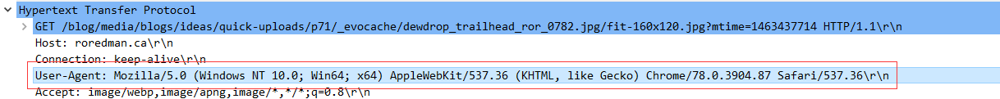

**4) Suppose two hosts A and B a directly connected. The propagation speed through the direct connection is $2*10^8$ meters per second. The distance between the two hosts is $5000$ m​. The transmission rate supported by the direct connection is 24 Mbps (1 Mbit = $2^{20}$bits). A user has a 3 Gb ($3*2^{30}$ bits) file to transfer across the connection.** 
**a) [1 points] What is the propagation delay?**

the propagation delay = distance between the two hosts / propagation speed = $5000m / (2*10^8 m/s)$ = $0.000025s$ = $2.5*10^{-5}s$ 

**b) [2 points] What is the maximum number of bits that have left A before the first bit arrives at B? This number of bits is called the bandwidth delay product.**

The first bit left A at time = 0s, and according to part a), it arrives at B at time = $2.5*10^{-5}s$, so the time duration is $2.5*10^{-5}s$.

The maximum number of bits that have left A before the first bit arrives at B = transmission rate * time duration = $ 24 Mbps * 2^{20} bits/Mbit * 2.5*10^{-5}s$ = $0.0006*2^{20} bits$ = $1.2288*2^9 bits$ 

Since $1.2288*2^9 bits$ < 3 Gb = $3*2^{30}$ bits, the file does not finish transmitting. Thus, the maximum number of bits that have left A before the first bit arrives at B is $1.2288*2^9$ 

**c) [1 points] We can think of each bit occupying a piece of the link. If the bandwidth delay product tells us that there are 100 bits in the transmission medium then we can think of each bit occupying 1/100 of the length of the transmission media. What is the width of each bit (the length of the transmission medium it fills)?**

the width of each bit = distance between two host / bandwidth delay product = $5000m / 100bits$ = $50m/bits$ 

So the width of each bit is $50m$ 

**Now consider that the connection between A and B is through a packet switched network. Message segmentation is the process of our file (or any other message) into smaller sections and sending each of those sections in a separate packet. Assume that each link in the packet switched network has a capacity of 90Mbps, the propagation delay on each link is 0.004s, the processing delay on each link is 0.003s, there are no queuing delays, and the packet is transmitted by A and by 9 additional hosts as it travels through the packet switched network to B.**

**d) [5 points] Consider sending the file through the packet switched network without message segmentation (as a single packet). Assume that each of the intermediate hosts are store and forward nodes. How long does it take to send the file from A to B?**

transmission delay on each link = length of the packet / transmission speed = $(3*2^{30} bits) / (90Mbps * 2^{20} bits/Mbits)$ = $(1/15) * 2^9 s$ = $1.0667 * 2^5 s$ = $34.1333s$

delay on each link = processing delay + propagation delay + transmission delay = $0.003s + 0.004s + 34.1333s = 34.1403s$ 

There are 9 hosts between A and B, so there are total $9+1+1-1$ = $10$ links.

Thus, end to end delay = delay on each link * number of links = $34.1403s * 10$ = $341.403s$ 

**e) [6 points] Assume that the file is segmented into packets containing 12000 bits each. Each packet has a header of 200 bits. If a packet is partially full of data the remainder of the data field is filled with zeros before the resulting full size packet is transmitted. How long does it take for the file to be transmitted through the network (assume no queuing delays).**

bits of data in each packet = packet size - bits of header = $12000 bits - 200 bits = 11800 bits$ 

number of packets the file will divided into = file size / bits of data in each packet = $3*2^{30} bits / 11800 bits = 272985.209492$

Since the number of packets should be an integer, the last packet will contain data that not fully filled the packet. 

So there are totally 272986 packets.

 Then, the transmission delay on each link for each packet = packet size / transmission speed = $12000 bits / (90Mbps * 2^{20}bits/Mbits) = 25 / 196608 = 0.000127s$

Thus, the end to end delay = (processing delay + propagation delay + transmission delay) * (number of packets + number of links -1) = $(0.003 + 0.004 + 0.000127) * (272986 + 10 - 1) = 1945.67904s$ 

**f) [0 points] What is the optimal packet size to transmit this file through this network. (will not be graded but may appear on a quiz or final)**

Suppose the optimal packet size is $x$ bits. 

bits of data in each packet = packet size - bits of header = $x$ bits - $200$ bits.

number of packets the file will divided into = file size / bits of data in each packet = $3*2^{30}$ bits / ( $x$ bits - $200$ bits)

The transmission delay on each link for each packet = packet size / transmission speed = $x$ bits / ($90$Mbps * $2^{20}$bits/Mbits).

 Thus, the end to end delay 

= (processing delay + propagation delay + transmission delay) * （number of packets + number of links - 1) 

= $(0.003 + 0.004 + x/(90*2^{20})) * (3*2^{30}/(x-200) + 10 - 1)$ 

= $0.1 * 2^{-20} + 2^9x/(15(x-200)) + (0.021*2^{30})/(x-200) + 0.063$ 

Let $u = x - 200$, 

= $0.1 * 2^{-20}*(u+200) + 2^9(u+200)/(15u) + (0.021*2^{30})/u + 0.063$

= $0.1 * 2^{-20}u + (0.021*2^{30} + 200*2^9/15)/u + 20*2^{-20} + 0.063$

According to Inequality of arithmetic and geometric means, when 

$0.1 * 2^{-20}u = (0.021*2^{30} + 200*2^9/15)/u$,

the equation get the minimum value, which is the minimum end to end delay in this case. 

We get $u = 15378899.9355$

Since the number of bits should be an integer, $u=15378899$ or $u = 15378900$

When $u=15378899$, the end to end delay = $2.99631145009s$

When $u = 15378900$, the end to end delay = $2.99631145009s$

Hence, we can choose either $u=15378899$ or $u = 15378900$

Then, the optimal packet size $x = u+200$, so the optimal packet size can be either $15379099$ bits or $15379100$ bits.

**5) Consider the HTTP protocol. HTTP is the protocol used for sending the contents of web pages between hosts, from a web server to an agent (client like firefox or explorer). HTTP is also used by agents to make requests to web servers for particular web pages. HTTP communications, both requests and replies travel through TCP connections. The packets sent back and forth between an agent requesting web pages and the web server receiving the web page were captured using the packet sniffer Wireshark. All the provided files provide a list of packets that were transmitted when web pages were requested using the chrome browser on a windows 10 machine.**

**You can download Wireshark and open the pcapng data files supplied with this problem. This will allow you to open the pcanpng files. These files contain a great deal of information about each packet. I will discuss some of the things you can do with Wireshark at the beginning of the class on May 27. You can capture your own packets, but please be aware that many license agreements specify you will not capture packets from the application, and many experiments using Wireshark will flag you to network admins of the networks you work on as a potential hacker. You do not need to capture any packets to complete this problem. Please use the supplied Wireshark files.**

**Summary data was captured and is provided for you in the files HTTP2020summary.pcapng and HTTP2020conversation.pcapng. The summary file contains the HTTP packets only. The conversation file contains both the HTTP packets and the TCP packets used to transmit the data sent by the server in response the HTTP requests. Both files include both the initial request for one or more web pages and the responses to those requests.**

**Based on the information in these files answer each of the following questions. In each case explain how the contents of the files supports the answer you have given.**

**a) [4 points] What is the difference between a basic HTTP GET request and a conditional HTTP get request? When is each type of request used? Give an example packet from one of the data files for at least one and if possible both cases. Explain briefly how you found the packets and what items within the packets tell you if the packet is executing a GET or a conditional GET.**

The difference between a basic HTTP GET request and a conditional HTTP GET request is that a conditional HTTP GET request is sent through a proxy server to improve the speed of getting the requested objects. And the header of a conditional HTTP GET request contains If-Modified statement, so it may return a response of HTTP 304 if the object has not been modified since last request, where a basic HTTP GET request is sent directly to the destination server, and it may returns HTTP 200 if the object is successfully retrieved. 

The basic HTTP GET request used when client requests objects from a web server and expecting objects to be returned. 

The conditional HTTP GET request used when there is a proxy server that stores the recently requested data. To check if the data has modified from the date the data stored in the proxy server, client agent should sent a conditional HTTP GET.

A basic HTTP GET request example is No. 7. The response message below returns a message "200 OK", which means request No.7 is a basic HTTP GET request. 

A conditional HTTP GET request example is No.18. The response message below returns a message "304 Not Modified", which means request No.18 get a response from a proxy server, where the requested object is not modified after previous request. So, it is a conditional HTTP GET request. 

**b) [4 points] What is different about the responses to a basic HTTP GET command and to a conditional HTTP GET request? What information does each type of response return? Would you expect a different response to the conditional get if the web page had been modified between the two requests?**

The difference about the response to a basic HTTP GET request and a conditional HTTP GET request is that a conditional HTTP GET request may return a response of HTTP 304, where a basic HTTP GET request returns HTTP 200. HTTP 304 indicates that the resources requested has not been modified during since the last GET request, it has already been stored in cache in a proxy server.

If the web page had been modified between the two requests, a conditional HTTP GET would get a response with "200 OK" if the objects has successfully retrieved, which is same as the basic HTTP GET request.  

**c) [3 points] What browser is making the request? What version of HTTP is that browser running? What version of HTTP is the queried web server running? Give reasons for your answers based on selected packets from the supplied packet captures.**

The browser making the request is Chrome. For example, in request No.7, the User-Agent information in Hypertext Transfer Protocol is , It shows that the browser is Chrome. 

The HTTP version of the browser is HTTP 1.1. For example, in request No.7, the GET request include "HTTP/1.1". 

The HTTP version of the queried web server is HTTP 1.1. For example, in request No.14, the HTTP information includes "HTTP/1.1". 

**d) [2 points] What was the IP address of the computer running the browser? What was the IP address of the web server it queried? Use evidence from the file HTTP2020summary.pcapng.**

The IP address of the computer running the browser: 192.168.1.44

The IP address of the web server it queried: 69.90.66.160

As the screenshot below shows, request No.7 is a HTTP GET request send from 192.168.1.44 to 69.90.66.160, so 192.168.1.44 is the client, and 69.90.66.160 is a server. No.20 is a GET response message send from 69.90.66.160 to 192.168.1.44, so 69.90.66.160 should be the queried server and 192.168.1.44 should be the client. 

**e) [2 point] For one of the HTTP GET responses shown in file conversationonly.pdf how many packets were used to carry the HTTP GET response from the server to the client? How did you determine your answer?** 

For example, request No.7 is a request to get a HTML object, and the response can be found in No.14 which returns a HTML object, and so in this case, only 1 packet was used to carry the response. 

**Again consider the file HTTP2020summary.pcapng and the file HTTP20202conversation.pcapng. These files contains a query made for a web page including multiple objects. Based on the contents of these files answer the following questions:**

**f) [3 points] Were persistent or non-persistent connections used to download the webpage information from the server? Explain why you think so?**

Persistent connections used to download the webpage information from the server since the the "Connection" information shows in the header is "Connection: keep-alive" for each HTTP GET request and response.

All TCP objects are transmitted with [ACK] until some TCP objects near the end using [FIN], which indicates this connection is finished. 

Hence, the connection should be persistent.

**g) [2 points] Can you see any evidence that pipelining was used to download the webpage information from the server? Explain why you think pipelining was used, or why you think pipelining was not used.**

Pipelining was used to download the webpage information form the server. As shown in the screenshot below, No. 107, No. 113, and No. 114 are HTTP GET requests, and the response of them are No. 150, No. 164, and No. 194. The three requests all come to the server before the server response to request No. 107. Hence, pipelining was used to download the webpage information from the server.

