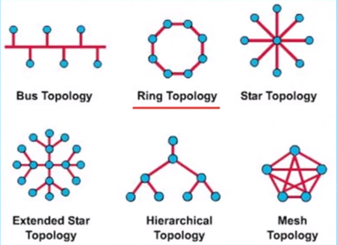
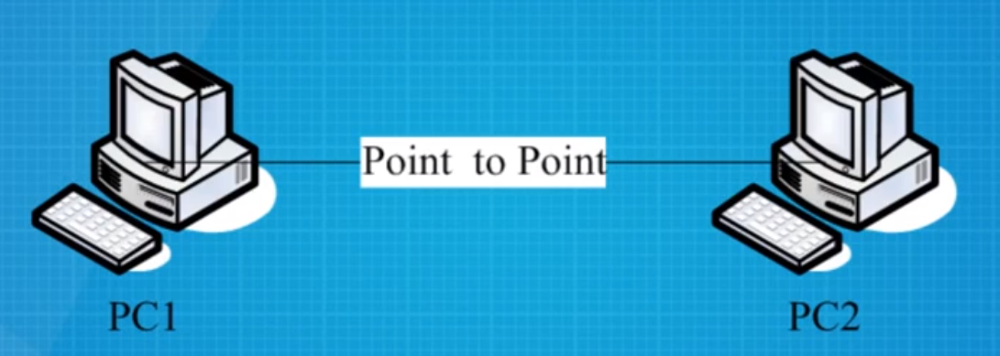
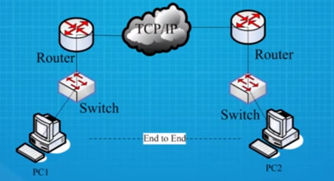
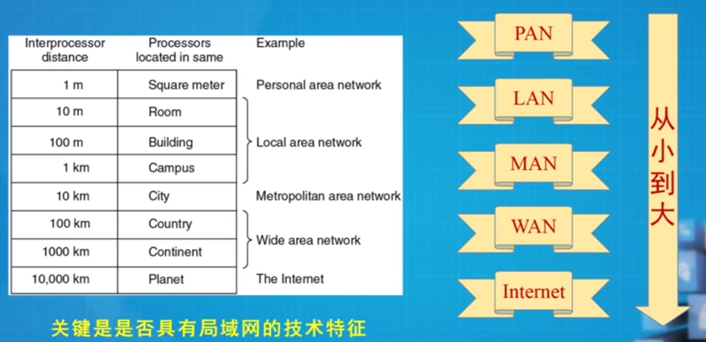
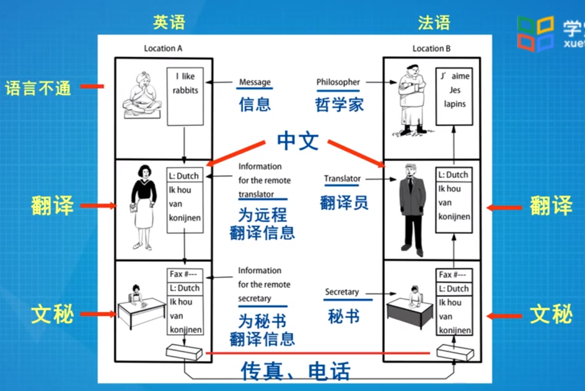
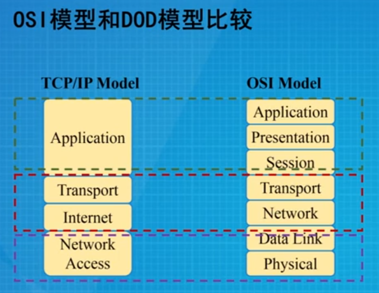
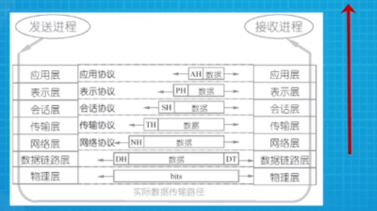
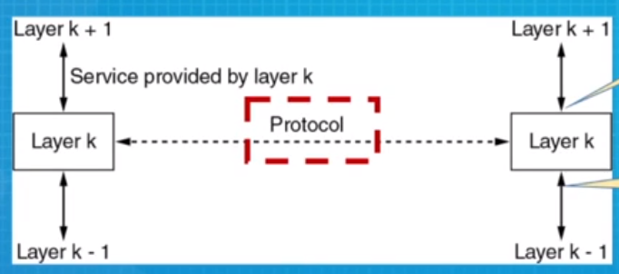

## 1-常用基本概念

##### 广义的网络

* 广义的网络，是指类似的事务链接在一起，以提供某些功能。

* eg. 交通网络、自来水网络、排水管网、邮政网络、快递网络、电话网络

##### 计算机网络

* 使用单一技术相互连接的<u>自主计算机</u>的互联集合
  * 单台计算机的独立自主性 - 上网的计算机，不受制于其他的计算机，开关是独立自主的
  * 连接介质可以是光纤、铜线，也可以是微波、红外、卫星。
  * 网络呈现出：不同的大小、形状和形式

* 互联网络 - 计算机网络的互相连接
  * 网络的网络
  * 也就是Internet，是覆盖全球最大的一张计算机网络。
  * www - 不是计算机网络，是构建在互联网上的一个分布式系统
    * www的所有一切都表现出高度的一致性，好像一个文档一样

##### 拓扑

* 信道的分布方式

  * 信道 - 信号的通道

* 常见拓扑

  * 总线型 - bus topology
  * 星型 - star topology
  * 拓展星型 - extended star topology
  * 环型 - ring topology 
  * 树型 / 层次型 - hierarchical topology
* 网状 / 全连通 - mesh topology
  

* 最常见的两种基础拓扑 - 总线拓扑 & 星型拓扑

  * 总线拓扑：主机挂接在总线上，相互直接通达
    * 从主机上发出的信号在总线上双向同时传输
    * 所有的主机都可以接收到这个信号
  * 星型拓扑：主机都挂接在一个中心节点上
    * 早期中心节点由集线器充当，现在的中心节点主要有交换机充当
    * 缺点：单点故障

##### 协议

* 一系列规则和约定的规范性描述，它控制网络中的设备之间如何进行信息交换

##### 数字带宽

* 指在单位时间内流经的信息总量

* 带宽越大越好，越大里面的信息越多

* 数字带宽的基本单位：比特每秒，即bps

  * bps单位太小，常用k/M/G

    | Unit of Bandwidth   | Abbrev | Equivalence                            |
    | ------------------- | ------ | -------------------------------------- |
    | bits per second     | bps    | 1 bps = fundamental unit of bandwidth  |
    | kilobits per second | kbps   | 1 kbps = 1,000 bps = 10^3^ bps         |
    | Megabits per second | Mbps   | 1 Mbps = 1,000,000 bps = 10^6^ bps     |
    | Gigabits per second | Gbps   | 1 Gbps = 1,000,000,000 bps = 10^9^ bps |
    
  * 个人电脑常见为100 Mbps， 干线上经常会用到Gbps这样的量度
  
  * 比bps大的还有T/P/E/Z/Y

##### 吞吐量(Throughput)

* 指实际的、可测到的带宽
  * 数字带宽是理想的带宽，吞吐量才是用户能感觉到的，实实在在的带宽
* 影响因素
  * 网络设备和性能
  * 用网的时间
  * 网络拓扑
  * 用户数量
  * 用户计算机性能
  * 服务器

##### 信息量(S)、带宽(BW)和传输时间(T)之间的关系

* 理想情况： $T = S/BW$
* 实际上：$T=S/P$ (P=吞吐量)

##### 点到点 和 端到端

* 点到点：信源机和信宿机之间的通信由一段一段的直接相连的机器间的通信组成机器间的直接连接叫做点到点连接。

  * eg, 计算机 - 计算机， 计算机 - 交换机， 计算机 - 电信局设备

  

* 端到端：信源机和信宿机之间直接通信，好像拥有一条直接的线路。

  * 这条“直接”的线路是虚拟的

  

##### 计算机网络分类

* 传输介质分：有线网络 & 无线网络

* 网络大小和规模来划分：

  * 最小的计算机网络：Personal Area Networks (PAN) 个域网
    * 覆盖范围1m左右，鼠标键盘之类的构成的就是PAN
  * 比PAN打的是局域网：Local Area Networks (LAN)
    * 覆盖范围约1km左右，通常覆盖一个校园、一个单位或一个建筑
  * 比LAN大的是城域网：Metropolitan Area Networks (MAN)
    * 覆盖约10km左右，通常覆盖一个城市
  * 比MAN大的是广域网：Wide Area Networks (WAN)
    * 覆盖范围约100/1000km，通常覆盖一个国家、一个州
  * 最大的是互联网： Internet
    * 覆盖范围：全球

* 区分网络类型不是看覆盖面积大小，而是看是否具有局域网的技术特征

  

  

## 2-参考模型

##### 分层的好处

* 各层工作独立，层之间通过接口联系，降低协议工作的复杂程度
* 灵活性好，任何一层的改变不影响其它层
* 每层的实现技术可以不同，减少了实现的复杂度
* 易于维护，每层可以单独进行调试
* 便于标准化

每个人只做自己的本职工作，只跟自己的上下层打交道，但好像每个人都可以直接跟别的人打交道一样。

##### 分层原则

* 信宿机第n层收到的对象应与信源机第n层发出的对象完全一致

##### 典型分层模型

* ISO OSI 七层模型
  * Open System Interconnection 开放系统互联
  * 是ISO(International Standards Organization)在1983年提出的 
  * OSI参考模型：
    * 7-Application 应用层：主要为各种各样的网络应用提供网络服务
      * Email、FTP、微信
    * 6-Presentation 表示层：将信息表示为一定形式和格式的数据流
      * 为啥要进行表示？因为计算机不认识信息，只认识 0/1 bit 流，在表示层，我们要把信息转化为bits
      * 这一层可完成任务：压缩解压缩、加密解密
    * 5-Session 会话层：负责通信主机间的回话的建立、管理和拆除，协调、通信双方
    * 4-Transport 传输层（核心层之一）：负责通信主机间的端到端连接
      * 对于TCP来说，还负责提供可靠传输、差错恢复、拥塞控制等额外的功能
      * 信源 - 信宿之间端到端信息传递
    * 3-Network 网络层（另一个核心层）：
      * 它的功能可用<u>地址</u>和<u>最优路径</u>来描述；
        * 地址 - 是说为通信主机提供标识 （例如IP地址）
        * 最优路径 - 就是路由，寻径，每一个中间设备都为到达的分组找到一根最优的路径，并送出
      * 它负责将每一个分组从源机一路送达目的机
    * 2-Data Link 数据链路层：它主要提供介质访问服务
      * 通过物理地址识别通信主机，提供可靠的帧传递，并做差错控制，流控等
    * 1-Physical 物理层：提供<u>透明的比特流</u>传输
      * 透明的比特流：光信号、电信号、无线信号
      * 物理层只关心比特流的传输，而忽略比特流里面的具体内容
    * 每一层都完成特定的功能，都为它的上一层提供服务，每一层都使用它下层提供的服务

* TCP/IP (DoD) 四层模型

  * 4-Application 应用层
  * 3-Transport 传输层
  * 2-Internet
  * 1-Network Access 物理层

* 相同点

  * 都分层
  * 都有应用层，尽管他们的服务不同
  * 都有可比较的传输层和网络层
  * 使用的分组交换而不是电路交换技术

* 不同点

  * TCP/IP将表示层和会话层包含到了应用层
  * TCP/IP将OSI的数据链路层和物理层暴扣到了一层中
  * TCP/IP更简洁，但OSI更易开发和排除故障
  * TCP/IP在实践中产生，是当今互联网Internet所采用的的模型，而OSI仅仅停留在教科书里！

  

##### OSI参考模型没有流行起来的原因

* 糟糕的时代
  * TCP/IP网络已经流行
* 糟糕的技术
  * 掺杂了太多政策的考量，技术并不是特别好
* 糟糕的实现
  * 庞大而笨拙，对于研发人员来说是一件非常痛苦的事情

## 3-数据如何传输？

涉及三个主角：发送方、接收方和中间的信号通道

##### 发方要做什么

* 封装/打包：
  * 将信息打包，从最高层（应用层）开始逐渐下行到最底层（物理层）
  * 在每一层上，数据都被加上头部信息，用于传递信息
    * 具体来说，在OSI参考模型的上三层，信息被表示为一定格式和形式的数据流(DataStream)
    * 数据流被传到传输层，将其切割为适合传输的数据段(Segment)并加上段头，段头中包含定位应用进程的端口号等信息
    * 数据段传到下一层（网络层），添加分组头部形成分组(Packet)分组头部中包含寻址主机的IP地址和其他一些传输需要用到的信息，比如生存周期、长度等
    * 分组再传到数据链路层，添加帧头帧尾形成帧，帧头中包含寻址主机所需的物理地址、校验等信息
    * 帧到了物理层，被转成可供传输的比特流
  * 上述描述的信息从应用层逐步跨越各层到物理层，信息在各层呈现出不同的形式，这个过程发生在<u>发送方</u>，被定义为“<u>封装</u>”，有时候也叫“<u>打包</u>”

##### 协议数据单元

* 数据在各层的形式（或者说各层处理的数据对象）叫协议数据单元
* PDU = Protocol Data Unit
* 信息在各层的名称：
  * 信息(Information) - 应用层
  * 数据流(Data stream) - 上三层
  * 数据段(Segment) - 传输层
  * 分组(Packet) - 网络层
  * 帧(Frame) - 数据链路层
  * 比特流(Bits) - 物理层

##### 解封装 / 解包

将收到的比特流解包，从最低层（物理层）开始，逐渐上行到最高层（应用层），提取出信息

##### 收方要做什么

* 解封装的过程是封装的逆向过程，在每层去掉头部信息，最终还原出应用层的输出：信息

* e.g. 在网络层 - 从下层收到分组，去掉分组头，提取出数据段，送给上层传输层

  

##### 收发双方的数据流的路径

* 发方的封装：信息 -> 数据流
* 数据流穿越复杂的中间信道
  * 复杂原因：中间可能是光纤、可能是卫星，无线，遭遇的设备可能有交换机、路由器。。。所以说中间通道非常复杂
* 收方的解封装：数据流 -> 信息

##### 谁负责完成封装、解封装等基本功能？

* 实体(Entity)：每层中活动的元素
* 每一层都有一个实体，可能是硬件也可能是软件，它负责实现本层的功能
* 对等实体(peer Entity)：收发双方对应层上的实体互称

##### 虚拟通信

* 只看发方和收方的对应层，发现收发双方的对应层之间（即对等实体之间）有一根直接的通道（虚通道）。沿着这根通道，PDU从发方到达收方

##### 服务、协议和接口之间的关系

* 参考模型上的每一层都为它的上层提供服务，以接口的形式供上层调用，协议作用于对应层之间
* 层与层之间有接口，用于服务的调用，服务就是这一层功能的实现

* 封装和解封装互为逆过程
* 封装由上而下，信息从数据流起，数据段、分组、帧、到比特流
* 数据从发方，穿越中间的网络云，流向收方，是一个“U”型流
* 发方和收方对应层之间有一个“直接”的通道，PDU从发方流向接收方