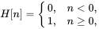

# Limits and Derivatives

极限(limits) 一般用到的地方：求切线，求瞬时速度

用一条无限接近于切线的割线来近似估算切线斜率：$k = \lim\limits_{h \to 0} \frac {f(x+h) - f(x)}{h} $ 

## The Limit of a Function

* Intuitive Definition of a **Limit** (极限的直观定义)

  * Suppose f(x) is defined when x is near the number a. (This means that f is defined on some open interval that contains a, except possibly at a itself.) Then we write
    $$
    \lim\limits_{x \to a} f(x) = L
    $$
    and say "the limit of f(x), as x approaches a, equals L"

    if we can make the values of f(x) arbitrarily close to L (as close to to L as we like) by restricting x to be sufficiently close to a (on either side of a) but not equal to a.

  * this means the values of f(x) tend to get closer and closer to the number L as x gets closer and closer to the number a (from either side of a) but $x \ne a$
    $$
    \lim \limits_{x \to a} f(x) = L 
    $$
    is $$ f(x) \to L$$ as $$x \to a$$, which is usually read "f(x) approaches L as x approaches a."

## One-Sided Limits

* Definition of **One-Sided Limits**

  * We write 
    $$
    \lim\limits_{x \to a^-} f(x) = L
    $$
    and say the left-hand limit of f(x) as x approaches a [or the limit of f(x) as x approaches a from the left] is equal to L if we can make the values of f(x) arbitrarily close to L by taking x to be sufficiently close to a with x less than a.

    Similar as right-hand limit. 

$\lim\limits_{x \to a} f(x) = L$ if and only if $\lim\limits_{x \to a^-} f(x) = L$ and $\lim\limits_{x \to a^+} f(x) = L$

ex. The Heaviside function H is defined by 

$\lim\limits_{t \to 0^-} H(t) = 0$ and $\lim\limits_{t \to 0^+} H(t) = 1$ 

## Infinite Limits

* Definition

  * Let f be a function defined on both sided of a, except possibly at a itself. Then 
    $$
    \lim\limits_{x \to a} f(x) = \infin
    $$
    means that the values of f(x) can be made arbitrarily large (as large as we please) by taking x sufficiently close to a, but not equal to a.

  * Let f be a function defined on both sided of a, except possibly at a itself. Then 
    $$
    \lim\limits_{x \to a} f(x) = -\infin
    $$

