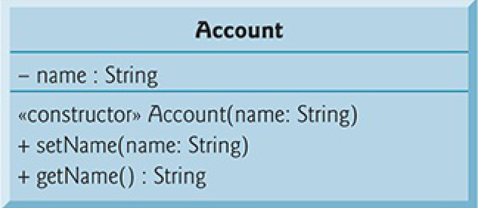
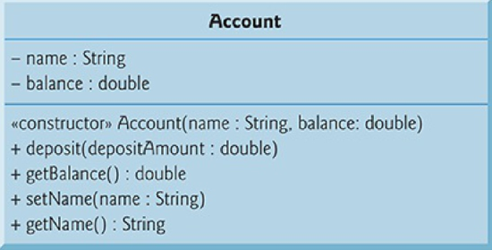
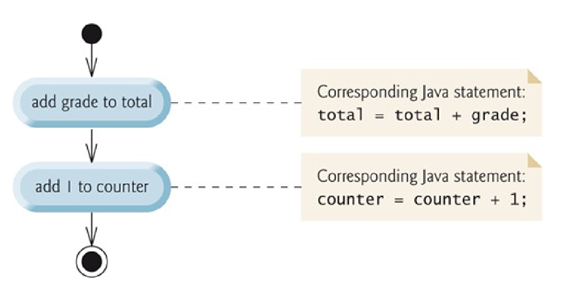
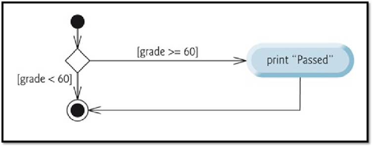
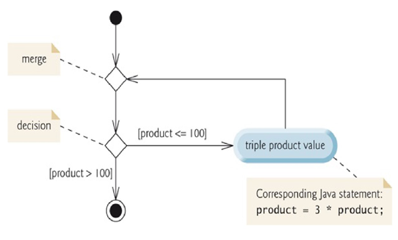
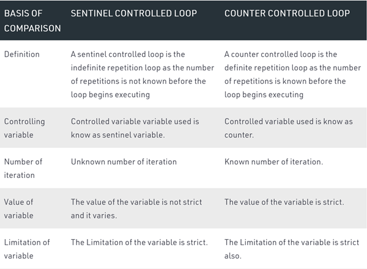
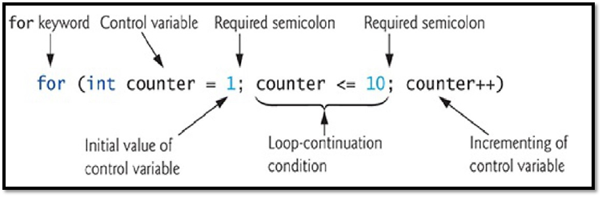
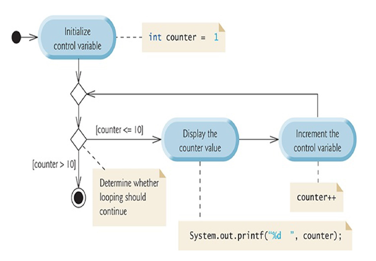

### 1 - Introduction

###### Java 

JVM - Java Virtual Machine

###### display / output messages on the screen

```java
public class MyFirstProgram {
    public static void main(String[] args1){
        System.out.println("Hello World!"); // 这行代码是为了打印出HelloWorld！
    }
}
```

`class` - 申明class

`public class` - Java class的开头

`MyFirstProgram` - class 的名字，也叫做identifier, 一般用驼峰命名法

`{}` - class名字之后的`{}`中间的内容是程序主体部分

`public static void main` - main function的标准写法

`main` - 每个project里有且只有一个method的名字叫`main`

`("Hello World!")` - argument 参数


###### Commenting in Java

```java
// 单行注释

/*
	多行注释
*/
```


###### 命名

* 不能以数字开头 - 6josds不对的
* 不能有空格： FirstProgram(驼峰命名法)，first_program (下划线命名法) 
* 区分大小写：FirstProgram 和 firstprogram 是不一样的变量


###### 转义字符

`\n` - 字符串中的换行符

`\t` - 制表符

`\r` - 光标重回本行开头

`\\` - 打印出`\`

`\"` - 打印出`"`

比如，以下两段代码打印出的结果一样

```java
public class MyFirstProgram {
           public static void main(String[] args) {
                   System.out.println("Welcome to \n Java Programming"); } 
}

public class MyFirstProgram {
           public static void main(String[] args) {
                   System.out.println("Welcome to");
                   System.out.println(“Java Programming!");
           } 
}

```


###### 三种打印方法

`System.out.println()` - 打印一行内容换行 ln - line

`System.out.print()` - 打印一行内容不换行

`System.out.printf()` - 格式化输出 f - format

```java
public class MyFirstProgram {
    public static void main(String[] args) {
        System.out.printf("%s%n%s%n", "Welcome to", " Programming Fundamentals!");
    }
}

// %s - 对应字符串
// %n - 换行符
```


###### read & add 2 integers and output the result

```java
import java.util.Scanner; // program uses class Scanner

public class Addition {
      public static void main(String[] args) {
          // create a Scanner to obtain input from the command window
          Scanner input = new Scanner(System.in);

          System.out.print("Enter first integer : "); // prompt
          int number1 = input.nextInt(); // read first number from user
		System.out.print("Enter second integer : "); // prompt
          int number2 = input.nextInt(); // read second number from use

          int sum = number1 + number2; // add numbers, then store total in sum

          System.out.printf("Sum is %d%n", sum); // display sum

      } // end method main

} // end class Addition

          


```

###### Java 数据类型

`boolean` - True / False

`byte` 字节

`char` 字符

`short` - short int, 2 bytes

`int` - int, 4 bytes

`long` - long int, 8 bytes

`float`  小数，精度 - 4 bytes

`double` 小数 - 8 bytes


###### 变量 Variable

variable 包含四个部分： 

* name
* type
* size (in bytes)
* value

`int number1 = 45`  - 将 int 数据 45 放进名字为 number1 的内存里

* name - number1
* type - int
* size - int 数据类型所占用的大小, 一般为4bytes
* value - 45

当该数据不再使用时，Java会自动将该数据清除，此过程称为 **destructive**


###### Arithmetic Operators

`+ - * / %` 和数学里的用法一样

`=` assignment operator ，赋值运算符

###### Condition

condition - true /  false

`>`, `<`, `>=`, `<=`, `==` `!=`

`x == y` 表示 x 等于 y

`x != y` 表示 x 不等于 y

```java
// Compare integers using if statements, relational operators 
// and equality operators. 
import java.util.Scanner; // program uses class Scanner 

public class Comparison { 
     public static void main(String[] args) { 
         // create Scanner to obtain input from command line 
            Scanner input = new Scanner(System.in);

            System.out.print("Enter first integer:"); // prompt
            int number1 = input.nextInt(); // read first number from user

           System.out.print("Enter second integer:"); // prompt
           int number2 = input.nextInt(); // read second number from user

           if (number1 == number2)
               System.out.printf("%d == %d%n", number1, number2);
             }

            if (number1 != number2) {
                       System.out.printf("%d != %d%n", number1, number2);
            }

           if (number1 < number2) {
                      System.out.printf("%d < %d%n", number1, number2);
           }
                 if (number1 > number2) {
                       System.out.printf("%d > %d%n", number1, number2);
             }

            if (number1 <= number2) {
                      System.out.printf("%d <= %d%n", number1, number2);
            }

           if (number1 >= number2) {
                     System.out.printf("%d >= %d%n", number1, number2);
          }
      } // end method main  

} // end class Comparison


```


### 2 - Classes, Objects, Methods, String and Math Class

###### Class 类

```java
// Account.java
public class Account {
       private String name; // instance variable
 
       // method to set the name in the object
       public void setName(String name) {
             this.name = name; // store the name
       }

      // method to retrieve the name from the object
      public String getName() {
              return name; // return value of name to caller
      }
}

int number1;
number1 = 45;

public class FirstProgram {
    public static void main(String[] args) {
        Account a1 = new Account();

        a1.setName("customer1");

        System.out.println(a1.getName());

    }
}
```

**method header** - the first line of each method declaration.

`void` - function return type

`void setName()` - 说明 method setName() return nothing

 `(String name, int accountNumber)` - parameter 参数，多个参数用逗号分开


###### Test Class 

* 白盒测试 - 根据代码测试功能。
* 黑盒测试 - 不知道代码是什么样的，只测试功能有没有达到。

```java
// AccountTest.java

import java.util.Scanner;
 
public class AccountTest {
       public static void main(String[] args) {
               // create a Scanner object to obtain input from the command window
               Scanner input = new Scanner(System.in);
 
              // create an Account object and assign it to myAccount
             Account myAccount = new Account();

             // display initial value of name (null)
            System.out.printf("Initial name is: %s%n%n", myAccount.getName());
              // prompt for and read name
             System.out.println("Please enter the name:");
             String theName = input.nextLine(); // read a line of text
             myAccount.setName(theName); // put theName in myAccount
             System.out.println(); // outputs a blank line

             // display the name stored in object myAccount
            System.out.printf("Name in object myAccount is:%n%s%n",
            myAccount.getName());
			int number1; // declaration 声明
           number1 = 45; // assignment 赋值
           int number1 = 45;
      }
}

```


###### local variable vs. instance variable

**local variable** - 在method内部的varibale

**instance variable** - 在method小括号里的variable


###### UML 统一建模语言 & UML Diagram


`-` private

`+` public


###### Initializing Objects with Constructors

```java
Account account1 = new Account("Jane Green");
```



###### Account Class with a Balance

```java
// Account class with a double instance variable balance and a constructor
 // and deposit method that perform validation.
 
    public class Account {
             private String name; // instance variable
             private double balance; // instance variable
 
             // Account constructor that receives two parameters
            public Account(String name, double balance) {
                          this.name = name; // assign name to instance variable name

                         // validate that the balance is greater than 0.0; if it's not,
                        // instance variable balance keeps its default initial value of 0.0
                if (balance > 0.0) { // if the balance is valid
                          this.balance = balance; // assign it to instance variable balance
              }
         }

        // method that deposits (adds) only a valid amount to the balance
       public void deposit(double depositAmount) {
               if (depositAmount > 0.0) { // if the depositAmount is valid
                           balance = balance + depositAmount; // add it to the balance
               }
       }
        // method returns the account balance
         public double getBalance() {
                  return balance;
         }

         // method that sets the name
        public void setName(String name) {
                  this.name = name;
        }

       // method that returns the name
       public String getName() {
                  return name;
       }
```




```java
// AccountTest.java
// Inputting and outputting floating-point numbers with Account objects.
 import java.util.Scanner;
 
 public class AccountTest {
          public static void main(String[] args) {
                    Account account1 = new Account("Jane Green", 50.00);
                    Account account2 = new Account("John Blue", -7.53);
 
                   // display initial balance of each object
                  System.out.printf("%s balance: $%.2f%n",
                  account1.getName(), account1.getBalance());
                  System.out.printf("%s balance: $%.2f%n%n",
                  account2.getName(), account2.getBalance());
                          // create a Scanner to obtain input from the command window
           Scanner input = new Scanner(System.in);

           System.out.print("Enter deposit amount for account1: "); // prompt
           double depositAmount = input.nextDouble(); // obtain user input
           System.out.printf("%nadding %.2f to account1 balance%n%n",
           depositAmount);
           account1.deposit(depositAmount); // add to account1’s balance

           // display balances
          System.out.printf("%s balance: $%.2f%n",
          account1.getName(), account1.getBalance());
          System.out.printf("%s balance: $%.2f%n%n",
          account2.getName(), account2.getBalance());
                            System.out.print("Enter deposit amount for account2: "); // prompt
              depositAmount = input.nextDouble(); // obtain user input
              System.out.printf("%nadding %.2f to account2 balance%n%n",
              depositAmount);
              account2.deposit(depositAmount); // add to account2 balance

              // display balances
             System.out.printf("%s balance: $%.2f%n",
             account1.getName(), account1.getBalance());
             System.out.printf("%s balance: $%.2f%n%n",
             account2.getName(), account2.getBalance());
       }
}
```


###### Primitive Types vs. Reference Types

Primitive Types - 首字母小写

* can hold exactly one value of its declared type at a time. 
* When another value is assigned to that variable, the new value replaces the previous one—which is lost.

Reference Types - 首字母大写

* 表示一个Object
* `Scanner input = new Scanner(System.in);`
* Creates an object of class Scanner, then assigns to the variable input a **reference** to that Scanner object.


### 3 - Selection

###### Algorithm

`Algorithm算法` - a procedure for solving a problem in terms of 

1. the actions to execute.

 	2. the order in which these actions execute.

例:

食谱处理：红烧排骨

1、锅内放水烧开，放入斩件排骨[氽烫]至出血水，捞起洗净后沥净水备用。

2、锅内放油，烧至六成热时爆香姜片，放入排骨煸炒到金黄微焦。

3、依次放入1汤匙花雕酒、2汤勺草菇老抽、1勺生抽、1汤勺白糖，炒匀，放入八角、桂皮，再倒入能没过排骨的开水，调中火焖15分钟，放入盐炒匀。

4、开大火收汁，收到汤汁将干时，出锅摆盘撒上葱花即可。

`program control` - specifying the order in which statements (actions) execute in a program. 


`Pseudocode` - an informal language (eg, English) that helps programmers develop algorithms without having to worry about the strict details of programming language (eg, Java) language syntax.

* Pseudocode does not execute on computers
* It’s helps programmers to think out a program before attempting to write it in a programming language. 

例：

```pseudocode
Set total to zero
Set grade counter to one

While grade counter is less than or equal to ten
Prompt the user to enter the next grade
Input the next grade
Add the grade into the total
Add one to the grade counter

Set the class average to the total divided by ten
Print the class average
```

###### Control Structures

`Sequential Execution` - typically, statements in a program are executed one after the other in the order in which they’re written.

`Transfer of Control` - statements that enable programmers to specify the next statement to execute is not necessarily the next one in sequence.  

`Sequence Structure` - the computer executes Java statements one after the other in the order in which they’re written.

* built into Java.

###### UML Activity Diagram

* UML activity diagram illustrates a typical sequence structure in which two calculations are performed in order.
* The diagram models the workflow of a portion of a software system.

例：



###### UML components

* rectangles - action-state symbols 
* diamonds - conditions
* small circles
  * solid circle at the top - initial state (start)
  * solid circle surrounded by a hollow circle at the bottom - final state
* transition arrows - represent the flow of the activity
* dotted line - connects each note with the element it describes. 

###### Selection Statements

`if` 

* the condition is true - performs an action
* the condition is false - skip it

```pseudocode
If student’s grade is greater than or equal to 60
Print “Passed”
```

```java
if (studentGrade >= 60) {
    System.out.println("Passed"); 
}
```



* 注意：不要忘记在箭头上写条件

`if...else`

* the condition is true - performs the action under `if`
* the condition is false - performs the action under `else`

```pseudocode
If student’s grade is greater than or equal to 60
      Print “Passed”
Else
      Print “Failed”
```

```java
if (grade >= 60) {
   System.out.println("Passed"); 
}
else {
   System.out.println("Failed");
}
```

练习：画出UML

```pseudocode
If student’s grade is greater than or equal to 90
      Print “A”
else
      If student’s grade is greater than or equal to 80
            Print “B”
      else
            If student’s grade is greater than or equal to 70
                  Print “C”
            else
                  If student’s grade is greater than or equal to 60
                        Print “D”
                  else
                        Print “F”

```

```java
if (studentGrade >= 90) {
       System.out.println("A"); 
} else {
   if (studentGrade >= 80) {
        System.out.println("B");
   } else {
      if (studentGrade >= 70) {
         System.out.println("C");
      } else {
           if (studentGrade >= 60) {
                System.out.println("D");
           } else {
                System.out.println("F");
           }
       }
   }
}
```

完整例子：

```java
//Student.java
// Student class that stores a student name and average.
public class Student {
           private String name;
           private double averag
          // constructor initializes instance variables
         public Student(String name, double average) {
                    this.name = na
                  // validate that average is > 0.0 and <= 100.0; otherwise,
                 // keep instance variable average's default value (0.0)
                if (average > 0.0) {
                         if (average <= 100.0) {
                                  this.average = average; // assign to instance variable
                          }
                   }

          // sets the Student's name
         public void setName(String name) {
                      this.name = name;

        // retrieves the Student's name
        public String getName() {
                      return name;
        }
         // sets the Student's average
        public void setAverage(double studentAverage) {
                 // validate that average is > 0.0 and <= 100.0; otherwise,
                 // keep instance variable average's current value
                if (average > 0.0) {
                            if (average <= 100.0) {
                                       this.average = average; // assign to instance variable
                            }
                }
    }

    // retrieves the Student's average
    public double getAverage() {
               return average;
    }
    // determines and returns the Student's letter grade
	public String getLetterGrade() {
	          String letterGrade = ""; // initialized to empty String
	        if (average >= 90.0) {
	        	letterGrade = "A";
	        }
	        else if (average >= 80.0) {
	            letterGrade = "B";
            }
            else if (average >= 70.0) {
                letterGrade = "C";
            }
            else if (average >= 60.0) {
                letterGrade = "D";
            }
            else {
                letterGrade = "F";
            }
            return letterGrade;
        }
}
```

```java
// Fig. 4.5: StudentTest.java
// Create and test Student objects.
public class StudentTest {
            public static void main(String[] args) {
                      Student account1 = new Student("Jane Green", 93.5);
                      Student account2 = new Student("John Blue", 72.75);

                      System.out.printf("%s's letter grade is: %s%n",
                      account1.getName(), account1.getLetterGrade());
                     System.out.printf("%s's letter grade is: %s%n",
                     account2.getName(), account2.getLetterGrade());
           }
}
```

`switch` - performs one of many different actions, depending on the value of an expression.

```java
Scanner input = new Scanner(System.in);
        int n = input.nextInt();
        switch (n){
            case 90:
                System.out.println("A");
                break;
            case 80:
                System.out.println("B");
                break;
            case 70:
                System.out.println("C");
                break;
            case 60:
                System.out.println("D");
                break;
            default:
                System.out.println("F");
        }
```


###### Block

**Block** - 在`{}`中间的statemens是一个block.

```java
if (grade >= 60) {
   System.out.println("Passed");
}
else {
   System.out.println("Failed");
   System.out.println("You must take this course again.");
}
```


### 4 - Repetition

##### Iteration Statements

###### while

* The loop executes as long as the condition is true
* perform the actions in the block zero or more times

```pseudocode
“While there are more items on my shopping list
   Purchase next item and cross it off my list”
```

```java
int product = 3;

while (product <= 100) {
       product = 3 * product;
}
```



* `merge `- joins 2 flows of activity into one.
  * e.g., diagram above, the merge symbol joins the transitions from the initial state and from the action state. 

###### Counter-controlled Iteration

完整例子： 

```pseudocode
Set total to zero
Set grade counter to one

While grade counter is less than or equal to ten
	Prompt the user to enter the next grade
	Input the next grade
	Add the grade into the total
	Add one to the grade counter
	
Set the class average to the total divided by ten
Print the class average
```

```java
// ClassAverage.java
// Solving the class-average problem using counter-controlled iteration. 
import java.util.Scanner; // program uses class Scanner 
public class ClassAverage { 
    public static void main(String[] args) { 
        // create Scanner to obtain input from command window 
        Scanner input = new Scanner(System.in); 
        // initialization phase 
        int total = 0;  // initialize sum of grades entered by the user
        int gradeCounter = 1; // initialize # of grade to be entered next
        // processing phase uses counter-controlled iteration 
        while (gradeCounter <= 10) { // loop 10 times 
            System.out.print("Enter grade: "); // prompt 
            int grade = input.nextInt(); // input next grade 
            total = total + grade; // add grade to total 
            gradeCounter = gradeCounter + 1; // increment counter by 1
        }
        // termination phase 
        int average = total / 10; // integer division yields integer result 
        // display total and average of grades 
        System.out.printf("%nTotal of all 10 grades is %d%n", total); 
        System.out.printf("Class average is %d%n", average); 
    }
}
```

###### Sentinel-Controlled Iteration

* Sentinel-controlled repetition is sometimes called **indefinite repetition** because it is not known in advance how many times the loop will be executed. 
* It is a repetition procedure for solving a problem by using a **sentinel value** (also called a signal value, a dummy value or a flag value) to indicate "end of data entry".

例：

a run of the class-average program might process a stream of inputs such as 95, 96, 75, 74, 89 and **–1**.

The program would then compute and print the class average for the grades 95, 96, 75, 74 and 89. 

Since **–1** is the sentinel value, it should not enter into the averaging calculation.

```pseudocode
Initialize total to zero 
Initialize counter to zero 

Prompt the user to enter the first grade 
Input the first grade (possibly the sentinel) 

While the user has not yet entered the sentinel 
	Add this grade into the running total 
	Add one to the grade counter 
	Prompt the user to enter the next grade 
	Input the next grade (possibly the sentinel) 

	If the counter is not equal to zero 
		Set the average to the total divided by the counter 
		Print the average 
	Else 
		Print “No grades were entered”
```

```java
// ClassAverage.java
// Solving the class-average problem using sentinel-controlled iteration. 
import java.util.Scanner; // program uses class Scanner 

public class ClassAverage { 
	public static void main(String[] args) { 
		// create Scanner to obtain input from command window 
		Scanner input = new Scanner(System.in); 
		// initialization phase 
		int total = 0; // initialize sum of grades 
		int gradeCounter = 0; // initialize # of grades entered so far 

		// processing phase 
		// prompt for input and read grade from user
		int grade = input.nextInt();     

		// loop until sentinel value read from user   
		while (grade != -1) { 
			total = total + grade; // add grade to total 
			gradeCounter = gradeCounter + 1; // increment counter 

			// prompt for input and read next grade from user
			System.out.print("Enter grade or -1 to quit: ");
			grade = input.nextInt(); 
		} 

			// termination phase 
			// if user entered at least one grade… 
			if (gradeCounter != 0) { 
				// use number with decimal point to calculate average of grades
				double average = (double) total / gradeCounter;     

				// display total and average (with two digits of precision) 
				System.out.printf("%nTotal of the %d grades entered is %d%n", gradeCounter, total); 
				System.out.printf("Class average is %.2f%n", average); 
			} 
			else { // no grades were entered, so output appropriate message 
				System.out.println("No grades were entered"); 
			} 
	} 
}
```



###### Nested Controls in a while Statement

```pseudocode
Initialize passes to zero 
Initialize failures to zero 
Initialize student counter to one 

While student counter is less than or equal to 10 
	Prompt the user to enter the next exam result 
	Input the next exam result 

	If the student passed 
		Add one to passes 
	Else 
		Add one to failures 
		
	Add one to student counter 
	
	Print the number of passes 
	Print the number of failures 

	If more than eight students passed 
		Print “Bonus to instructor!”
```

```java
//Analysis.java 
// Analysis of examination results using nested control statements. 
import java.util.Scanner; // class uses class Scanner 

public class Analysis { 
	public static void main(String[] args) { 
		// create Scanner to obtain input from command window 
		Scanner input = new Scanner(System.in); 

		// initializing variables in declarations
		int passes = 0;
		int failures = 0;
		int studentCounter = 1;
		// process 10 students using counter-controlled loop 
		while (studentCounter <= 10) { 
			// prompt user for input and obtain value from user 
			System.out.print("Enter result (1 = pass, 2 = fail): "); 
			int result = input.nextInt(); 
		
            // if …else is nested in the while statement
			if (result == 1) {
                passes = passes + 1;
            } else {
                failures = failures + 1;
            }
            // increment studentCounter so loop eventually terminates
            studentCounter = studentCounter + 1;
        }
        
        // termination phase; prepare and display results
        System.out.printf("Passed: %d%nFailed: %d%n", passes, failures);
        // determine whether more than 8 students passed
        if (passes > 8) {
            System.out.println("Bonus to instructor!");
        }
    }
}
```

###### Compound Assignment Operators

`+=` - `c = c + 3` 和 `c += 3` 是一样的。

`+=, -=, *=, /=, %=`

###### Increment and Decrement Operators

1. Unary increment operator, `++` 

2. Unary decrement operator, `--`

**prefix increment/decrement**

**postfix increment/decrement**

```java
// Increment.java 
// Prefix increment and postfix increment operators.

public class Increment {
    public static void main(String[] args) {
        // demonstrate postfix increment operator
        int c = 5;
        System.out.printf("c before postincrement: %d%n", c); // prints 5
        System.out.printf("    postincrementing c: %d%n", c++); // prints 5
        System.out.printf(" c after postincrement: %d%n", c); // prints 6
        System.out.println(); // skip a line
        // demonstrate prefix increment operator
        c = 5;
        System.out.printf(" c before preincrement: %d%n", c); // prints 5
        System.out.printf("     preincrementing c: %d%n", ++c); // prints 6 
        System.out.printf("  c after preincrement: %d%n", c); // prints 6
    }
}
```

`do...while`

`for`

* perform the actions in the block zero or more times

```java
//WhileCounter.java
// Counter-controlled iteration with the while iteration statement.
public class WhileCounter {
    public static void main(String[] args) {
        int counter = 1; // declare and initialize control variable
        while (counter <= 10) { // loop-continuation condition 
            System.out.printf("%d ", counter);
            ++counter; // increment control variable
        }
        System.out.println();
    } 
}

//ForCounter.java
// Counter-controlled iteration with the for iteration statement.
public class ForCounter {
    public static void main(String[] args) {
        // for statement header includes initialization,
        // loop-continuation condition and increment
        for (int counter = 1; counter <= 10; counter++) {
            System.out.printf("%d ", counter);
        }
        System.out.println();
    }
}
```



```pseudocode
for (initialization; loopContinuationCondition; increment) {
           Group of Java statements;
}
```

The **increment** expression in a **for** acts as if it were a standalone

statement at the end of the **for’s** body. 

So, the following expressions are equivalent increment expressions in a for statement.

```java
counter = counter + 1
counter += 1
++counter
counter++
```

```java
for (int j = x; j <= 4 * x * y; j += y / x)
for (int j = 2; j <= 80; j += 5)
// They are equivalent
```



`enhanced for`


###### Application: Compound-Interest Calculations

A person invests $1,000 in a savings account yielding 5% interest. 

Assuming that all the interest is left on deposit, calculate and print the amount of money in the account at the end of each year for 10 years. 

Use the following formula to determine the amounts:
$$
a = p(1 + r)^n
$$
**p** is the original amount invested (i.e., the principal)

**r** is the annual interest rate (e.g., use 0.05 for 5%)

**n** is the number of years

**a** is the amount on deposit at the end of the nth year

```java
//Interest.java 
//Compound-interest calculations with for. 

public class Interest {
    public static void main(String[] args) {
        double principal = 1000.0; // initial amount before interest 
        double rate = 0.05; // interest rate
        // display headers 
        System.out.printf("%s%20s%n", "Year", "Amount on deposit"); 
        // calculate amount on deposit for each of ten years
        for (int year = 1; year <= 10; ++year) {
            // calculate new amount on deposit for specified year
            double amount = principal * Math.pow(1.0 + rate, year);
            // display the year and the amount
            System.out.printf("%4d%,20.2f%n", year, amount);
        }
    }
}
```

