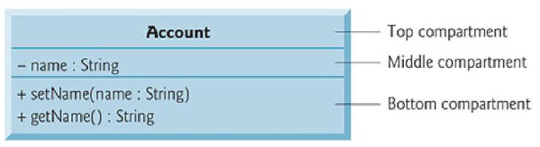

### Introduction

###### Java

JVM - Java Virtual Machine

###### display / output messages on the screen

```java
public class MyFirstProgram {
    public static void main(String[] args){
        System.out.println("Hello World!");
    }
}
```

`class` - 申明class

`public class` - Java class的开头

`MyFirstProgram` - class 的名字，也叫做identifier, 一般用驼峰命名法

`{}` - class名字之后的`{}`中间的内容是程序主体部分

`public static void main` - main function的标准写法

`main` - 必须至少有一个method的名字叫`main`

`("Hello World!")` - argument

###### Commenting in Java

```java
// 单行注释
/*
	多行注释
*/
```


###### 命名

* 不能以数字开头
* 不能有空格
* 区分大小写

###### 其他知识点

`\n` - 字符串中的换行符

`\t` - 制表符

`\r` - 光标重回本章开头

`\\` - 打印出`\`

`\"` - 打印出`"`

比如，以下两段代码打印出的结果一样

```java
public class MyFirstProgram {
           public static void main(String[] args) {
                   System.out.println("Welcome to \n Java Programming"); } 
}

public class MyFirstProgram {
           public static void main(String[] args) {
                   System.out.println("Welcome to");
                   System.out.println(“Java Programming!");
           } 
}

```


###### 三种打印方法

`System.out.println()` - 打印一行内容，打印完换行

`System.out.print()` - 打印一行内容，打印完不换行

`System.out.printf()` - 格式化输出

```java
public class MyFirstProgram {
    public static void main(String[] args) {
        System.out.printf("%s%n%s%n", "Welcome to", " Programming Fundamentals!");
    }
}

// %s - 对应字符串
// %n - 换行符
```


###### read & add 2 integers and output the result

```java
import java.util.Scanner; // program uses class Scanner

public class Addition {
      public static void main(String[] args) {
          // create a Scanner to obtain input from the command window
          Scanner input = new Scanner(System.in);

          System.out.print("Enter first integer : "); // prompt
          int number1 = input.nextInt(); // read first number from user
		System.out.print("Enter second integer : "); // prompt
          int number2 = input.nextInt(); // read second number from use

          int sum = number1 + number2; // add numbers, then store total in sum

          System.out.printf("Sum is %d%n", sum); // display sum

      } // end method main

} // end class Addition

          


```

###### Java 数据类型

`boolean`

`byte`

`char`

`short`

`int`

`long`

`float`

`double`

###### 变量 Variable

variable 包含四个部分： 

* name
* type
* size (in bytes)
* value

`int number1 = 45`  - 将 int 数据 45 放进名字为 number1 的内存里

* name - number1
* type - int
* size - int 数据类型所占用的大小, 一般为4bytes
* value - 45

当该数据不再使用时，Java会自动将该数据清除，此过程称为 **destructive**


###### Arithmetic Operators

`+ - * / %` 和数学里的用法一样

`=` assignment operator ，赋值运算符

###### Condition

condition - true /  false

`>`, `<`, `>=`, `<=`, `==` `!=`

`x == y` 表示 x 等于 y

`x != y` 表示 x 不等于 y

```java
// Compare integers using if statements, relational operators 
// and equality operators. 
import java.util.Scanner; // program uses class Scanner 

public class Comparison { 
     public static void main(String[] args) { 
         // create Scanner to obtain input from command line 
            Scanner input = new Scanner(System.in);

            System.out.print("Enter first integer:"); // prompt
            int number1 = input.nextInt(); // read first number from user

           System.out.print("Enter second integer:"); // prompt
           int number2 = input.nextInt(); // read second number from user

           if (number1 == number2)
               System.out.printf("%d == %d%n", number1, number2);
             }

            if (number1 != number2) {
                       System.out.printf("%d != %d%n", number1, number2);
            }

           if (number1 < number2) {
                      System.out.printf("%d < %d%n", number1, number2);
           }
                 if (number1 > number2) {
                       System.out.printf("%d > %d%n", number1, number2);
             }

            if (number1 <= number2) {
                      System.out.printf("%d <= %d%n", number1, number2);
            }

           if (number1 >= number2) {
                     System.out.printf("%d >= %d%n", number1, number2);
          }
      } // end method main  

} // end class Comparison


```


### Classes, Objects, Methods, String and Math Class

###### Class

```java
// Account.java
public class Account {
       private String name; // instance variable
 
       // method to set the name in the object
       public void setName(String name) {
             this.name = name; // store the name
       }

      // method to retrieve the name from the object
      public String getName() {
              return name; // return value of name to caller
      }
}
```

**method header** - the first line of each method declaration.

`void` - function return type

`void setName()` - 说明 method setName() return nothing

 `(String name)` - parameter 参数，多个参数用逗号分开


###### Test Class 

* 白盒测试 - 根据代码测试功能。
* 黑盒测试 - 不知道代码是什么样的，只测试功能有没有达到。

```java
// AccountTest.java

import java.util.Scanner;
 
public class AccountTest {
       public static void main(String[] args) {
               // create a Scanner object to obtain input from the command window
               Scanner input = new Scanner(System.in);
 
              // create an Account object and assign it to myAccount
             Account myAccount = new Account();

             // display initial value of name (null)
            System.out.printf("Initial name is: %s%n%n", myAccount.getName());
              // prompt for and read name
             System.out.println("Please enter the name:");
             String theName = input.nextLine(); // read a line of text
             myAccount.setName(theName); // put theName in myAccount
             System.out.println(); // outputs a blank line

             // display the name stored in object myAccount
            System.out.printf("Name in object myAccount is:%n%s%n",
            myAccount.getName());

      }
}

```


###### local variable vs. instance variable

**local variable** - 在method内部的varibale

**instance variable** - 在method小括号里的variable


###### UML 统一建模语言 & UML Diagram



`-` private

`+` public


###### Initializing Objects with Constructors

```java
Account account1 = new Account("Jane Green");
```


###### Account Class with a Balance

```java
// Account class with a double instance variable balance and a constructor
 // and deposit method that perform validation.
 
    public class Account {
             private String name; // instance variable
             private double balance; // instance variable
 
             // Account constructor that receives two parameters
            public Account(String name, double balance) {
                          this.name = name; // assign name to instance variable name

                         // validate that the balance is greater than 0.0; if it's not,
                        // instance variable balance keeps its default initial value of 0.0
                if (balance > 0.0) { // if the balance is valid
                          this.balance = balance; // assign it to instance variable balance
              }
         }

        // method that deposits (adds) only a valid amount to the balance
       public void deposit(double depositAmount) {
               if (depositAmount > 0.0) { // if the depositAmount is valid
                           balance = balance + depositAmount; // add it to the balance
               }
       }
        // method returns the account balance
         public double getBalance() {
                  return balance;
         }

         // method that sets the name
        public void setName(String name) {
                  this.name = name;
        }

       // method that returns the name
       public String getName() {
                  return name;
       }
```


```java
// AccountTest.java
// Inputting and outputting floating-point numbers with Account objects.
 import java.util.Scanner;
 
 public class AccountTest {
          public static void main(String[] args) {
                    Account account1 = new Account("Jane Green", 50.00);
                    Account account2 = new Account("John Blue", -7.53);
 
                   // display initial balance of each object
                  System.out.printf("%s balance: $%.2f%n",
                  account1.getName(), account1.getBalance());
                  System.out.printf("%s balance: $%.2f%n%n",
                  account2.getName(), account2.getBalance());
                          // create a Scanner to obtain input from the command window
           Scanner input = new Scanner(System.in);

           System.out.print("Enter deposit amount for account1: "); // prompt
           double depositAmount = input.nextDouble(); // obtain user input
           System.out.printf("%nadding %.2f to account1 balance%n%n",
           depositAmount);
           account1.deposit(depositAmount); // add to account1’s balance

           // display balances
          System.out.printf("%s balance: $%.2f%n",
          account1.getName(), account1.getBalance());
          System.out.printf("%s balance: $%.2f%n%n",
          account2.getName(), account2.getBalance());
                            System.out.print("Enter deposit amount for account2: "); // prompt
              depositAmount = input.nextDouble(); // obtain user input
              System.out.printf("%nadding %.2f to account2 balance%n%n",
              depositAmount);
              account2.deposit(depositAmount); // add to account2 balance

              // display balances
             System.out.printf("%s balance: $%.2f%n",
             account1.getName(), account1.getBalance());
             System.out.printf("%s balance: $%.2f%n%n",
             account2.getName(), account2.getBalance());
       }
}
```


###### Primitive Types vs. Reference Types

Primitive Types - 首字母小写

* can hold exactly one value of its declared type at a time. 
* When another value is assigned to that variable, the new value replaces the previous one—which is lost.

Reference Types - 首字母大写

* 表示一个Object
* `Scanner input = new Scanner(System.in);`
* Creates an object of class Scanner, then assigns to the variable input a **reference** to that Scanner object.