## 1 - Communications and Networks

#### Network & Internet

**Network** - system for connecting computer using a single transmission technology 连接计算机的系统的单次传输技术

**Internet** - set of networks connected by routers that are configured to pass traffic among any computers attached to networks in the set. 通过路由器连接的任意电子设备组成的网络

#### Evolution of Internet

###### ARPANET

* Fundamental changes from centralized to distributed computing
* Incorporated reliability and robustness 
* Multiple links & distributed routing 

###### Ethernet

* Ethernet standard made local networking feasible 

###### TCP/IP protocol 

* TCP/IP protocol made *internetworking* possible
* Developed *after* Arpanet
* Switchover occurred in 1983 
* Exponential growth - doubling every 18 months 

#### Growth of Computer Networks (NW)

###### Economic Impact

* Data NW made telecommuting available to individuals and have changed business communication
* •Popularity & importance of NW has produced a demand in all industries for people with more NW expertise - •Companies need workers to plan, acquire, install, operate, and manage the hardware (HW) and software (SW) systems that comprise computer NW and Internets 

#### Why Network is Complex?

1. Diverse technologies, each has features that distinguish it from the others

2. Multiple NW standards, some are incompatible

3. Various commercial NW products and services that use the technologies in unconventional ways

4. Multiple technologies required to interconnect two or more NW

#### **Network Conceptual Models**

* **Simplistic models**: do not distinguish among details
* **Complex models**: do not help simplify the subject

#### Five Key Aspects of Networks

###### Network Applications

**Network Applications** - program that communicates across a network

* Email, file transfer, web browsing 

**Network programming** - write codes for network applications to communicate across a network

###### Data Communications

**Data Communications** - study of low-level technologies used to send information across a medium like wire and radio wave. Provides foundation of concepts on which networking is built upon

###### Packet Switching

**Packet Switching** - a way to allow multiple senders to transmit data over a shared network

**Packet** - small blocks of data

###### Internetworking with TCP/IP

**Transmission Control Protocol (TCP)** 传输控制协议 - Transport layer protocol that receives data and divide them into smaller packets 

**Internet Protocol (IP)** - Network layer protocol that deals with the routing of the packets through the Internet

###### Public and Private Networks

**Internet Service Providers (ISP)** - vendors who offer Internet access for a fee

**Public network** - a network owned by a ISP and offers service to any individual or organization that pays the subscription fee

**Private network** - a network that is restricted to one group which can be leased from a provider

#### **Private Network Types**

###### Consumer

smallest and least expensive network

###### Small Office/Home office (SOHO)

slightly larger than consumer network 

###### Small-to-medium Business (SMB)

larger than SOHO, usually multiple offices in a building

###### Large Enterprise

large network with multiple buildings

#### History of Communication

* the smoke signal

  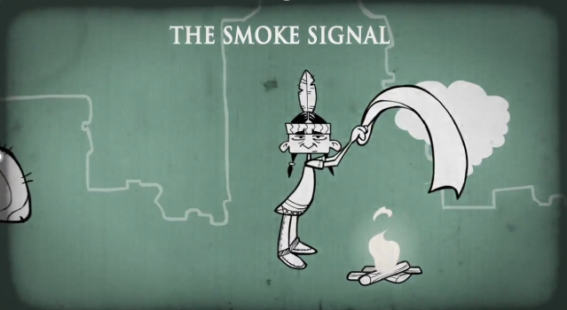

* The homing pigeon

  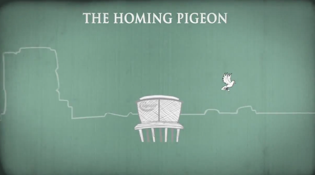

* The pony express

  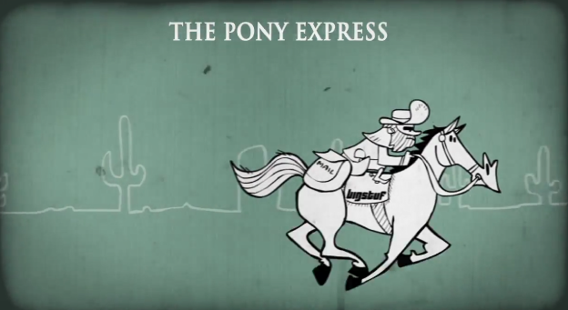

* The semaphore flag

  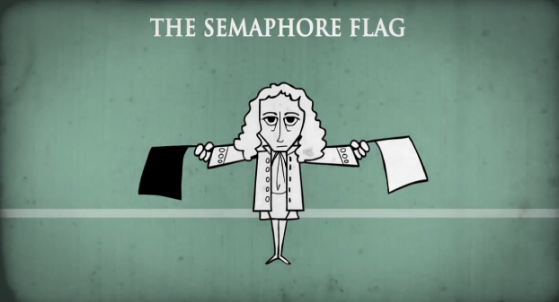

* The telegraph

  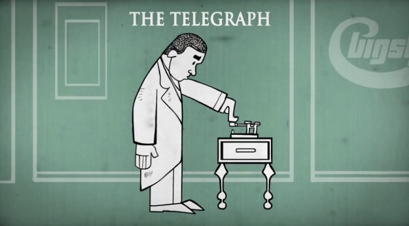

* The telephone

  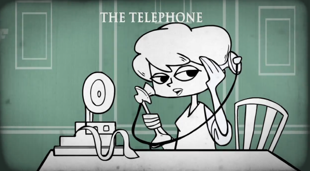

* The radio

  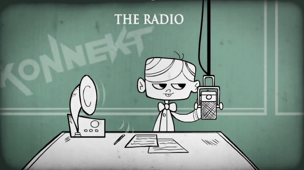

* Email

  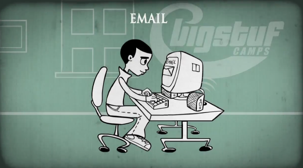

#### Communications

Communication must involved at least two entities - **sender** & **Receiver**

Can also contain intermediate entities - devices to **forward** packets.

#### **Interoperability** 互通性

Misunderstanding can occur in communications

* Real-world: different language, different context etc.

* Network: disruptions, corrupted data, congestion

**Interoperability**: ability of two entities to communicate <u>without</u> misunderstanding

#### **Communication Protocol**

**Protocols** are specification or set of rules

**Communication protocol**: specifies details for one aspect of computer communication

* Actions taken when errors arises
* Voltage and signals to be used
* Format of messages that applications exchange 

Networking standards ensure interoperability between **product vendors**

* **de jure**: if they have been produced or accepted by a recognized standards body

  * Hardware and communications standards are often de jure

    ​	e.g. Network routers

* **de facto**: if they have not been accepted by a recognized body but have gained widespread use by market forces

  * Software standards are often de facto
  * **Proprietary standards**(专有标准) which are produced, owned and controlled by a commercial organization - Microsoft Windows
  * **Open standards** may originally produced by a commercial organization but since transferred to the public domain - Unix

#### Network Architecture

###### Network architecture

Structured framework within which networks can be analysed, designed and implemented, incorporating a defined set of layers and protocols

###### **Cooperating Protocols**

**Protocol suite** - set of protocols that work together to fulfil a communication, each protocol fulfil one aspect

**Layer model** - Abstract version of protocol suite is a layering model

* Set of layers each serving different function - Can be implemented separately
* Lower layers provides a service to the layer directly above it by means of an interface

#### **Layered Architecture Benefits**

1. Divide complex operations into manageable groups

2. Can change one layer without affecting others

3. Can mix different technologies and suppliers for different layers

International Organization for Standardization (**ISO**)

<u>Seven layer model</u>: Open Systems Interconnection (**OSI**) 

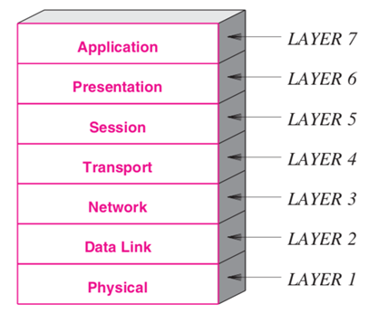

**TCP/IP** model

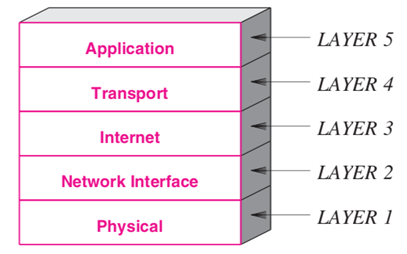

###### **Physical Layer Protocols**

Concern with transmission medium and the associated hardware 

* Specification about: 
  * Electrical properties
  * Radio frequencies
  * Signals

###### **Network Interface**

* Specifications about:
  * Network addresses 
  * Maximum packet size that a network can support
  * Protocols used to access the underlying medium 
  * Hardware addressing

###### **Internet**

Also known as network layer

* Specifications about:
  * Internet addressing structure
  * Format of Internet packets
  * Methods for dividing packets into smaller packets for transmission
  * Mechanisms for reporting errors

###### **Transport**

* Specifications about:
  * Maximum receiver rate
  * Congestion control
  * Delivery of data
  * Ordered, no duplication, no error

###### **Application**

* Specifications about:
  * Email exchange
  * File Transfer
  * Web Browsing
  * Telephone services
  * Video conferencing

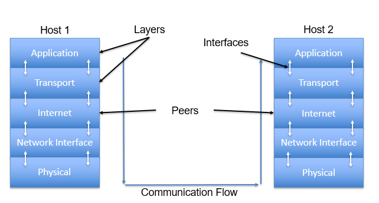

#### **Headers and Layers**

* Each layer will add their own information
  * **Header**: additional information added/removed by the corresponding layer
  * Not necessary of the same size for each header
  * Example: Port number (transport), IP address (Internet)

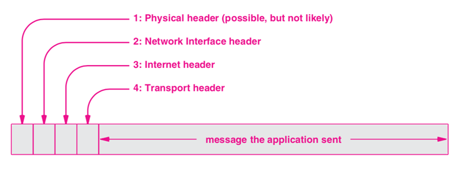

## **History of the Internet**

#### **History**

###### **Early Computer Networks**

Early computers networks when computers were large and very expensive, and the main motivation was resource sharing 

1. To connect multiple users
   * Each with a screen & keyboard (terminals) to a large centralized computer 

2. Allows sharing of peripheral devices
   * Permitted sharing of expensive, centralized resources

###### **Birth of the Internet**

* In 1960s, Department of Defense for Advanced Research Projects Agency (DARPA or ARPA) wanted to find ways to share resources 
* Researchers needed powerful computers, but were very expensive
* ARPA budget was insufficient
* ARPA planned to interconnect all computers with a network!

###### **ARPANET**

* ARPA devise a software that would allow a researcher to use whichever computer was best suited to perform a given task
* ARPA did the following to achieve the visionary work:
  * gathered some of the best minds
  * focused them on computer network research
  * hired contractors to turn the designs into a working system: ARPANET
  * Research turned out to be revolutionary

###### **Growth of the Internet**

* In less than 30 years, the Internet has grown from ARPANET
  * Connecting a handful of sites to a global communication system 
* The rate of growth has been phenomenal!

###### **Exponential Growth**

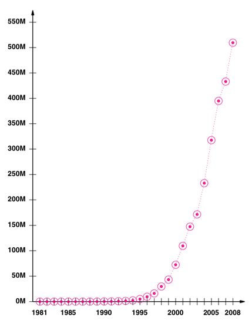

#### **Early Internet Timeline**

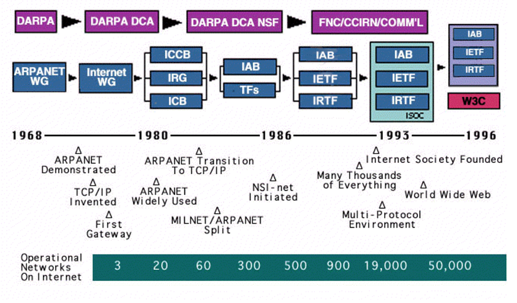

#### **Changes** **in** **the Internet**

The Internet changed in two ways:

* Communication speeds increased dramatically  
* New applications arose that appealed to many parts of the society

#### **Technological Changes**

Internet was born out of <u>resource sharing</u>, but more for <u>communication</u> now.

Two technological changes that shifted the Internet

* Higher communication speeds - enable large data to be transferred quickly
* Affordable personal computers - powerful computational power and graphical display eliminates needs for resource sharing

###### **Text to Multimedia**

Data being sent across the Internet has changed

* Multimedia: combination of text, audio, graphics and video

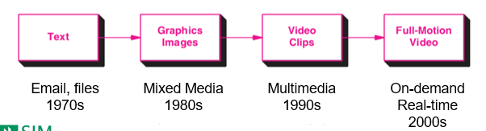

* Much of the content available is now multimedia
  * Quality of media also improved due to higher bandwidth
  * High resolution video and high-fidelity audio

###### **Static to Dynamic**

* The Internet has transitioned from transfer of static textual documents
* Now the Internet can transfer dynamic high-quality multimedia
* Offline vs real-time requirements

###### Changes in communication systems

* Voice and television moved from analog to digital
* Support for mobile communication
* Although the Internet applications changes, the underlying technologies remain the same

###### **Analogue vs Digital**

* Analogue: analogue signals
  * Sounds waves, which vary continuously over time are analogue data 
* Digital: digital signals (bits)
  * Each bit can be represented by one of a number of discrete energy values
  * Superior performance 
  * Computers produce digital data that is in binary form, that is, it is represented as a series of 1s and 0s 

###### **Telephone System**

* Before: analog transmission of audio
  * Use the analog telephone circuits to communicate
  * Known as the Public Switched Telephone Network (PSTN)
* After: digital transmission of audio
  * Uses the Internet infrastructure to communicate
  * Voice over Internet Protocol (VoIP) 

###### **Television**

* Before: wired analog channel
  * Can also make use of satellite dishes to receive TV broadcasts
* After: wired/wireless digital 
  * Can be received wireless 
  * Digital transmission
  * Uses Internet Protocol (IP) for transmission

###### **Cellular**

* Before: analog wireless cellular services
  * Satellite dishes on Earth
  * No connection to the Internet
* After: digital cellular services
  * 3G onwards
  * High speed mobile data

###### **Internet Access**

* Before: wired, dial-up modem
  * Make use of telephone circuits
  * Cannot use telephone while connected
* After: wireless, broadband, fibre optic
  * Wi-Fi
  * Separate/shared channel from telephone

###### **Wi-Fi**

* Before: mobile devices has to have mobile data connectivity
  * Additional hardware needed for Internet Access
  * Incurs mobile data charges
* After: any device near a Wi-Fi broadcast can access the Internet 
* Allows for less powerful electronic devices to connect to the Internet
* Save on mobile data charges

###### **Data Access**

* Before: centralised
  * Single server, multiple users
  * Bottleneck performance
* After: distributed, peer-to-peer (P2P)
  * User can act as servers (Torrent)
  * Can be used as backups

###### **Content Delivery**

* Before: requires download to view
  * Sometimes slow download
  * Impact work efficiency
* After: streaming
  * Can view content on browser
  * Video streaming

###### **Applications**

* Before: standalone, download and install
  * Updates requires additional download
  * Manual updates
* After: cloud, auto-updates
  * Low cost computers, good productivity
  * No need to install applications, save space
  * Auto updates

###### **Technology on the Internet**

| **Area**         | **Before**               | **After**                 | **Technology**         |
| ---------------- | ------------------------ | ------------------------- | ---------------------- |
| Telephone System | Analog voice             | Voice over IP             | VoIP                   |
| Television       | Analog delivery          | Digital delivery          | Internet Protocol (IP) |
| Cellular         | Analog cellular services | Digital cellular services | 3G                     |
| Internet Access  | Wired, Dial-up           | Wireless                  | Wi-Fi                  |
| Data Access      | Centralised              | Distributed               | P2P                    |
| Content Delivery | Download                 | Streaming                 | Video streaming        |
| Applications     | Standalone               | Cloud                     | Cloud services         |

#### **Application Changes**

###### **Application Trends**

* Technological advances has lead to many new Internet applications

###### **Teleconferencing Systems**

* Teleconferencing system: combination of software and hardware to allow virtual meetings
* Made possible by technological changes
* Benefits
  * Reduces travel expenses/costs
  * Communicate anywhere

###### **Navigation System**

* Navigation system: combination of software and hardware that provides users with map functions
* Enabled by cloud technologies
* Benefits
  * Can navigate to new locations
  * No need for standalone GPS system

